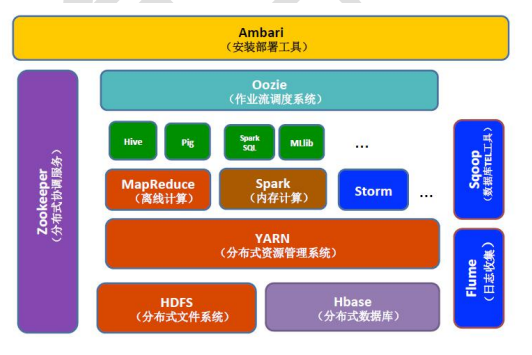

## Hadoop 背景

其实最先被这些问题困惑的并不是电商，而是 google，他需面对的挑战一点也不会比电商小
* 大量的网页怎么存储
* 面对的数据和计算难题

2003，2004 年 Google
* GFS
* MapReduce

为了解决上面的两大难题，google 提出了自己的简介方案，当然这解决方案是闭源的，另外
还提出了两篇论文，为大量数据的存储与计算问题提供了思路。

---

## Hadoop 生态
[Hadoop 是 apache 下面的一套开源软件平台](http://hadoop.apache.org/)

Hadoop 的功能：利用服务器的集群，根据用户的业务逻辑对海里信息进行处理（存储与计算）
Hadoop 的核心组件:
* HDFS(分布式文件系统)
* MAPREDUCE(分布式运行系统)
* YARN(运算资源调度系统)
以上就是 hadoop 最核心的部分，可是随着时间的推移，hadoop 已经不只是这些技术了，它慢慢进化成了一个生态圈

---

## Hadoop 起源
* Hadoop 最初是由 Apache Lucene 项目的创始人 Doug Cutting 开发的文本搜索库。Hadoop 源自始于 2002 年的 Apache Nutch 项目——一个开源的网络搜索引擎并且也是 Lucene 项目的一部分
* 2004 年 Nutch 项目也模仿 GFS 开发了自己的分布式文件系统 NDFS（Nutch Distributed File System），也就是 HDFS 的前身
* 2005 年，Nutch 开源实现了谷歌的 MapReduce
* 2006 年 2 月，Nutch 中的 NDFS 和 MapReduce 开始独立出来，成为 Lucene 项目的一个子项目，称为 Hadoop，同时，Doug Cutting 加盟雅虎
* 2008 年 1 月，HADOOP 成为 Apache 顶级项目，迎来了它的快速发展期。

