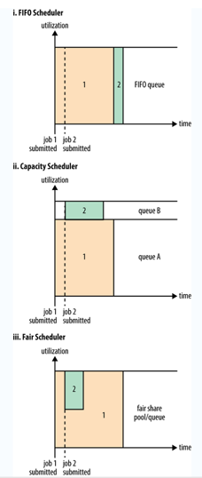

配置 ([官方文档](https://hadoop.apache.org/docs/stable/hadoop-yarn/hadoop-yarn-common/yarn-default.xml)):
`yarn.resourcemanager.scheduler.class` 默认: `org.apache.hadoop.yarn.server.resourcemanager.scheduler.capacity.CapacityScheduler`

---

1. FIFO 队列缺点: 大任务会耗时太长会导致小任务得不到及时的执行
2. 分为大小任务两个队列，小任务在大任务执行时也能得到及时执行
    * 缺点：如果只有大任务或只有小任务，会浪费掉一部分内存资源维护另一个用不到的队列
    * Apache Hadoop 原生默认的队列类型
3. 公平队列：在大任务执行过程中，如果加入了小任务，那么大任务会让出部分资源给小任务执行
    * 缺点：小任务需要等待大任务让出资源，得不到及时执行
