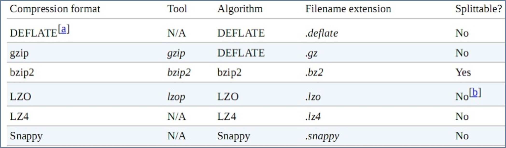

## 原则
MapReduce 支持压缩，通过压缩算法对 mapper 或者 reducer 的最终数据结果进行压缩
* 好处：减少了磁盘 io，提高了 MR 获取数据的速度，节省了磁盘空间
* 坏处：压缩需要增加 cpu 的运算负担

原则:
* 运算密集的 job，少用压缩，尤其是中间数据
* Io 密集的 job，可以用压缩，尤其是最终归档数据

[官方文档](http://hadoop.apache.org/docs/stable/hadoop-mapreduce-client/hadoop-mapreduce-client-core/MapReduceTutorial.html#Data_Compression)

---

## Mapper 输出压缩
配置文档:
* `mapreduce.map.output.compress=false`
* `mapreduce.map.output.compress.codec=org.apache.hadoop.io.compress.DefaultCodec`

在代码中进行配置:
```java
conf.setBoolean(Job.MAP_OUTPUT_COMPRESS, true);
conf.setClass(Job.MAP_OUTPUT_COMPRESS_CODEC, GzipCodec.class, CompressionCodec.class);
```

## Reduce 输出压缩
配置文档:
* `mapreduce.output.fileoutputformat.compress=false `
* `mapreduce.output.fileoutputformat.compress.codec=org.apache.hadoop.io.compress.DefaultCodec `
* `mapreduce.output.fileoutputformat.compress.type=RECORD`

在代码中进行配置:
```java
Job job = Job.getInstance(conf);
FileOutputFormat.setCompressOutput(job, true);
FileOutputFormat.setOutputCompressorClass(job, GzipCodec.class);
```

---



不建议使用配置文档的方式，不灵活，可以使用代码进行配置
[配置文件官方文档](http://hadoop.apache.org/docs/stable/hadoop-mapreduce-client/hadoop-mapreduce-client-core/mapred-default.xml)


