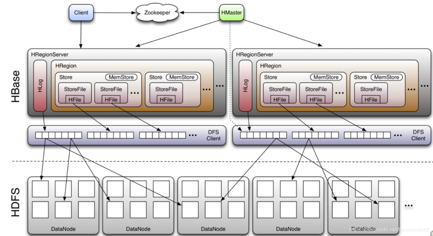

## HBase 列式数据库简介
HBase 是一个开源的非关系型分布式数据库（NoSql） 原型是 Google 的 BigTable 论文，受到了该论文思想的启发，目前作为Hadoop 的子项目来开发维护。它介于 nosql 和 RDBMS 之间，仅能通过主键(row key)和主键的 range 来检索数据，可通过 hive 支持来实现多表 join 等复杂操作。

## HBase 特点

* **海量存储**: Hbase 适合存储 PB 级别的海量数据，在 PB 级别的数据以及采用廉价 PC 存储的情况下，能在几十到百毫秒内返回数据。这与 Hbase 的极易扩展性息息相关。正式因为 Hbase 良好的扩展性，才为海量数据的存储提供了便利。
* **列式存储**: 这里的列式存储其实说的是列族（ColumnFamily）存储，Hbase 是根据列族来存储数据的。列族下面可以有非常多的列，列族在创建表的时候就必须指定。
* **极易扩展**: Hbase 的扩展性主要体现在两个方面，一个是基于上层处理能力（RegionServer）的扩展，一个是基于存储的扩展（HDFS）。通过横向添加RegionSever 的机器，进行水平扩展，提升 Hbase 上层的处理能力，提升 Hbsae 服务更多 Region 的能力。
* **高并发**: 由于目前大部分使用 Hbase 的架构，都是采用的廉价 PC，因此单个 IO 的延迟其实并不小，一般在几十到上百 ms 之间。这里说的高并发，主要是在并发的情况下，Hbase 的单个 IO 延迟下降并不多。能获得高并发、低延迟的服务。
* **稀疏**: 稀疏主要是针对 Hbase 列的灵活性，在列族中，你可以指定任意多的列，在列数据为空的情况下，是不会占用存储空间的。

适用场景:
* 持久化存储大量数据（TB、PB）
* 对扩展伸缩性有要求
* 需要良好的随机读写性能
* 简单的业务 KV 查询(不支持复杂的查询比如表关联等)
* 能够同时处理结构化和非结构化的数据
* 订单流水、交易记录、需要记录历史版本的数据等

不适用场景:
* 几千、几百万那种还不如使用 RDBMS
* 需要类型列
* 需要跨行事务，目前 HBase 只支持单行事务
* SQL 查询

## HBase 数据模型
<table>
    <tr>
        <th>Row Key</th>
        <th>Time Stamp</th>
        <th>CF1</th>
        <th>CF2</th>
        <th>CF3</th>
    </tr>
    <tr>
        <td rowspan="3">rk00001</td>
        <td>t1</td>
        <td></td>
        <td>CF2:q1=val1</td>
        <td>CF3:q2=val2</td>
    </tr>
    <tr>
        <td>t2</td>
        <td></td>
        <td></td>
        <td></td>
    </tr>
    <tr>
        <td>t3</td>
        <td>CF1:q3=val3</td>
        <td></td>
        <td></td>
    </tr>
</table>

* ROW KEY
    * 决定一行数据
    * 按照字典顺序排序的
    * ROW KEY 只能存储 64k 的字节数据
* Column Family 列族 & qualifier 列
    * HBase 表中的每个列都归属于某个列族，列族必须作为表模式(schema)定义的一部分预先给出。`create 'test', 'course'`
    * 列名以列族作为前缀， 每个“列族”都可以有多个列成员(column) ； 如 `course:math`,`course:english`, 新的列族成员（列）可以随后按需、动态加入；
    * 权限控制、存储以及调优都是在列族层面进行的；
    * HBase 把同一列族里面的数据存储在同一目录下，由几个文件保存
* Timestamp 时间戳
    * 在HBase 每个 cell 存储单元对同一份数据有多个版本，根据唯一的时间戳来区分每个版本之间的差异，不同版本的数据按照时间倒序排序，最新的数据版本排在最前面
    * 时间戳的类型是 64 位整型
    * 时间戳可以由HBase(在数据写入时自动)赋值，此时时间戳是精确到毫秒的当前系统时间
    * 时间戳也可以由客户显式赋值
* Cell 单元格
    * 由行和列的坐标交叉决定
    * 单元格是有版本的
    * 单元格的内容是未解析的字节数组
    * 由`{rowkey，column(=<family> +<qualifier>)，version}`唯一确定的单元
    * Cell 中的数据是没有类型的，全部是二进制字节码形式存储

## HBase 架构

* **Client**: 包含了访问 Hbase 的接口，另外 Client 还维护了对应的 cache 来加速 HBase 的访问，比如 cache 的.META.元数据的信息
* **Zookeeper**: HBase 通过 Zookeeper 来做 master 的高可用、RegionServer 的监控、元数据的入口以及集群配置的维护等工作
    * 通过 Zoopkeeper 来保证集群中只有1个 master 在运行，如果 master 异常，会通过竞争机制
    * 产生新的 master 提供服务
    * 通过 Zoopkeeper 来监控 RegionServer 的状态，当 RegionSevrer 有异常的时候，通过回调的形式通知 Master RegionServer 上下线的信息
    * 通过 Zoopkeeper 存储元数据的统一入口地址
* **HMaster**: 
    * 为 RegionServer 分配 Region
    * 维护整个集群的负载均衡
    * 维护集群的元数据信息
    * 发现失效的 Region，并将失效的 Region 分配到正常的 RegionServer 上
    * 当 RegionSever 失效的时候，协调对应 Hlog 的拆分
* **HregionServer**: 直接对接用户的读写请求，是真正的“干活”的节点
    * 管理 master 为其分配的 Region
    * 处理来自客户端的读写请求
    * 负责和底层 HDFS 的交互，存储数据到 HDFS
    * 负责 Region 变大以后的拆分
    * 负责 Storefile 的合并工作
* **HDFS**: 为 Hbase 提供最终的底层数据存储服务，同时为 HBase 提供高可用（Hlog 存储在 HDFS）的支持
    * 提供元数据和表数据的底层分布式存储服务
    * 数据多副本，保证的高可靠和高可用性

## HBase 中的角色

* **HMaster**
    * 监控 RegionServer
    * 处理 RegionServer 故障转移
    * 处理元数据的变更
    * 处理 region 的分配或转移
    * 在空闲时间进行数据的负载均衡
    * 通过 Zookeeper 发布自己的位置给客户端
* **RegionServer**
    * 负责存储 HBase 的实际数据
    * 处理分配给它的 Region
    * 刷新缓存到 HDFS
    * 维护 Hlog
    * 执行压缩
    * 负责处理 Region 分片
* **Write-Ahead logs (WAL)**
    * HBase 的修改记录，当对 HBase 读写数据的时候，数据不是直接写进磁盘，它会在内存中保留一段时间（时间以及数据量阈值可以设定）。但把数据保存在内存中可能有更高的概率引起数据丢失，为了解决这个问题，数据会先写在一个叫做 Write-Ahead logfile 的文件中，然后再写入内存中。所以在系统出现故障的时候，数据可以通过这个日志文件重建。
* **Region**
    * Hbase 表的分片，HBase 表会根据 RowKey 值被切分成不同的 region 存储在 RegionServer 中，在一个 RegionServer 中可以有多个不同的 region
* **Store**
    * HFile 存储在 Store 中，一个 Store 对应 HBase 表中的一个列族(列簇， ColumnFamily)
* **MemStore**
    * 顾名思义，就是内存存储，位于内存中，用来保存当前的数据操作，所以当数据保存在 WAL 中之后，RegsionServer 会在内存中存储键值对
* **HFile**
    * 这是在磁盘上保存原始数据的实际的物理文件，是实际的存储文件。StoreFile 是以 HFile 的形式存储在 HDFS 的

