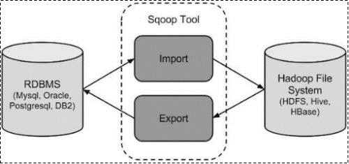

## Sqoop 简介
Sqoop 是 apache 旗下的工具，用于实现结构型数据（如关系数据库）和 Hadoop 之间进行数据迁移的工具, 可以讲关系型数据库中的数据导入到 Hadoop 的 HDFS 中，同样也完全可以把 HDFS 的数据导入到关系型数据库里面
* 导入数据：MySQL, Oracle 导入数据到 Hadoop 的 HDFS, HIVE, HBASE 等数据存储系统
* 导出数据：从 Hadoop 的文件系统中导出数据到关系数据库

## Sqoop 原理
Sqoop 把导入或导出命令翻译成 `mapreduce` 代码来实现, 在翻译出的 `mapreduce` 中，其实只是对 `inputformat` 和 `outputformat` 进行了定制

---

该项目已于 2021-06 终止, 并移入 Apache Attic

