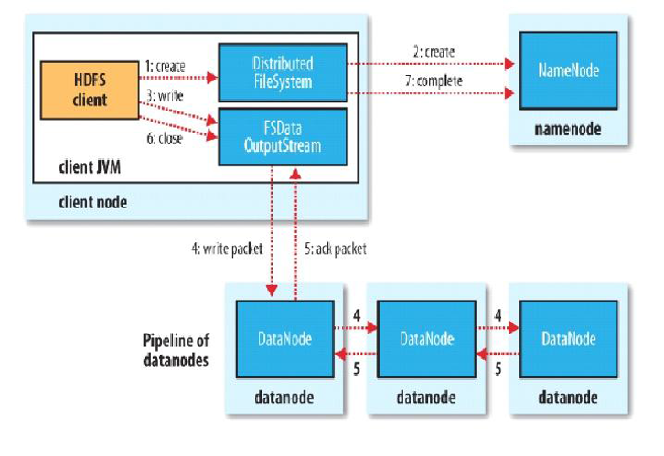
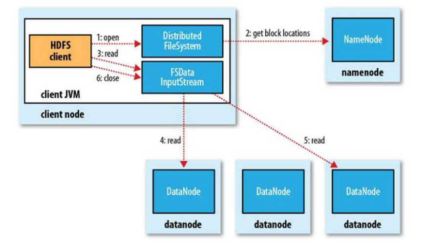

## HDFS 特点

1. hdfs 里的文件是分块（block）存储的，默认大小是 128M
2. hdfs 使用统一的抽象目录树管理文件，客户端不需要关心具体的文件分块
    * 例如：hdfs://hadoop01:port/path1/path2/file
3. 抽象目录树以及分块的信息由 namenode 节点管理
4. 具体的 block 存储在每一个节点上，并且每一个 block 可以有多个副本（dfs.replication）
5. Hdfs 适合设计成一次写入多次读取的情况，不支持修改

## HDFS 写文件流程

举例来说，现在要上传一个 hadoop.jar 文件, 200M（按默认得配置应该分成两个 block [128,72]）
对应命令是： `hadoop fs put hadoop.jar /`

1. 客户端使用 FIleSystem 上传
2. FIleSystem 与 namenode 进行通信，nn 会检查自己维护得目录树，判断当前目录是否存在
3. 当 namenode 正确返回后，客户端再向 namenode 请求上传第一个 block, namenode 确认 datanode 的状态，把健康的 datanode 集合返回给客户端，客户端会根据返回的 datanode 集合挑选一个进行连接
4. 客户端对每一个用于传输的节点都建立 pipeline 管道，并对传输第一个 block 块的数据（每次传输的并不是一整个 block 块，而是一个 packet，默认大小为 64K，64K 的 packet 中每次传输 512b 的数据时（一个 chunk）会进行一次校验）所以你可以把 packet 又理解成 chunk的集合
5. 每个 datenode 写完个 block 后再返回确认信息
6. 所有写完了，关闭输出流
7. 整个完成后最后通知 namdenode 完成数据上传

## HDFS 读文件流程

`hadoop fs get /hadoop.jar`

1. client 访问 NameNode，查询元数据信息，获得这个文件的数据块位置列表，返回输入流对象。
2. 就近挑选一台 datanode 服务器，请求建立输入流
3. DataNode 向输入流中中写数据，以 packet 为单位
4. 关闭输入流

