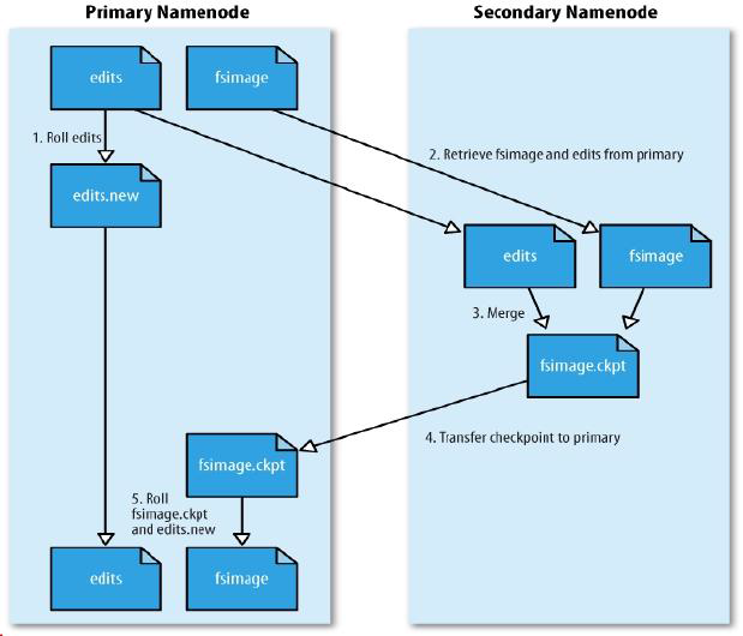

## 元数据的存储形式
hdfs 的读写流程都离不开 namenode，在 namenode 中维护了文件、文件块的信息，这些信息统统称之为元数据

元数据在 hdfs 中有 3 种存在形式 (<font color="red">内存的数据 = fsimage + edits 文件</font>)
1. 存在内存中，这个最全的元数据
2. fsimage 磁盘元数据镜像文件
3. 最新的操作日志文件

查看存储结构:
* `cd /soft/data/tmp/dfs/name/current`
* `hdfs oev -i edits_0000000000000001913-0000000000000001959 -o edits.xml`
* `hdfs oiv -i fsimage_0000000000000001972 -p XML -o fsimage.xml`

## checkpoint
当达到某个条件后，secondary namenode 会把 namenode 上保存的 edits 和最新的 fsimage 下载到本地，并把这些 edits 和 fsimage 进行合并，产生新的 fsimage，这整个过程把他称作 <font color="red">checkpoint</font> ([官方文档](http://hadoop.apache.org/docs/stable/hadoop-project-dist/hadoop-hdfs/hdfs-default.xml))

checkpoint 的条件配置 (hdfs-site.xml):
```properties
#检查触发条件是否满足的频率，60 秒
dfs.namenode.checkpoint.check.period=60 

# 以下两个参数做checkpoint 操作时，代表 secondary namenode 的本地工作目录
dfs.namenode.checkpoint.dir=file://${hadoop.tmp.dir}/dfs/namesecondary
dfs.namenode.checkpoint.edits.dir=${dfs.namenode.checkpoint.dir} 

#最大重试次数
dfs.namenode.checkpoint.max-retries=3 
#两次 checkpoint 之间的时间间隔 3600 秒
dfs.namenode.checkpoint.period=3600 
#两次 checkpoint 之间最大的操作记录
dfs.namenode.checkpoint.txns=1000000 
```

## checkpoint 工作机制



1. SecondaryNameNode 会定时的和 NameNode 通信，请求其停止使用 edits 文件，暂时将新的写操作写到一个新的文件 edits.new 上，这个操作是瞬时完成的，上层的写日志函数完全感觉不到差别
2. econdaryNameNode 通过 HTTP 的 get 方法从 NameNode 上获取到 fsimage 和 edits 文件，SecondaryNameNode 将 fsimage 文件载入内存中，逐一执行 edits 文件中的事务，创建新的合并后的 fsimage 文件，<font color="red">使得内存中的 fsimage 保存最新</font>。
3. SecondaryNameNode 执行完 2 之后，会通过 post 方法将新的 fsimage 文件发送到 NameNode 节点上
4. NameNode 将从 SecondaryNameNode 接收到的新的 fsimage 文件保存为.ckpt 文件
5. NameNode 重新命名 fsimage.ckpt 为 fsimage 替换旧的 fsimage 文件，同时将 edits.new 替换为 edits 文件，<font color="red">通过这个过程 edits 文件就变小了</font>。
