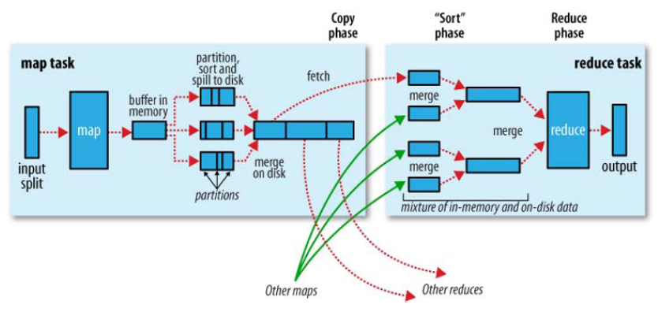

shuffle 并不是个组件，而是 mr 处理流程中的一个子过程，它过程开始于 maptask 把数据写入环形缓存一直到数据到 reduce 之间的整个过程

1. maptask 收集我们的 `map()` 方法输出的 kv 对，放到内存缓冲区中
2. 从内存缓冲区不断溢出本地磁盘文件，可能会溢出多个文件
3. 多个溢出文件会被合并成大的溢出文件
4. 在溢出过程中，及合并 Combine 的过程中，都要调用 partitoner 进行分组和针对 key 进行排序 (compare)
5. reducetask 根据自己的分区号，去各个 maptask 机器上取相应的结果分区数据
6. reducetask 会取到同一个分区的来自不同 maptask 的结果文件，reducetask 会将这些文件再进行合并（归并排序）
7. 合并成大文件后，shuffle 的过程也就结束了，后面进入 reducetask 的逻辑运算过程（从文件中取出一个个的键值对 group，调用用户自定义的 `reduce()`方法）
8. 缓冲区的大小可以通过参数调整, 参数：`mapreduce.task.io.sort.mb` 默认 100M

---
[官方文档](http://hadoop.apache.org/docs/stable/hadoop-mapreduce-client/hadoop-mapreduce-client-core/mapred-default.xml)
