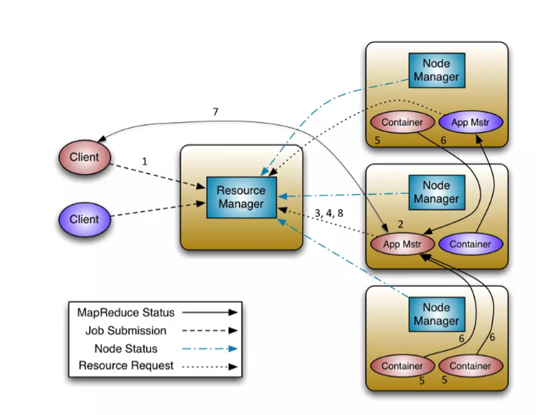

YARN 是运算资源调度系统，他只做运算资源的分配和调度，不参与用户程序内部的具体工作，所以 YARN 可以作为一个通用的资源调度平台

在 Hadoop1.x 的时候其实是没有 YRAN，当初的 MapReduce 由两个组件组成
* Job Tracker: 相当于 RM + MrAppMaster
* Task Tracker: 相当于 NM + Task(MapTask, ReduceTask)

---

1. 客户端程序向 ResourceManager 提交应用并请求一个 ApplicationMaster 实例
2. ResourceManager 找到一个可以运行一个 Container 的 NodeManager，并在这个 Container 中启动 ApplicationMaster 实例
3. ApplicationMaster 向 ResourceManager 进行注册 ，注册之后客户端就可以查询 ResourceManager 获得自己 ApplicationMaster 的详细信息 ，以后就可以和自己的 ApplicationMaster 直接交互了（这个时候，客户端主动和 ApplicationMaster 交互，应用先向 ApplicationMaster 发送一个满足自己需求的资源请求）
4. 在平常的操作过程中，ApplicationMaster 根据协议向 ResourceManager 发送资源请求
5. 当 Container 被成功分配后，ApplicationMaster 通过向 NodeManager 发送信息来启动 Container，信息包含了能够让 Container 和 ApplicationMaster 交互所需要的资料
6. 应用程序的代码以 task 形式在启动的 Container 中运行，并把运行的进度、状态等信息通过协议发送给 ApplicationMaster
7. 在应用程序运行期间，提交应用的客户端主动和 ApplicationMaster 交流获得应用的运行状态、进度更新等信息
8. 一旦应用程序执行完成并且所有相关工作也已经完成，ApplicationMaster 向 ResourceManager 取消注册然后关闭，用到所有的 Container 也归还给系统

