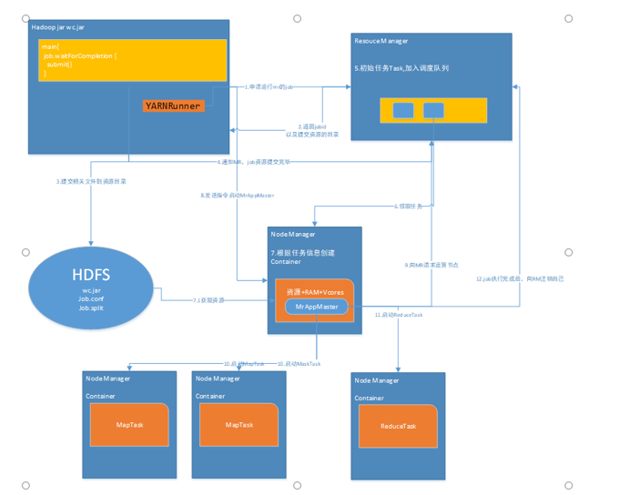

1. 应用申请运行RM的JOB
2. RM返回JOBID以及提交资源的目录
3. 应用提交相关文件到资源目录
4. 通知RM, JOB资源提交完毕
5. RM初始任务TASK, 加入调度队列
6. 空闲NM领取任务
7. NM根据任务信息创建Container (并且从资源目录获取JOB资源)
8. 应用发送指令启动NM的MrAppMaster
9. MrAppMaster向RM请求运算节点
10. MrAppMaster向请求回来的运算节点中启动MapTask
11. MrAppMaster向请求回来的运算节点中启动ReduceTask
12. JOB执行完成后, MrAppMaster向RM注销自己
