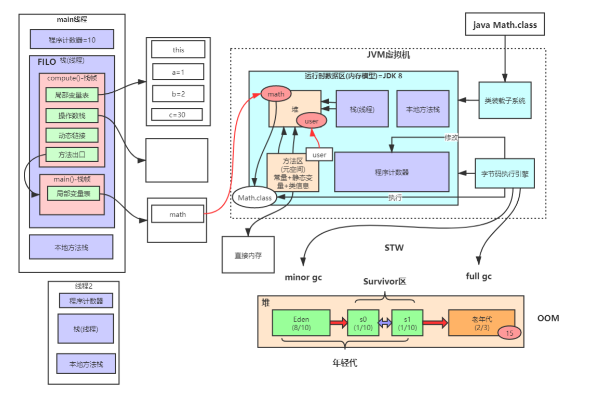
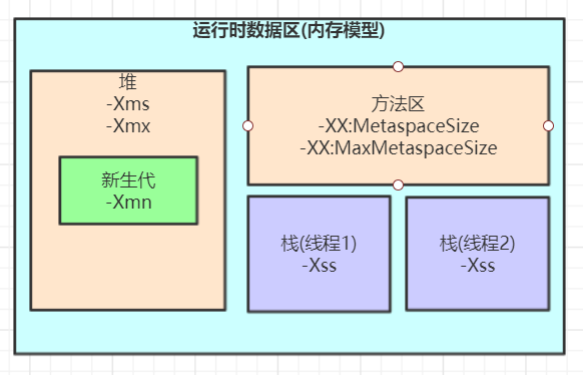
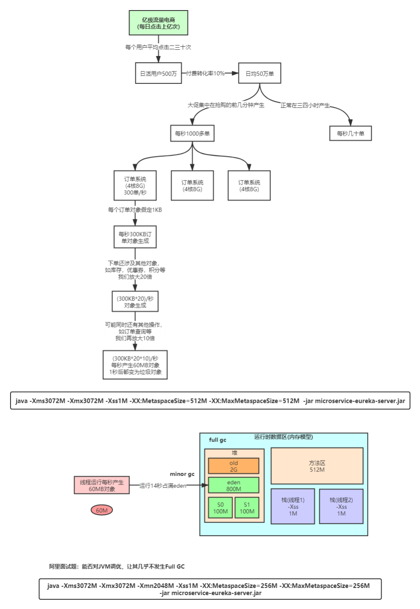

::: tip 介绍
1. JVM 内存模型
2. JVM 内存核心参数
3. 存调优案例
:::

## JVM 内存模型

## JVM 内存核心参数

- 关于元空间的JVM参数有两个：`-XX:MetaspaceSize=N` 和 `-XX:MaxMetaspaceSize=N`
	- `-XX:MaxMetaspaceSize` ： 设置元空间最大值， 默认是 -1， 即不限制， 或者说只受限于本地内存大小
	- `-XX:MetaspaceSize`： 指定元空间触发Fullgc的初始阈值(元空间无固定初始大小)， 以字节为单位，默认是21M，达到该值就会触发full gc进行类型卸载
		- 同时收集器会对该值进行调整： 如果释放了大量的空间， 就适当降低该值； 如果释放了很少的空间， 那么在不超过 `-XX:MaxMetaspaceSize`（如果设置了的话） 的情况下， 适当提高该值
		- 这个跟早期jdk版本的 `-XX:PermSize` 参数意思不一样，`-XX:PermSize` 代表永久代的初始容量
	- 由于调整元空间的大小需要Full GC，这是非常昂贵的操作，如果应用在启动的时候发生大量Full GC，通常都是由于永久代或元空间发生了大小调整，基于这种情况，一般建议在JVM参数中将 MetaspaceSize 和 MaxMetaspaceSize 设置成一样的值，并设置得比初始值要大，对于 8G 物理内存的机器来说，一般我会将这两个值都设置为 256M
- `-Xss` 设置越小，说明一个线程栈里能分配的栈帧就越少，但是对 JVM 整体来说能开启的线程数会更多
- 尽可能让对象都在新生代里分配和回收，尽量别让太多对象频繁进入老年代，避免频繁对老年代进行垃圾回收，同时给系统充足的内存大小，避免新生代频繁的进行垃圾回收

## 内存调优案例

