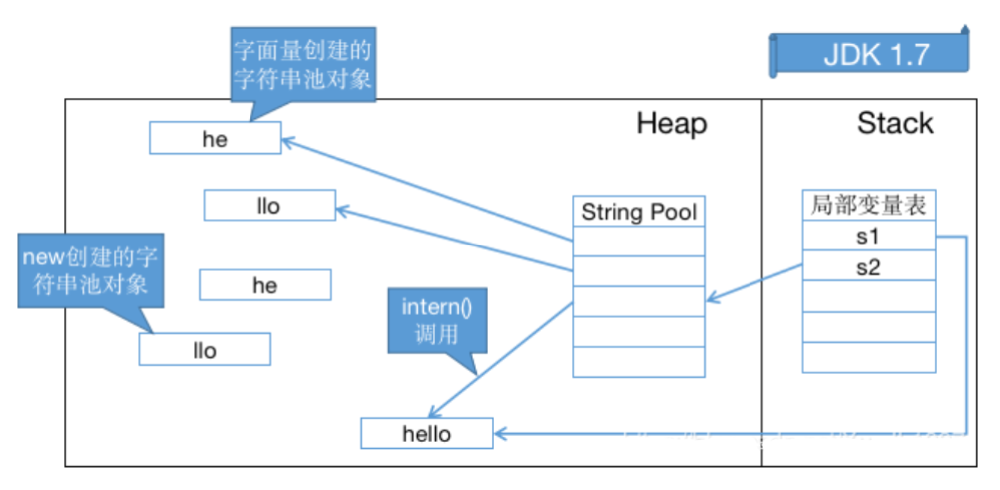
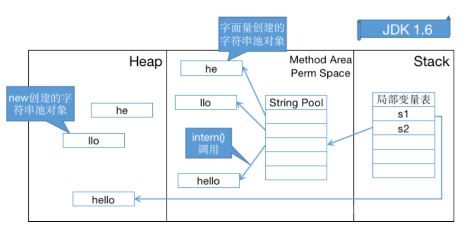

::: tip 介绍
1. Class 常量池与运行时常量池
2. 字符串常量池
3. 八种基本类型的包装类和对象池
:::

## Class 常量池与运行时常量池

- Class 常量池与运行时常量池（`javap -v Xxx.class` -> Constant pool）：常量池中主要存放字面量和符号引用
	- Class常量池可以理解为是Class文件中的资源仓库
		- Class文件中除了包含类的版本、字段、方法、接口等描述信息外， 还有一项信息就是常量池(constant pool table)，用于存放编译期生成的各种字面量(Literal)和符号引用(Symbolic References)
	- 字面量：就是指由字母、数字等构成的字符串或者数值常量
		- 字面量只可以右值出现，所谓右值是指等号右边的值，如：int a=1 这里的a为左值，1为右值
	- 符号引用：是编译原理中的概念，是相对于直接引用来说的
		- 主要包括了三类常量：类和接口的全限定名；字段的名称和描述符；方法的名称和描述符
	- 运行时常量池：这些常量池现在是静态信息，只有到运行时被加载到内存后，这些符号才有对应的内存地址信息，这些常量池一旦被装入内存就变成运行时常量池
		- 例如，compute()这个符号引用在运行时就会被转变为compute()方法具体代码在内存中的 地址，主要通过对象头里的类型指针去转换直接引用

## 字符串常量池
- 字符串常量池
	- 设计思想
		- 字符串的分配，和其他的对象分配一样，耗费高昂的时间与空间代价，作为最基础的数据类型，大量频繁的创建字符串，极大程度地影响程序的性能
		- JVM为了提高性能和减少内存开销，在实例化字符串常量的时候进行了一些优化
			- 为字符串开辟一个字符串常量池，类似于缓存区
			- 创建字符串常量时，首先查询字符串常量池是否存在该字符串
			- 存在该字符串，返回引用实例，不存在，实例化该字符串并放入池中
	- 三种字符串操作
		- 直接赋值字符串（指向常量池中的引用）：`String s = "jxch";`
			- 这种方式创建的字符串对象，只会在常量池中
			- 创建对象s的时候，JVM会先去常量池中通过 equals(key) 方法，判断是否有相同的对象
				- 如果有，则直接返回该对象在常量池中的引用
				- 如果没有，则会在常量池中创建一个新对象，再返回引用
		- `String s = new String("jxch");` （指向内存中的对象引用）
			- 这种方式会保证字符串常量池和堆中都有这个对象，没有就创建，最后返回堆内存中的对象引用
			- 先检查字符串常量池中是否存在字符串
				- 不存在，先在字符串常量池里创建一个字符串对象；再去内存中创建一个字符串对象
				- 存在的话，就直接去堆内存中创建一个字符串对象
			- 最后，将内存中的引用返回
		- `intern` 方法是一个 native 的方法
			- 如果池已经包含一个等于此String对象的字符串（equals(oject)），则返回池中的字符串
			- 否则，将intern返回的引用指向当前字符串
				- 在 JDK 1.7 (及以上版本) 中，由于字符串池不在永久代了，intern() 做了一些修改，更方便地利用堆中的对象（字符串不存在时不再需要重新创建实例，可以直接指向堆上的实例）
				- jdk1.6版本需要将字符串复制到字符串常量池里
	- 常量池的位置
		- Jdk1.6及之前： 有永久代, 运行时常量池在永久代，运行时常量池包含字符串常量池
		- Jdk1.7：有永久代，但已经逐步“去永久代”，字符串常量池从永久代里的运行时常量池分离到堆里
		- Jdk1.8及之后： 无永久代，运行时常量池在元空间，字符串常量池里依然在堆里
	- 设计原理：类似 HashTable ，本质上是字符串对象的引用

## 八种基本类型的包装类和对象池
- 八种基本类型的包装类和对象池
	- java中基本类型的包装类的大部分都实现了常量池技术 (严格来说应该叫对象池，在堆上)
	- Byte,Short,Integer,Long,Character,Boolean （另外两种浮点数类型的包装类则没有实现对象池）
	- Byte,Short,Integer,Long,Character这5种整型的包装类也只是在对应值小于等于127时才可使用对象池
		- 即对象不负责创建和管理大于127的这些类的对象
		- 一般这种比较小的数用到的概率相对较大


## 字符串常量池示例

```java
String s1 = new String("he") + new String("llo");
String s2 = s1.intern();
 
System.out.println(s1 == s2);
// 在 JDK 1.6 下输出是 false，创建了 6 个对象
// 在 JDK 1.7 及以上的版本输出是 true，创建了 5 个对象 
// 当然我们这里没有考虑GC，但这些对象确实存在或存在过
```






```java
String s0="zhuge"; 
String s1="zhuge"; 
String s2="zhu" + "ge";
System.out.println( s0==s1 ); //true 
System.out.println( s0==s2 ); //true

String s0="zhuge";
String s1=new String("zhuge");
String s2="zhu" + new String("ge");
System.out.println( s0==s1 ); // false 
System.out.println( s0==s2 )； // false 
System.out.println( s1==s2 ); // false

String a = "a1";
String b = "a" + 1;
System.out.println(a == b); // true
String a = "atrue";
String b = "a" + "true";
System.out.println(a == b); // true
String a = "a3.4";
String b = "a" + 3.4;
System.out.println(a == b); // true

String a = "ab"; 
String bb = "b"; 
String b = "a" + bb;
System.out.println(a == b); // false 由于在字符串的"+"连接中，有字符串引用存在，而引用的值在程序编译期是无法确定的

String a = "ab";
final String bb = "b"; 
String b = "a" + bb;
System.out.println(a == b); // true 对于final修饰的变量，它在编译时被解析为常量值的一个本地拷贝存储到自己的常量池中或嵌入到它的字节码流中

private static String getBB() { return "b"; }
String a = "ab";
final String bb = getBB(); 
String b = "a" + bb;
System.out.println(a == b); // false JVM对于字符串引用bb，它的值在编译期无法确定，只能在程序运行期调用方法后，将方法的返回值和"a"来动态连接并分配地址为b

String str1 = new StringBuilder("ja").append("va").toString();
System.out.println(str1 == str1.intern()); //false java是关键字，在JVM初始化的相关类里肯定早就放进字符串常量池了
```

::: info 注意
String是不可变的
:::

```java
String s = "a" + "b" + "c"; //就等价于String s = "abc";
String a = "a";
String b = "b";
String c = "c";
String s1 = a + b + c;

// `s1` 这个就不一样了，可以通过观察其 `JVM` 指令码发现 `s1` 的 `+` 操作会变成如下操作
StringBuilder temp = new StringBuilder(); 
temp.append(a).append(b).append(c);
String s = temp.toString();
```

## 包装类对象池示例

```java
 //5种整形的包装类Byte,Short,Integer,Long,Character的对象，
 //在值小于127时可以使用对象池
 Integer i1 = 127; //这种调用底层实际是执行的Integer.valueOf(127)，里面用到了IntegerCache对象池 
 Integer i2 = 127;
 System.out.println(i1 == i2);//输出true
 
 //值大于127时，不会从对象池中取对象
 Integer i3 = 128;
 Integer i4 = 128;
 System.out.println(i3 == i4);//输出false
 
 //用new关键词新生成对象不会使用对象池
 Integer i5 = new Integer(127);
 Integer i6 = new Integer(127);
 System.out.println(i5 == i6);//输出false
 
 //Boolean类也实现了对象池技术
 Boolean bool1 = true;
 Boolean bool2 = true;
 System.out.println(bool1 == bool2);//输出true
 
 //浮点类型的包装类没有实现对象池技术
 Double d1 = 1.0;
 Double d2 = 1.0;
 System.out.println(d1 == d2);//输出false
```


