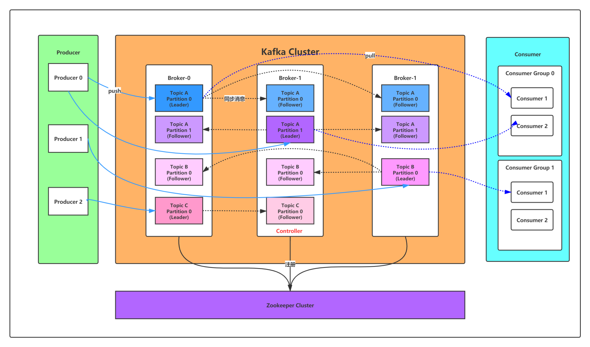
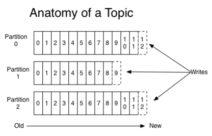
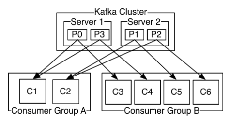

:::tip
- 核心组件
- 配置文件
- 基础命令
- Topic
- Kafka集群
- Java客户端 & SpringBoot支持
:::

---
## 核心组件


| 名称            | 解释                                                                                                           |
| ------------- | ------------------------------------------------------------------------------------------------------------ |
| Broker        | 消息中间件处理节点，一个Kafka节点就是一个broker，一<br>个或者多个Broker可以组成一个Kafka集群                                                  |
| Topic         | Kafka根据topic对消息进行归类，发布到Kafka集群的每条<br>消息都需要指定一个topic                                                          |
| Producer      | 消息生产者，向Broker发送消息的客户端                                                                                        |
| Consumer      | 消息消费者，从Broker读取消息的客户端                                                                                        |
| ConsumerGroup | 每个Consumer属于一个特定的Consumer Group，一条消<br>息可以被多个不同的Consumer Group消费，但是一个<br>Consumer Group中只能有一个Consumer能够消费该消息 |
| Partition     | 物理上的概念，一个topic可以分为多个partition，每个<br>partition内部消息是有序的                                                        |



---
## 配置文件

- 配置：`server.properties`
```properties
#broker.id属性在kafka集群中必须要是唯一
broker.id=0
#kafka部署的机器ip和提供服务的端口号
listeners=PLAINTEXT://192.168.65.60:9092
#kafka的消息存储文件
log.dir=/usr/local/data/kafka‐logs
#kafka连接zookeeper的地址
zookeeper.connect=192.168.65.60:2181
```
- 默认配置

| Property                   | Default                       | Description                                                                                                                                                      |
| -------------------------- | ----------------------------- | ---------------------------------------------------------------------------------------------------------------------------------------------------------------- |
| broker.id                  | 0                             | 每个broker都可以用一个唯一的非负整数id进行标识；这个id可以作为<br>broker的“名字”，你可以选择任意你喜欢的数字作为id，只要id是唯<br>一的即可                                                                             |
| log.dirs                   | /tmp/kafka-logs               | kafka存放数据的路径。这个路径并不是唯一的，可以是多个，路径之间<br>只需要使用逗号分隔即可；每当创建新partition时，都会选择在包含最<br>少partitions的路径下进行                                                                  |
| listeners                  | PLAINTEXT://192.168.65.60:909 | server接受客户端连接的端口，ip配置kafka本机ip即可                                                                                                                                 |
| zookeeper.connect          | localhost:2181                | zooKeeper连接字符串的格式为：hostname:port，此处hostname和<br>port分别是ZooKeeper集群中某个节点的host和port；zookeeper如果<br>是集群，连接方式为 hostname1:port1, hostname2:port2, <br>hostname3:port3 |
| log.retention.hours        | 168                           | 每个日志文件删除之前保存的时间。默认数据保存时间对所有topic都一样                                                                                                                              |
| num.partitions             | 1                             | 创建topic的默认分区数                                                                                                                                                    |
| default.replication.factor | 1                             | 自动创建topic的默认副本数量，建议设置为大于等于2                                                                                                                                      |
| min.insync.replicas        | 1                             | 当producer设置acks为-1时，min.insync.replicas指定replicas的最小<br>数目（必须确认每一个repica的写数据都是成功的），如果这个数目没<br>有达到，producer发送消息会产生异常                                              |
| delete.topic.enable        | false                         | 是否允许删除主题                                                                                                                                                         |

---
## 基础命令

- 启动：`kafka‐server‐start.sh ‐daemon server.properties`
	- ­`-daemon` 表示以后台进程运行，否则ssh客户端退出后，就会停止服务
	- 在启动kafka时会使用linux主机名关联的ip地址，所以需要把主机名和linux的ip映射配置到本地host里，用 `vim /etc/hosts`
- 停止：`kafka‐server‐stop.sh`
- 创建主题：当producer发布一个消息到某个指定的Topic，这个Topic如果不存在，就自动创建
	- `kafka‐topics.sh ‐‐create ‐‐zookeeper 192.168.65.60:2181 ‐‐replication‐factor 1 ‐‐partitions 1 ‐‐topic test`
	- `kafka‐topics.sh ‐‐create ‐‐zookeeper 192.168.65.60:2181 ‐‐replication‐factor 1 ‐‐partitions 2 ‐‐topic test`
	- `kafka‐topics.sh ‐‐list ‐‐zookeeper 192.168.65.60:2181`
- 查看Topic：`kafka‐topics.sh ‐‐describe ‐‐zookeeper 192.168.65.60:2181 ‐‐topic test`
	- 第一行是所有分区的概要信息，之后的每一行表示每一个partition的信息
	- leader节点负责给定partition的所有读写请求
	- replicas 表示某个partition 在哪几个 broker上存在备份。不管这个几点是不是”leader“，甚至这个节点挂了，也会列出
	- isr 是replicas的一个子集，它只列出当前还存活着的，并且已同步备份了该partition的节点。leader的选举也是从ISR(in-sync replica)中进行的
- 增加Topic的分区数量（目前不支持减少分区）：`kafka‐topics.sh ‐alter ‐‐partitions 3 ‐‐zookeeper 192.168.65.60:2181 ‐‐topic test`
- 删除主题：`kafka‐topics.sh ‐‐delete ‐‐topic test ‐‐zookeeper 192.168.65.60:2181`
- 发送消息：`kafka‐console‐producer.sh ‐‐broker‐list 192.168.65.60:9092 ‐‐topic test`
- 消费消息：默认是消费最新的消息
	- `kafka‐console‐consumer.sh ‐‐bootstrap‐server 192.168.65.60:9092 ‐‐topic test`
	- `kafka‐console‐consumer.sh ‐‐bootstrap‐server 192.168.65.60:9092 ‐‐from‐beginning ‐‐topic test`
- 消费多主题：`kafka‐console‐consumer.sh ‐‐bootstrap‐server 192.168.65.60:9092 ‐‐whitelist "test|test‐2"`
- 单播消费：只需让消费者在同一个消费组里即可
	- `kafka‐console‐consumer.sh ‐‐bootstrap‐server 192.168.65.60:9092 ‐‐consumer‐property group.id=testGroup ‐‐topic test`
- 多播消费：只要保证这些消费者属于不同的消费组即可
	- `kafka‐console‐consumer.sh ‐‐bootstrap‐server 192.168.65.60:9092 ‐‐consumer‐property group.id=testGroup‐2 ‐‐topic test`
- 生产消费集群消息
	- `kafka‐console‐producer.sh ‐‐broker‐list 192.168.65.60:9092,192.168.65.60:9093,192.168.65.60:9094 ‐‐topic my‐replicated‐topic`
	- `kafka‐console‐consumer.sh ‐‐bootstrap‐server 192.168.65.60:9092,192.168.65.60:9093,192.168.65.60:9094 ‐‐from‐beginning ‐‐topic my‐replicated‐topic`
- 查看消费组名：`kafka‐consumer‐groups.sh ‐‐bootstrap‐server 192.168.65.60:9092 ‐‐list`
- 查看消费组的消费偏移量：`kafka‐consumer‐groups.sh ‐‐bootstrap‐server 192.168.65.60:9092 ‐‐describe ‐‐group testGroup`
	- current-offset：当前消费组的已消费偏移量
	- log-end-offset：主题对应分区消息的结束偏移量(HW)
	- lag：当前消费组未消费的消息数
---
## Topic

- 同类消息发送到同一个Topic下面。对于每一个Topic，下面可以有多个分区(Partition)日志文件
	- 
	- Partition是一个有序的message序列，这些message按顺序添加到一个叫做commit log的文件中。每个partition中的消息都有一个唯一的编号，称之为offset，用来唯一标示某个分区中的message
	- 每个partition，都对应一个commit log文件。一个partition中的message的offset都是唯一的，但是不同的partition中的message的offset可能是相同的
	- kafka一般不会删除消息，不管这些消息有没有被消费。只会根据配置的日志保留时间(log.retention.hours)确认消息多久被删除，默认保留最近一周的日志消息。kafka的性能与保留的消息数据量大小没有关系，因此保存大量的数据消息日志信息不会有什么影响
	- 每个consumer是基于自己在commit log中的消费进度(offset)来进行工作的。在kafka中，消费offset由consumer自己来维护；一般情况下我们按照顺序逐条消费commit log中的消息，当然可以通过指定offset来重复消费某些消息，或者跳过某些消息
	- 这意味kafka中的consumer对集群的影响是非常小的，添加一个或者减少一个consumer，对于集群或者其他consumer来说，都是没有影响的，因为每个consumer维护各自的消费offset
- 对Topic下数据进行分区存储
	- commit log文件会受到所在机器的文件系统大小的限制，分区之后可以将不同的分区放在不同的机器上，相当于对数据做了分布式存储，理论上一个topic可以处理任意数量的数据
	- 提高并行度
---
## Kafka集群

- kafka集群：一个单独的broker意味着kafka集群中只有一个节点。要想增加kafka集群中的节点数量，只需要多启动几个broker实例即可
	- kafka将很多集群关键信息记录在zookeeper里，保证自己的无状态，从而在水平扩容时非常方便
- 集群消费
	- log的partitions分布在kafka集群中不同的broker上，每个broker可以请求备份其他broker上partition上的数据。kafka集群支持配置一个partition备份的数量
	- 针对每个partition，都有一个broker起到“leader”的作用，0个或多个其他的broker作为“follwers”的作用
	- leader处理所有的针对这个partition的读写请求，而followers被动复制leader的结果，不提供读写(主要是为了保证多副本数据与消费的一致性)。如果这个leader失效了，其中的一个follower将会自动的变成新的leader
- Producers：生产者将消息发送到topic中去，同时负责选择将message发送到topic的哪一个partition中。通过round­-robin做简单的负载均衡。也可以根据消息中的某一个关键字来进行区分。通常第二种方式使用的更多
- Consumers：consumer group
	- queue 模式：consumer 位于同一个 consumer group 下
	- publish-subscribe 模式：consumer 有自己唯一的 consumer group
	- 
- 消费顺序：一个partition同一个时刻在一个consumer group中只能有一个consumer instance在消费，从而保证消费顺序
	- Kafka只在partition的范围内保证消息消费的局部顺序性，不能在同一个topic中的多个partition中保证总的消费顺序性
	- 如果有在总体上保证消费顺序的需求，那么我们可以通过将topic的partition数量设置为1，将consumer group中的consumer instance数量也设置为1，但是这样会影响性能，所以kafka的顺序消费很少用
	- consumer group中的consumer instance的数量不能比一个Topic中的partition的数量多，否则，多出来的consumer消费不到消息
---
## Java客户端

- 绑定Kafka服务器
```java
Properties props = new Properties();
props.put(ProducerConfig.BOOTSTRAP_SERVERS_CONFIG, "192.168.65.60:9092,192.168.65.60:9093,192.168.65.60:9094");
// 生产者
Producer<String, String> producer = new KafkaProducer<String, String>(props);
// 消费者
KafkaConsumer<String, String> consumer = new KafkaConsumer<String, String>(props);
```
- 生产者配置
```java
/* 
 * 发出消息持久化机制参数
 * acks=0： 表示producer不需要等待任何broker确认收到消息的回复，就可以继续发送下一条消息。性能最高，但是最容易丢消息
 * acks=1： 至少要等待leader已经成功将数据写入本地log，但是不需要等待所有follower是否成功写入，就可以继续发送下一条消息
 *          如果follower没有成功备份数据，而此时leader又挂掉，则消息会丢失
 * acks=‐1或all： 需要等待 min.insync.replicas(默认为1，推荐配置大于等于2) 这个参数配置的副本个数都成功写入日志
 *                这种策略会保证只要有一个备份存活就不会丢失数据。这是最强的数据保证。一般除非是金融级别，或跟钱打交道的场景才会使用这种配置
 */
props.put(ProducerConfig.ACKS_CONFIG, "1");
// 发送失败重试次数，重试能保证消息发送的可靠性，但是也可能造成消息重复发送，需要接收者做好消息接收的幂等性处理
props.put(ProducerConfig.RETRIES_CONFIG, 3);
// 重试间隔设置，默认重试间隔100ms
props.put(ProducerConfig.RETRY_BACKOFF_MS_CONFIG, 300);
// 设置发送消息的本地缓冲区，如果设置了该缓冲区，消息会先发送到本地缓冲区，可以提高消息发送性能，默认值是33554432，即32MB
props.put(ProducerConfig.BUFFER_MEMORY_CONFIG, 33554432);
// kafka本地线程会从缓冲区取数据，批量发送到broker，设置批量发送消息的大小，默认值是16384，即16kb，就是说一个batch满了16kb就发送出去
props.put(ProducerConfig.BATCH_SIZE_CONFIG, 16384);
/* 
 * batch最大的延迟发送时间
 * 默认值是0：意思就是消息必须立即被发送，但这样会影响性能
 * 一般设置10毫秒左右，就是说这个消息发送完后会进入本地的一个batch，如果10毫秒内，这个batch满了16kb就会随batch一起被发送出去
 * 如果10毫秒内，batch没满，那么也必须把消息发送出去，不能让消息的发送延迟时间太长
 * 
 *  消息 -> 本地缓冲区（32M）-> batch（16k）-> 发送（10ms batch不满也发送）
 */
props.put(ProducerConfig.LINGER_MS_CONFIG, 10);
// 把发送的key和value从字符串序列化为字节数组
props.put(ProducerConfig.KEY_SERIALIZER_CLASS_CONFIG, StringSerializer.class.getName());
props.put(ProducerConfig.VALUE_SERIALIZER_CLASS_CONFIG, StringSerializer.class.getName());
```
- 生产者发送消息：指定分区；不指定分区；同步；异步
```java
// 指定发送分区
var producerRecord = new ProducerRecord<String, String>(TOPIC_NAME, 0, key_json, value_json);
// 未指定发送分区，具体发送的分区计算公式：hash(key) % partitionNum
var producerRecord = new ProducerRecord<String, String>(TOPIC_NAME, key_json, value_json);
// 等待消息发送成功的同步阻塞方法
RecordMetadata metadata = producer.send(producerRecord).get();
// 异步回调方式发送消息
producer.send(producerRecord, new Callback() {
	public void onCompletion(RecordMetadata metadata, Exception exception) {
		// 处理异常
	}
});
// 关闭
producer.close();
```
- 消费配置
```java
// 消费分组名
props.put(ConsumerConfig.GROUP_ID_CONFIG, CONSUMER_GROUP_NAME);
// 是否自动提交offset，默认就是true
props.put(ConsumerConfig.ENABLE_AUTO_COMMIT_CONFIG, "true");
// 自动提交offset的间隔时间
props.put(ConsumerConfig.AUTO_COMMIT_INTERVAL_MS_CONFIG, "1000");
/* 
 * 当消费主题的是一个新的消费组，或者指定offset的消费方式，offset不存在，那么应该如何消费
 * latest(默认) ：只消费自己启动之后发送到主题的消息
 * earliest：第一次从头开始消费，以后按照消费offset记录继续消费，这个需要区别于 consumer.seekToBeginning(每次都从头开始消费)
 */
props.put(ConsumerConfig.AUTO_OFFSET_RESET_CONFIG, "earliest");
// consumer给broker发送心跳的间隔时间，broker接收到心跳如果此时有rebalance发生会通过心跳响应将rebalance方案下发给consumer，这个时间可以稍微短一点
props.put(ConsumerConfig.HEARTBEAT_INTERVAL_MS_CONFIG, 1000);
// 服务端broker多久感知不到一个consumer心跳就认为他故障了，会将其踢出消费组，对应的Partition也会被重新分配给其他consumer，默认是10秒
props.put(ConsumerConfig.SESSION_TIMEOUT_MS_CONFIG, 10 * 1000);
// 一次poll最大拉取消息的条数，如果消费者处理速度很快，可以设置大点，如果处理速度一般，可以设置小点
props.put(ConsumerConfig.MAX_POLL_RECORDS_CONFIG, 500);
// 如果两次poll操作间隔超过了这个时间，broker就会认为这个consumer处理能力太弱，会将其踢出消费组，将分区分配给别的consumer消费
props.put(ConsumerConfig.MAX_POLL_INTERVAL_MS_CONFIG, 30 * 1000);
// 把发送的key和value从字符串序列化为字节数组
props.put(ConsumerConfig.KEY_DESERIALIZER_CLASS_CONFIG, StringDeserializer.class.getName());
props.put(ConsumerConfig.VALUE_DESERIALIZER_CLASS_CONFIG, StringDeserializer.class.getName());
```
- 消费者接收消息（topic）：指定分区；回溯（从头，指定offset）；拉取集合
```java
// 订阅Topic
consumer.subscribe(Arrays.asList(TOPIC_NAME));
// 消费指定分区
consumer.assign(Arrays.asList(new TopicPartition(TOPIC_NAME, 0)));
// 回溯消费（从头消费 - seekToBeginning）
consumer.assign(Arrays.asList(new TopicPartition(TOPIC_NAME, 0)));
consumer.seekToBeginning(Arrays.asList(new TopicPartition(TOPIC_NAME, 0)));
// 指定offset消费
consumer.assign(Arrays.asList(new TopicPartition(TOPIC_NAME, 0)));
consumer.seek(new TopicPartition(TOPIC_NAME, 0), 10);
// 从指定时间点开始消费 - 1小时前
List<PartitionInfo> topicPartitions = consumer.partitionsFor(TOPIC_NAME);
long fetchDataTime = new Date().getTime() ‐ 1000 * 60 * 60;
Map<TopicPartition, Long> map = new HashMap<>();
for (PartitionInfo par : topicPartitions) {
	map.put(new TopicPartition(topicName, par.partition()), fetchDataTime);
}
// 遍历 value.offset(); 获取offset，然后指定offset消费
Map<TopicPartition, OffsetAndTimestamp> parMap = consumer.offsetsForTimes(map);
// 拉取消息集合
ConsumerRecords<String, String> records = consumer.poll(Duration.ofMillis(1000));
```
- 消费提交（offset）：同步；异步
```java
// 手动同步提交offset，当前线程会阻塞直到offset提交成功，一般使用同步提交，因为提交之后一般也没有什么逻辑代码了
consumer.commitSync();
// 手动异步提交offset，当前线程提交offset不会阻塞，可以继续处理后面的程序逻辑
consumer.commitAsync(new OffsetCommitCallback() {
	@Override
	public void onComplete(Map<TopicPartition, OffsetAndMetadata> offsets, Exception ex) {
		// 处理异常
	}
});
```
---
## SpringBoot支持

- springboot配置application.yml
```yml
spring:
	kafka:
		bootstrap‐servers: 192.168.65.60:9092,192.168.65.60:9093,192.168.65.60:9094
		producer:
			retries: 3
			batch‐size: 16384
			buffer‐memory: 33554432
			acks: 1
			key‐serializer: org.apache.kafka.common.serialization.StringSerializer
			value‐serializer: org.apache.kafka.common.serialization.StringSerializer
		consumer:
			group‐id: default‐group
			enable‐auto‐commit: false
			auto‐offset‐reset: earliest
			key‐deserializer: xxx.StringDeserializer
			value‐deserializer: xxx.StringDeserializer
			listener:
				ack‐mode: manual_immediate
```
- ack‐mode
	- RECORD：当每一条记录被消费者监听器（ListenerConsumer）处理之后提交
	- BATCH：当每一批poll()的数据被消费者监听器处理之后提交
	- TIME：当每一批poll()的数据被消费者监听器处理之后，距离上次提交时间大于TIME时提交
	- COUNT：当每一批poll()的数据被消费者监听器处理之后，被处理record数量大于等于COUNT时提交
	- TIME | COUNT：有一个条件满足时提交
	- MANUAL：当每一批poll()的数据被消费者监听器处理之后, 手动调用Acknowledgment.acknowledge()后提交
	- MANUAL_IMMEDIATE：手动调用Acknowledgment.acknowledge()后立即提交，一般使用这种（一次提交一条消息）
- 生产者
```java
@Autowired
private KafkaTemplate<String, String> kafkaTemplate;
kafkaTemplate.send(TOPIC_NAME, 0, "key", "this is a msg");
```
- 消费者
```java
@KafkaListener(topics = "my‐replicated‐topic",groupId = "zhugeGroup")
public void listenZhugeGroup(ConsumerRecord<String, String> record, Acknowledgment ack) {
	String value = record.value();
	ack.acknowledge();  //手动提交offset
}

// 配置多个消费组（再写一个消费组处理同一个topic）
@KafkaListener(topics = "my‐replicated‐topic",groupId = "tulingGroup")

// 配置多个topic，concurrency就是同组下的消费者个数，就是并发消费数，必须小于等于分区总数
@KafkaListener(groupId = "testGroup", topicPartitions = {
	@TopicPartition(topic = "topic1", partitions = {"0", "1"}),
	@TopicPartition(topic = "topic2", partitions = "0",
		partitionOffsets = @PartitionOffset(partition = "1", initialOffset = "100"))
},concurrency = "6")
```
---
- Kafka事务
```java
Properties props = new Properties();
props.put("bootstrap.servers", "localhost:9092");
props.put("transactional.id", "my‐transactional‐id");
Producer<String, String> producer = new KafkaProducer<>(props, new StringSerializer(), new StringSerializer());
producer.initTransactions();      // 初始化事务
try {
	producer.beginTransaction();  // 开启事务
	producer.send(/*...*/);       // 发到不同的主题的不同分区
	producer.commitTransaction(); // 提交事务
} catch (ProducerFencedException | OutOfOrderSequenceException | AuthorizationException e) {
	producer.close();
} catch (KafkaException e) {
	producer.abortTransaction();  // 回滚事务
}
producer.close();
```


