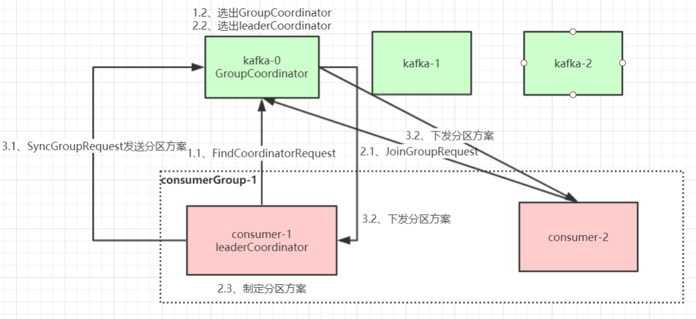
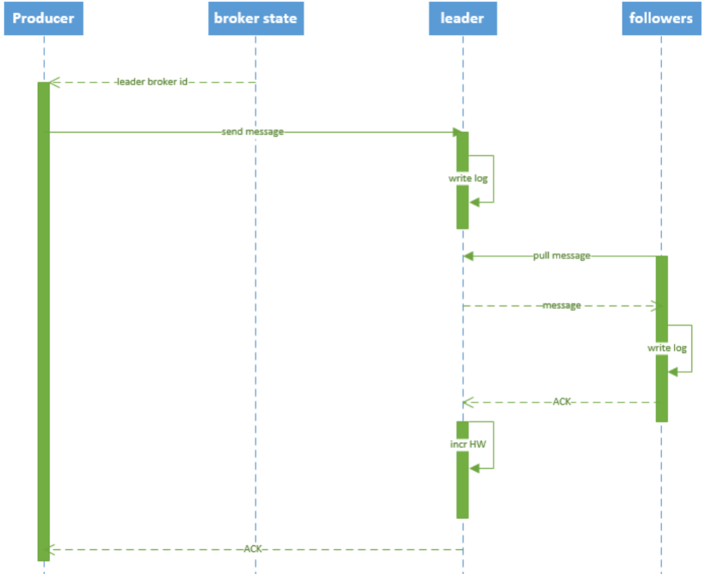
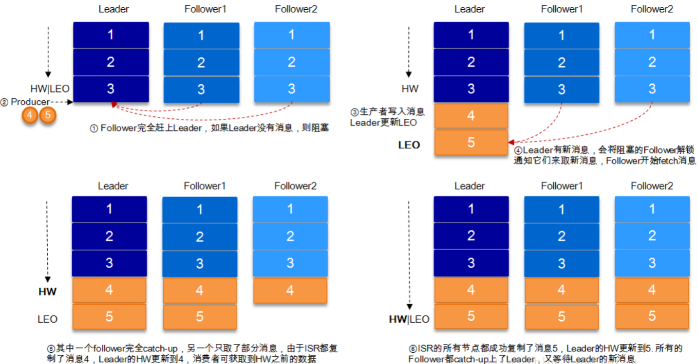
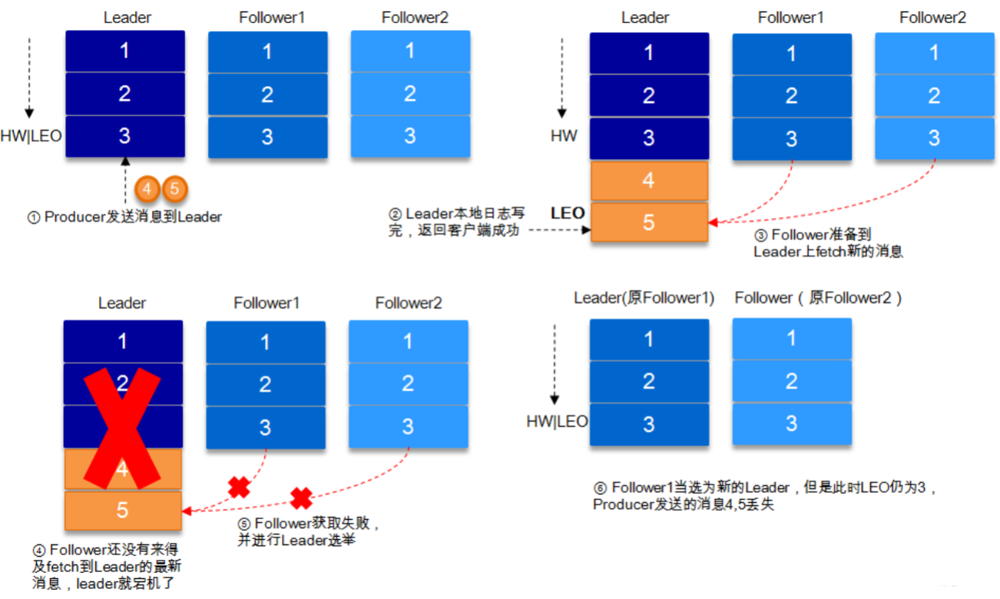

:::tip
- Controller
- Leader - Partition
- Rebalance
- 消息发布机制
- HW与LEO
- 日志分段
- zookeeper
:::

---
## Controller

- Kafka核心总控制器Controller：在Kafka集群中会有一个或者多个broker，其中有一个broker会被选举为控制器（Kafka Controller），它负责管理整个集群中所有分区和副本的状态
	- 当某个分区的leader副本出现故障时，由控制器负责为该分区选举新的leader副本
	- 当检测到某个分区的ISR集合发生变化时，由控制器负责通知所有broker更新其元数据信息
	- 当使用kafka-topics.sh脚本为某个topic增加分区数量时，同样还是由控制器负责让新分区被其他节点感知到
- Controller选举机制
	- zookeeper临时节点的创建来选举controller：在kafka集群启动的时候，会自动选举一台broker作为controller来管理整个集群，选举的过程是集群中每个broker都会尝试在zookeeper上创建一个 /controller 临时节点，zookeeper会保证有且仅有一个broker能创建成功，这个broker就会成为集群的总控器controller
	- controller重新选举：当这个controller角色的broker宕机了，此时zookeeper临时节点会消失，集群里其他broker会一直监听这个临时节点，发现临时节点消失了，就竞争再次创建临时节点，就是我们上面说的选举机制，zookeeper又会保证有一个broker成为新的controller
- 具备控制器身份的broker需要比其他普通的broker多一份职责，具体细节如下
	- 监听broker相关的变化。为Zookeeper中的/brokers/ids/节点添加BrokerChangeListener，用来处理broker增减的变化
	- 监听topic相关的变化。为Zookeeper中的/brokers/topics节点添加TopicChangeListener，用来处理topic增减的变化；为Zookeeper中的/admin/delete_topics节点添加TopicDeletionListener，用来处理删除topic的动作
	- 从Zookeeper中读取获取当前所有与topic、partition以及broker有关的信息并进行相应的管理。对于所有topic所对应的Zookeeper中的/brokers/topics/\[topic\]节点添加PartitionModificationsListener，用来监听topic中的分区分配变化
	- 更新集群的元数据信息，同步到其他普通的broker节点中
---
## Leader - Partition

- Partition副本选举Leader机制
	- controller感知到分区leader所在的broker挂了（controller监听了很多zk节点可以感知到broker存活）
	- controller会从ISR列表(参数unclean.leader.election.enable=false的前提下)里挑第一个broker作为leader(第一个broker最先放进ISR列表，可能是同步数据最多的副本)
	- 如果参数unclean.leader.election.enable为true，代表在ISR列表里所有副本都挂了的时候可以在ISR列表以外的副本中选leader，这种设置，可以提高可用性，但是选出的新leader有可能数据少很多
- 副本进入ISR列表有两个条件
	- 必须能与zookeeper保持会话以及跟leader副本网络连通
	- 副本能复制leader上的所有写操作，并且不能落后太多
		- 与leader副本同步滞后的副本，是由 replica.lag.time.max.ms 配置决定的，超过这个时间都没有跟leader同步过的一次的副本会被移出ISR列表
- 消费者消费消息的offset记录机制
	- 每个consumer会定期将自己消费分区的offset提交给kafka内部topic：\_\_consumer_offsets
		- 提交过去的时候，key是consumerGroupId+topic+分区号，value就是当前offset的值
		- kafka会定期清理topic里的消息，最后就保留最新的那条数据
	- 因为__consumer_offsets可能会接收高并发的请求，kafka默认给其分配50个分区(可以通过offsets.topic.num.partitions设置)，这样可以通过加机器的方式抗大并发
---
## Rebalance

- Rebalance分区分配策略（partition.assignment.strategy）：range（默认）、round-robin、sticky
	- range：按照分区序号排序，比如分区0~3给一个consumer，分区4~6给一个consumer，分区7~9给一个consumer
	- round-robin：轮询分配，比如分区0、3、6、9给一个consumer，分区1、4、7给一个consumer，分区2、5、8给一个consumer
	- sticky：与round-robin类似，但是在rebalance的时候，需要保证如下两个原则（当两者发生冲突时，第一个目标优先于第二个目标）
		- 分区的分配要尽可能均匀
		- 分区的分配尽可能与上次分配的保持相同
- Rebalance机制：如果消费组里的消费者数量有变化或消费的分区数有变化，kafka会重新分配消费者消费分区的关系。比如consumer group中某个消费者挂了，此时会自动把分配给他的分区交给其他的消费者，如果他又重启了，那么又会把一些分区重新交还给他
	- rebalance只针对subscribe这种不指定分区消费的情况，如果通过assign这种消费方式指定了分区，kafka不会进行rebanlance
	- rebalance过程中，消费者无法从kafka消费消息，这对kafka的TPS会有影响，如果kafka集群内节点较多，比如数百个，那重平衡可能会耗时极多，所以应尽量避免在系统高峰期的重平衡发生
- 触发消费者rebalance
	- 消费组里的consumer增加或减少了
	- 动态给topic增加了分区
	- 消费组订阅了更多的topic
- Rebalance过程：当有消费者加入消费组时，消费者、消费组及组协调器之间会经历以下几个阶段
	1. 选择组协调器（GroupCoordinator）：每个consumer group都会选择一个broker作为自己的组协调器coordinator，负责监控这个消费组里的所有消费者的心跳，以及判断是否宕机，然后开启消费者rebalance
		- consumer group中的每个consumer启动时会向kafka集群中的某个节点发送FindCoordinatorRequest请求来查找对应的组协调器GroupCoordinator，并跟其建立网络连接
		- 组协调器选择方式：通过如下公式可以选出consumer消费的offset要提交到__consumer_offsets的哪个分区，这个分区leader对应的broker就是这个consumer group的coordinator。说白了，leader分区所在的节点就是GroupCoordinator
	1. 加入消费组（JOIN GROUP），选择消费组协调器
		1. 在成功找到消费组所对应的 GroupCoordinator 之后就进入加入消费组的阶段，在此阶段的消费者会向 GroupCoordinator 发送 JoinGroupRequest 请求，并处理响应。
		2. 然后GroupCoordinator 从一个consumer group中选择第一个加入group（第一个与GroupCoordinator连接的consumer）的consumer作为leader(消费组协调器)
		3. 把consumer group情况发送给这个leader，接着这个leader会负责制定分区方案
	2. SYNC GROUP
		1. consumer leader通过给GroupCoordinator发送SyncGroupRequest
		2. 接着GroupCoordinator就把分区方案下发给各个consumer，他们会根据指定分区的leader broker进行网络连接以及消息消费

---
## 消息发布机制

- producer发布消息机制
	- 写入方式：producer 采用 push 模式将消息发布到 broker，每条消息都被 append 到 patition 中，属于顺序写磁盘（顺序写磁盘效率比随机写内存要高，保障 kafka 吞吐率）
	- 消息路由：producer 发送消息到 broker 时，会根据分区算法选择将其存储到哪一个 partition
		1. 指定了 patition，则直接使用
		2. 指定 patition 但指定 key，通过对 key 的 value 进行 hash 选出一个 patition 
		3. patition 和 key 都未指定，使用轮询选出一个 patition
	- 写入流程
		1. producer 先从 zookeeper 的 "/brokers/.../state" 节点找到该 partition 的 leader 
		2. producer 将消息发送给该 leader 
		3. leader 将消息写入本地 log 
		4. followers 从 leader pull 消息，写入本地 log 后向leader 发送 ACK
		5. leader 收到所有 ISR 中的 replica 的 ACK 后，增加 HW（high watermark，最后 commit 的 offset） 并向 producer 发送 ACK

---
## HW与LEO

- HW：HW俗称高水位，HighWatermark的缩写，取一个partition对应的ISR中最小的LEO(log-end-offset)作为HW，consumer最多只能消费到HW所在的位置。
	- 每个replica都有HW，leader和follower各自负责更新自己的HW的状态。
	- 对于leader新写入的消息，consumer不能立刻消费，leader会等待该消息被所有ISR中的replicas同步后更新HW，消息才能被consumer消费。
	- 这样就保证了如果leader所在的broker失效，该消息仍然可以从新选举的leader中获取。
	- 对于来自内部broker的读取请求，没有HW的限制
- 当producer生产消息至broker后，ISR以及HW和LEO的流转过程
	- 
- Kafka的复制机制既不是完全的同步复制，也不是单纯的异步复制，很好的均衡了确保数据不丢失以及吞吐率
- 当 acks=1
	- 

---
## 日志分段

- 日志分段存储：Kafka 一个分区的消息数据对应存储在一个文件夹下，以topic名称+分区号命名，消息在分区内是分段(segment)存储，每个段的消息都存储在不一样的log文件里，这种特性方便old segment file快速被删除，kafka规定了一个段位的 log 文件最大为 1G，做这个限制目的是为了方便把 log 文件加载到内存去操作
	- 00000000000000000000.index：部分消息的offset索引文件，kafka每次往分区发4K(可配置)消息就会记录一条当前消息的offset到index文件
		- 如果要定位消息的offset会先在这个文件里快速定位，再去log文件里找具体消息
	- 00000000000000000000.log：消息存储文件，主要存offset和消息体
	- 00000000000000000000.timeindex：息的发送时间索引文件，kafka每次往分区发4K(可配置)消息就会记录一条当前消息的发送时间戳与对应的offset到timeindex文件
		- 如果需要按照时间来定位消息的offset，会先在这个文件里查找
	- 文件名00000000000000000000就是表了这个日志段文件里包含的起始 Offset
- log.segment.bytes：限定了每个日志段文件的大小，最大就是 1GB
	- 一个日志段文件满了，就自动开一个新的日志段文件来写入，避免单个文件过大，影响文件的读写性能，这个过程叫做log rolling，正在被写入的那个日志段文件，叫做 active log segment。

