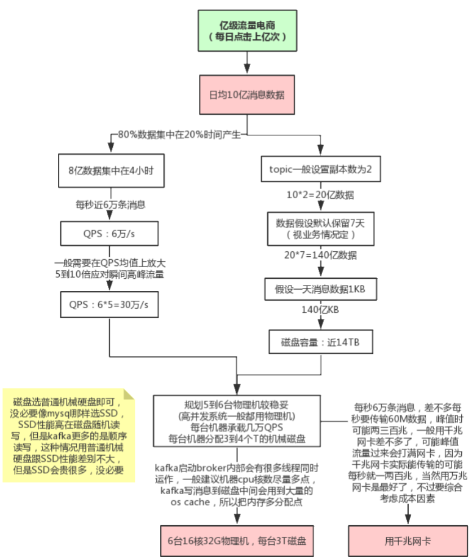
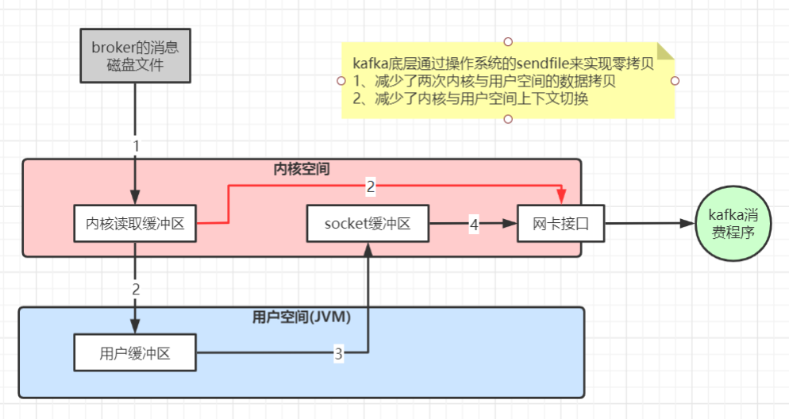

:::tip
- 环境规划
- 线上问题
- Kafka事务
- Kafka高性能原因
:::

---
## 环境规划

- Kafka可视化管理工具：kafka-manager
- 线上环境规划
	- 
- JVM参数设置：bin/kafka-start-server.sh 中的jvm设置
	- `export KAFKA_HEAP_OPTS="‐Xmx16G ‐Xms16G ‐Xmn10G ‐XX:MetaspaceSize=256M ‐XX:+UseG1GC ‐XX:MaxGCPauseMillis=50 ‐XX:G1HeapRegionSize=16M"`
	- 这种大内存的情况一般都要用G1垃圾收集器，因为年轻代内存比较大，用G1可以设置GC最大停顿时间，不至于一次minor gc就花费太长时间，当然，因为像kafka，rocketmq，es这些中间件，写数据到磁盘会用到操作系统的page cache，所以JVM内存不宜分配过大，需要给操作系统的缓存留出几个G
---
## 线上问题

- 消息丢失
	- 发送端：acks 设置
	- 消费端：如果消费这边配置的是自动提交，万一消费到数据还没处理完，就自动提交offset了，但是此时你consumer直接宕机了，未处理完的数据丢失了，下次也消费不到了
- 重复消费：一般消费端都是要做消费幂等处理的
	- 发送端：发送消息如果配置了重试机制，比如网络抖动时间过长导致发送端发送超时，实际broker可能已经接收到消息，但发送方会重新发送消息
	- 消费端：如果消费这边配置的是自动提交，刚拉取了一批数据处理了一部分，但还没来得及提交，服务挂了，下次重启又会拉取相同的一批数据重复处理
- 消息乱序
	- 如果发送端配置了重试机制，kafka不会等之前那条消息完全发送成功才去发送下一条消息，这样可能会出现，发送了1，2，3条消息，第一条超时了，后面两条发送成功，再重试发送第1条消息，这时消息在broker端的顺序就是2，3，1了
		- 是否一定要配置重试要根据业务情况而定。也可以用同步发送的模式去发消息，当然acks不能设置为0
	- kafka保证全链路消息顺序消费，需要从发送端开始，将所有有序消息发送到同一个分区，然后用一个消费者去消费，但是这种性能比较低
		- 可以在消费者端接收到消息后将需要保证顺序消费的几条消费发到内存队列(可以搞多个)，一个内存队列开启一个线程顺序处理消息
- 消息积压
	- 线上有时因为发送方发送消息速度过快，或者消费方处理消息过慢，可能会导致broker积压大量未消费消息
		- 如果积压了上百万未消费消息需要紧急处理，可以修改消费端程序，让其将收到的消息快速转发到其他topic(可以设置很多分区)，然后再启动多个消费者同时消费新主题的不同分区
	- 由于消息数据格式变动或消费者程序有bug，导致消费者一直消费不成功，也可能导致broker积压大量未消费消息
		- 可以将这些消费不成功的消息转发到其它队列里去(类似死信队列)，后面再慢慢分析死信队列里的消息处理问题
- 延时队列：消息被发送以后，并不想让消费者立刻获取，而是等待特定的时间后，消费者才能获取这个消息进行消费
	- 发送延时消息时先把消息按照不同的延迟时间段发送到指定的队列中（topic_1s，topic_5s，topic_10s，...topic_2h，这个一般不能支持任意时间段的延时）
	- 通过定时器进行轮训消费这些topic，查看消息是否到期，如果到期就把这个消息发送到具体业务处理的topic中
	- 队列中消息越靠前的到期时间越早，具体来说就是定时器在一次消费过程中，对消息的发送时间做判断，看下是否延迟到对应时间了，如果到了就转发，如果还没到这一次定时任务就可以提前结束了
- 消息回溯：对之前已消费的消息重新消费
	- 如果某段时间对已消费消息计算的结果觉得有问题，可能是由于程序bug导致的计算错误，当程序bug修复后，这时可能需要对之前已消费的消息重新消费
	- 可以指定从多久之前的消息回溯消费，这种可以用consumer的offsetsForTimes、seek等方法指定从某个offset偏移的消息开始消费
- 分区数与吞吐量：一般情况分区数跟集群机器数量相当就差不多了
	- `kafka‐producer‐perf‐test.sh ‐‐topic test ‐‐num‐records 1000000 ‐‐record‐size 1024 ‐‐throughput ‐1 ‐‐producer‐props bootstrap.servers=192.168.65.60:9092 acks=1`
	- 往test里发送一百万消息，每条设置1KB，throughput 用来进行限流控制，当设定的值小于 0 时不限流，当设定的值大于 0 时，当发送的吞吐量大于该值时就会被阻塞一段时间
	- 如果分区数设置过大，比如设置10000，可能会设置不成功，后台会报错"java.io.IOException : Too many open files"
		- `ulimit -n 65535` 调大文件描述符
- 消息传递保障
	- at most once（消费者最多收到一次消息，0-1次）：acks = 0 可以实现
	- at least once（消费者至少收到一次消息，1-多次）：ack = all 可以实现
	- exactly once（消费者刚好收到一次消息）：at least once 加上消费者幂等性可以实现，还可以用kafka生产者的幂等性来实现
		- kafka生产者的幂等性：因为发送端重试导致的消息重复发送问题，kafka的幂等性可以保证重复发送的消息只接收一次
			- 只需在生产者加上参数 `props.put("enable.idempotence", true)` 即可，默认是 false 不开启
			- 具体实现原理是，kafka每次发送消息会生成PID和Sequence Number，并将这两个属性一起发送给broker，broker会将PID和Sequence Number跟消息绑定一起存起来，下次如果生产者重发相同消息，broker会检查PID和Sequence Number，如果相同不会再接收
				- PID：每个新的 Producer 在初始化的时候会被分配一个唯一的 PID，这个PID 对用户完全是透明的。生产者如果重启则会生成新的PID
				- Sequence Number：对于每个 PID，该 Producer 发送到每个 Partition 的数据都有对应的序列号，这些序列号是从0开始单调递增的
			- 但是它只保证了生产者的幂等性，没保证消费者的幂等性，所以保险起见还是要再消费端考虑幂等性的问题
---
## Kafka事务

- kafka的事务：保障一次发送多条消息的事务一致性（流式计算场景）
	- Kafka的事务不同于Rocketmq，Rocketmq是保障本地事务(比如数据库)与mq消息发送的事务一致性，Kafka的事务主要是保障一次发送多条消息的事务一致性(要么同时成功要么同时失败)
	- 一般在kafka的流式计算场景用得多一点，比如，kafka需要对一个topic里的消息做不同的流式计算处理，处理完分别发到不同的topic里，这些topic分别被不同的下游系统消费(比如hbase，redis，es等)，这种我们肯定希望系统发送到多个topic的数据保持事务一致性。Kafka要实现类似Rocketmq的分布式事务需要额外开发功能
```java
Properties props = new Properties();
props.put("bootstrap.servers", "localhost:9092");
props.put("transactional.id", "my‐transactional‐id");
Producer<String, String> producer = new KafkaProducer<>(props, new StringSerializer(), new StringSerializer());

// 初始化事务
producer.initTransactions();
try {
	// 开启事务
	producer.beginTransaction();
	// 发到不同的主题的不同分区
	producer.send(/*...*/);

	// 提交事务
	producer.commitTransaction();
} catch (ProducerFencedException | OutOfOrderSequenceException | AuthorizationException e) {
	producer.close();
} catch (KafkaException e) {
	// 回滚事务
	producer.abortTransaction();
}
// 关闭
producer.close();
```
---
## Kafka高性能原因

- kafka高性能的原因
	- 磁盘顺序读写：kafka消息不能修改以及不会从文件中间删除保证了磁盘顺序读，kafka的消息写入文件都是追加在文件末尾，不会写入文件中的某个位置(随机写)保证了磁盘顺序写
	- 读写数据的批量batch处理以及压缩传输
	- 数据传输的零拷贝
		- 


