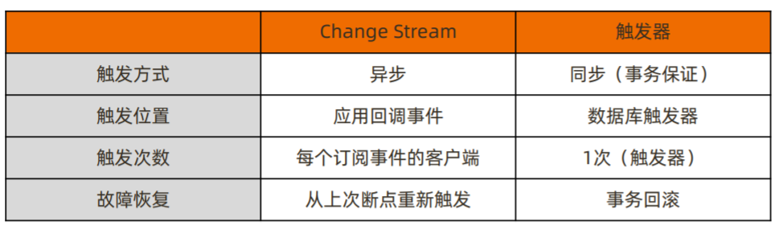
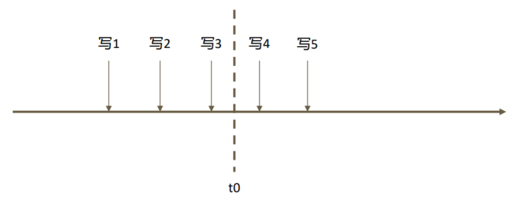

- Change Stream 指数据的变化事件流，MongoDB从3.6版本开始提供订阅数据变更的功能
	- 是用于实现变更追踪的解决方案
	- 
- Change Stream 的实现原理：是基于 oplog 实现的，提供推送实时增量的推送功能
	- 它在 oplog 上开启一个 tailable cursor 来追踪所有复制集上的变更操作，最终调用应用中定义的回调函数
	- 被追踪的变更事件主要包括
		- insert/update/delete：插入、更新、删除；
		- drop：集合被删除；
		- rename：集合被重命名；
		- dropDatabase：数据库被删除；
		- invalidate：drop/rename/dropDatabase 将导致 invalidate 被触发， 并关闭 change stream；
- 如果只对某些类型的变更事件感兴趣，可以使用使用聚合管道的过滤步骤过滤事件
	- `var cs = db.user.watch([{ $match:{operationType:{$in:["insert","delete"]}} }])`
- Change Stream会采用 `readConcern:majority` 这样的一致性级别，保证写入的变更不会被回滚
	- 未开启 majority readConcern 的集群无法使用 Change Stream；
	- 当集群无法满足 `{w:majority}` 时，不会触发 Change Stream（例如 PSA 架构 中的 S 因故障宕机）
- Change Stream 故障恢复
	- 
	- 假设在一系列写入操作的过程中，订阅 Change Stream 的应用在接收到“写3”之后 于 t0 时刻崩溃
		- 想要从上次中断的地方继续获取变更流，只需要保留上次变更通知中的 `_id` 即可
		- Change Stream 回调所返回的的数据带有 `_id`，这个 `_id` 可以用于断点恢复
		- `var cs = db.collection.watch([], {resumeAfter: <_id>})`
- 使用场景
	- 跨集群的变更复制——在源集群中订阅 Change Stream，一旦得到任何变更立即写入目标集群
	- 微服务联动——当一个微服务变更数据库时，其他微服务得到通知并做出相应的变更
	- 其他任何需要系统联动的场景
		- 监控；消息推送
		- 分析平台：推到下游的计算平台
		- 数据同步：热备份；冷备份
- 注意事项
	- Change Stream 依赖于 oplog，因此中断时间不可超过 oplog 回收的最大时间窗
	- 在执行 update 操作时，如果只更新了部分数据，那么 Change Stream 通知的也是增量部分
	- 删除数据时通知的仅是删除数据的 `_id`

