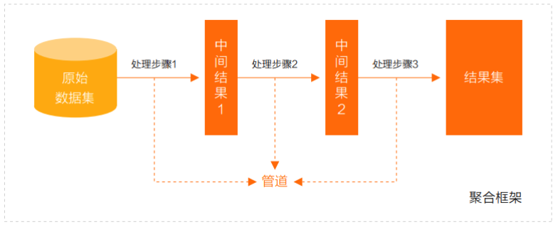
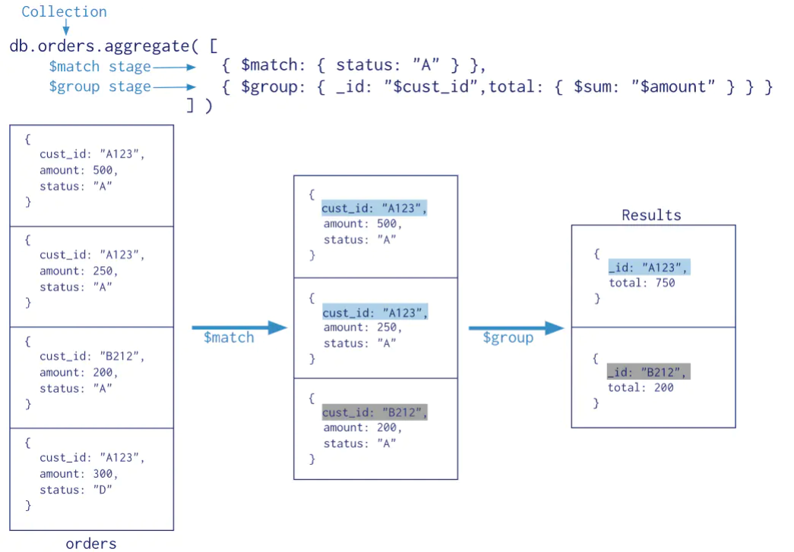
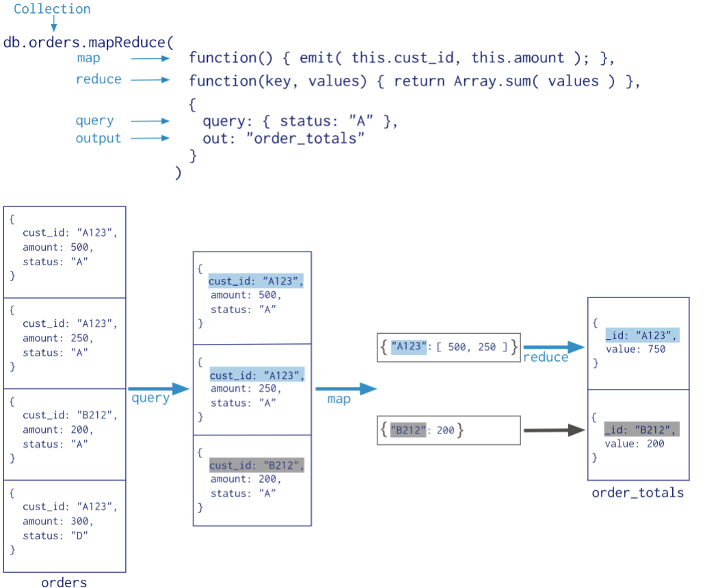

- 单一作用聚合：提供了对常见聚合过程的简单访问，操作都从单个集合聚合文档
- 聚合管道：是一个数据聚合的框架，模型基于数据处理流水线的概念。文档进入多级管道，将文档转换为聚合结果
- MapReduce 操作具有两个阶段（已被弃用，使用聚合管道代替）
	- 处理每个文档并向每个输入文档发射一个或多个对象的map阶段
	- reduce组合map操作的输出阶段

---
## 单一作用聚合

聚合来自单个集合文档：
- `db.collection.estimatedDocumentCount()` 返回集合或视图中所有文档的计数
- `db.collection.count()` 返回与find()集合或视图的查询匹配的文档计数
	- `db.books.count(query)` 等同于 `db.collection.find(query).count()`
	- 在分片群集上，如果存在孤立文档或正在进行块迁移，则 `db.collection.count()` 没有查询谓词可能导致计数不准确
		- 要避免这些情况，请在分片群集上使用 `db.collection.aggregate()` 方法
- `db.collection.distinct()`  在单个集合或视图中查找指定字段的不同值，并在数组中返回结果
	- `db.books.distinct("type")`
	- `db.books.distinct("type",{favCount:{$gt:90}})`

---
## 聚合管道

- MongoDB 聚合框架（Aggregation Framework）是一个计算框架
	- 作用在一个或几个集合上
	- 对集合中的数据进行的一系列运算
	- 将这些数据转化为期望的形式
- 从效果而言，聚合框架相当于 SQL 查询中的 GROUP BY、 LEFT OUTER JOIN 、 AS等
- 管道（Pipeline）和阶段（Stage）：整个聚合运算过程称为管道（Pipeline），它是由多个阶段（Stage）组成的
	- 
	- 每个管道
		- 接受一系列文档（原始数据）
		- 每个阶段对这些文档进行一系列运算
		- 结果文档输出给下一个阶段
- 聚合管道操作语法：`db.collection.aggregate([$stage1, $stage2, ...$stageN], {options})`
	- pipelines 一组数据聚合阶段
		- 除`$out`、`$Merge` 和 `$geonear` 阶段之外，每个阶段都可以在管道中出现多次
	- options 可选，聚合操作的其他参数
		- 查询计划、是否使用临时文件、 游标、最大操作时间、读写策略、强制索引等
	- 
- 常用的管道聚合阶段
	- `$match` 筛选条件 
	- `$project` 投影 
	- `$lookup` 左外连接 
	- `$sort` 排序 
	- `$group` 分组 
	- `$skip/$limit` 分页
	- `$unwind` 展开数组
	- `$graphLookup` 图搜索
	- `$facet/$bucket` 分面搜索
- 聚合表达式
	- 获取字段信息
		- `$<field>`  用 `$` 指示字段路径
		- `$<field>.<sub field>` 使用 `$` 和 `.` 来指示内嵌文档的路径
	- 常量表达式
		-  `$literal:<value>`  指示常量 `<value>`
	- 系统变量表达式
		- `$$<variable>` 使用 `$$` 指示系统变量
		- `$$CURRENT` 指示管道中当前操作的文档
- `$project`：投影操作， 将原始字段投影成指定名称
	- `db.books.aggregate([{$project:{name:"$title"}}])` 
		- 将集合中的 title 投影成 name
	- `db.books.aggregate([{$project:{name:"$title",_id:0,type:1,author:1}}])`
		- 剔除不需要的字段
	- 从嵌套文档中排除字段
		- `db.books.aggregate([{$project:{name:"$title",_id:0,type:1,"author.name":1}}])`
		- `db.books.aggregate([{$project:{name:"$title",_id:0,type:1,author:{name:1}}}])`
- `$match` 用于对文档进行筛选，之后可以在得到的文档子集上做聚合，可以使用除了地理空间之外的所有常规查询操作符
	- `db.books.aggregate([{$match:{type:"technology"}}])`
	- 在实际应用中尽可能将`$match`放在管道的前面位置
		- 可以减少后续管道操作符要操作的文档数，提升效率
		- 如果再投射和分组之前执行`$match`，查询可以使用索引
- `$count` 计数并返回与查询匹配的结果数
	- `db.books.aggregate([{$match:{type:"technology"}},{$count: "type_count"}])`
		- `$match`阶段筛选出type匹配technology的文档，并传到下一阶段
		- `$count`阶段返回聚合管道中剩余文档的计数，并将该值分配给`type_count`
- `$group` 按指定的表达式对文档进行分组，并将每个不同分组的文档输出到下一个阶段
	- 输出文档包含一个`_id`字段，该字段按键包含不同的组
	- 输出文档还可以包含计算字段，该字段保存由`$group`的`_id`字段分组的一些`accumulator`表达式的值
	- `$group`不会输出具体的文档而只是统计信息
	- `{$group:{_id:<expression>,<field1>:{<accumulator1>:<expression1>},...}}`
		- `_id`字段是必填的;但是，可以指定`_id`值为`null`来为整个输入文档计算累计值
		- 剩余的计算字段是可选的，并使用`<accumulator>`运算符进行计算
		- `_id`和`<accumulator>`表达式可以接受任何有效的表达式
	- `accumulator` 操作符 
		- `$avg` 计算均值 
		- `$first` 返回每组第一个文档，如果有排序，按照排序，如果没有按照默认的存储的顺序的第一个文档
		- `$last` 返回每组最后一个文档，如果有排序，按照排序，如果没有按照默认的存储的顺序的最后个文档
		- `$max` 根据分组，获取集合中所有文档对应值得最大值
		- `$min` 根据分组，获取集合中所有文档对应值得最小值
		- `$push` 将指定的表达式的值添加到一个数组中
		- `$addToSet` 将表达式的值添加到一个集合中（无重复值，无序）
		- `$sum` 计算总和
		- `$stdDevPop` 返回输入值的总体标准偏差（population standard deviation）
		- `$stdDevSamp` 返回输入值的样本标准偏差（the sample standard deviation）
	- `$group` 阶段的内存限制为100M
		- 默认情况下，如果stage超过此限制，`$group`将产生错误
		- 将 `allowDiskUse` 选项设置为 `true` 以启用`$group`操作写入临时文件来允许处理大型数据集
	- `db.books.aggregate([{$group:{_id:null,count:{$sum:1},pop:{$sum:"$favCount"},avg:{$avg:"$favCount"}}}])`
		- book的数量，收藏总数和平均值
	- `db.books.aggregate([{$group:{_id:"$author.name",pop:{$sum:"$favCount"}}}])`
		- 统计每个作者的book收藏总数
	- `db.books.aggregate([{$group:{_id:"$author.name",types:{$addToSet:"$type"}}}])`
		- 每个作者的book的type合集
- `$merge` 用于将聚合结果写入到指定的集合中。可以将结果合并到现有集合中，或者创建一个新集合
	- into 输出集合的名称，如果目标集合不存在，MongoDB 将创建它
	- on 用于查找匹配文档的字段或字段组合
	- whenMatched 当文档匹配时执行的操作，可选值包括 “replace”, “merge”, “keepExisting”, “fail”, “pipeline”（自定义聚合阶段，用于更复杂的更新逻辑）
	- whenNotMatched 当文档不匹配时执行的操作，可选值包括 “insert”, “discard”, “fail”
- `$unwind` 可以将数组拆分为单独的文档
	- path 要指定字段路径，在字段名称前加上`$`符并用引号括起来
	- includeArrayIndex 可选，一个新字段的名称用于存放元素的数组索引。该名称不能以`$`开头
	- preserveNullAndEmptyArrays 可选，`default :false`
		- 若为true，如果路径为空，缺少或为空数组，则`$unwind`输出文档
- `$sort` 对所有输入文档进行排序，并按排序顺序将它们返回到管道
	- `db.books.aggregate([{$sort : {favCount:‐1,title:1}}])`
	- 要对字段进行排序，请将排序顺序设置为1或-1，以分别指定升序或降序排序
- `$limit` 限制传递到管道中下一阶段的文档数
	- 当`$sort`在管道中的`$limit`之前立即出现时，`$sort`操作只会在过程中维持前n个结果，其中n是指定的限制，而MongoDB只需要将n个项存储在内存中
- `$skip` 跳过进入stage的指定数量的文档，并将其余文档传递到管道中的下一个阶段
- `$bucket` 用于对输入文档进行分组，根据指定的边界（buckets）将文档分配到指定的组，类似于 `GROUP BY`
	- groupBy（必需）：指定要分组的字段或表达式。文档将根据该字段的值来分配到不同的 bucket 中
	- boundaries（必需）：一个数组，定义了 buckets 的分界点。数组元素是按升序排列的，表示不同的边界值
		- 值必须是相同的数据类型
		- 例如，`[0, 10, 20, 30]` 表示创建三个 buckets
	- default（可选）：指定一个 bucket，用于存储所有不在 `boundaries` 定义的范围内的文档。如果未指定，超出边界范围的文档将被丢弃
	- output（可选）：一个文档，定义了每个 bucket 中需要包含的计算字段。每个字段是一个聚合表达式，该表达式操作落入该 bucket 中的文档
		- 例如，可以计算每个 bucket 中的文档总数、最大值、最小值、平均值等
- `$lookup` 主要用来实现多表关联查询
	- 每个输入待处理的文档，经过 `$lookup` 阶段的处理，输出的新文档中会包含一个新生成的数组（可根据需要命名新key ）
	- 数组列存放的数据是来自被Join集合的适配文档，如果没有，集合为空（即 为`[ ]`)
	- 参数
		- from 同一个数据库下等待被Join的集合
		- localField 源集合中的match值，如果输入的集合中，某文档没有 localField 这个Key（Field），在处理的过程中，会默认为此文档含有 `localField:null` 的键值对
			- 注意：`null = null` 此为真
```js
db.collection.aggregate([{
	$lookup: {
		from: "<collection to join>",
		localField: "<field from the input documents>",
		foreignField: "<field from the documents of the from collection>",
		as: "<output array field>"
	}
```

---
## MapReduce

- 从MongoDB 5.0开始，map-reduce操作已被弃用
	- 聚合管道比map-reduce操作提供更好的性能和可用性
	- Map-reduce操作可以使用聚合管道操作符重写，例如`$group`、 `$merge`等
- MapReduce操作将大量的数据处理工作拆分成多个线程并行处理，然后将结果合并在一起
- MapReduce具有两个阶段
	- 将具有相同Key的文档数据整合在一起的map阶段 
	- 组合map操作的结果进行统计输出的reduce阶段
-  MapReduce的基本语法 
	- 

```js
db.collection.mapReduce(
	function() {emit(key,value);}, //map 函数，将数据拆分成键值对，交给reduce函数
	function(key,values) {return reduceFunction}, //reduce 函数，根据键将值做统计运算
	{
		out: <collection>,   // 可选，将结果汇入指定表
		query: <document>,   // 可选，筛选数据的条件，筛选的数据送入map 
		sort: <document>,    // 排序完后，送入map 
		limit: <number>,     // 限制送入map的文档数 
		finalize: <function>,// 可选，修改reduce的结果后进行输出
		scope: <document>,   // 可选，指定map、reduce、finalize的全局变量 
		jsMode: <boolean>,   // 可选，默认false。在mapreduce过程中是否将数据转换成bson格式
		verbose: <boolean>,  // 可选，是否在结果中显示时间，默认false 
		bypassDocumentValidation: <boolean> // 可选，是否略过数据校验
	}
```


