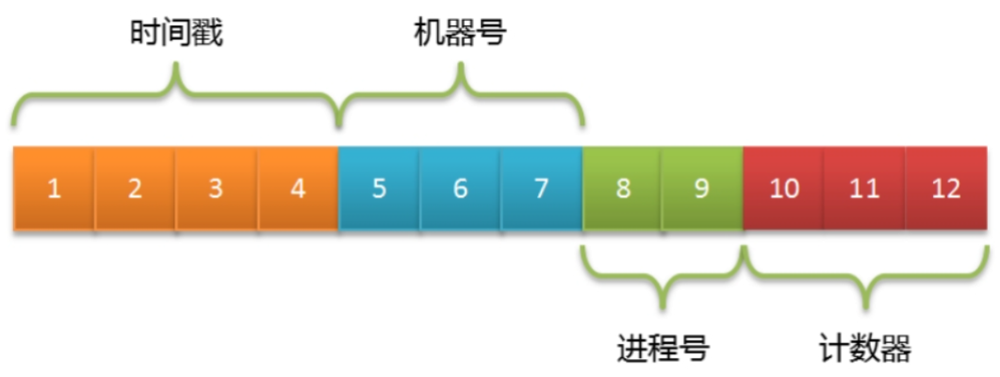
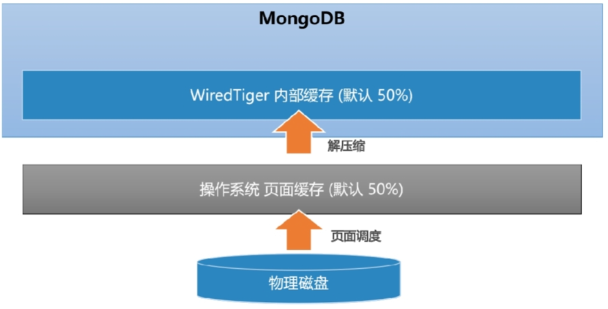
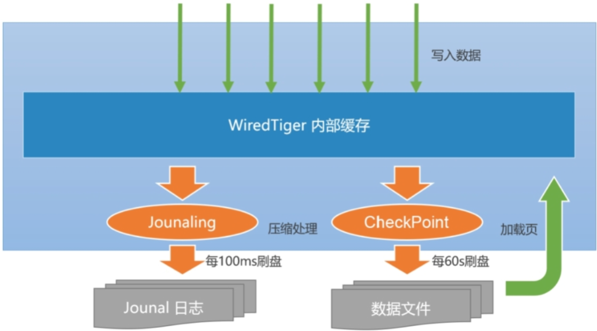

- BSON
- ObjectId 生成器
- 内嵌文档和数组
- 固定集合
- WiredTiger读写模型

---
## BSON

- JSON基于文本的解析效率并不是最好的，在某些场景下往往会考虑选择更合适的编/解码格式
- BSON（Binary JSON）是二进制版本的JSON，其在性能方面有更优的表现
	- 在空间的使用上，BSON相比JSON并没有明显的优势
- MongoDB在文档存储、命令协议上都采用了BSON作为编/解码格式
	- 类JSON的轻量级语义，支持简单清晰的嵌套、数组层次结构，可以实现模式灵活的文档结构
	- 更高效的遍历，BSON在编码时会记录每个元素的长度，可以直接通过seek操作进行元素的内容读取，相对JSON解析来说，遍历速度更快
	- 更丰富的数据类型，除了JSON的基本数据类型，BSON还提供了MongoDB所需的一些扩展类型，比如日期、二进制数据等，这更加方便数据的表示和操作
- 一个BSON文档最大大小为16M，文档嵌套的级别不超过100
- $type 操作符基于BSON类型来检索集合中匹配的数据类型，并返回结果
	- `db.xx.find({"title" : {$type : "string"}})`
- 日期类型 `db.dates.insert([{data1:Date()},{data2:new Date()},{data3:ISODate()}])`
	- `Date()` 使用UTC（Coordinated Universal Time）进行存储，也就是+0时区的时间
	- 使用`new Date()`与`ISODate()`最终都会生成ISODate类型的字段（对应于UTC时间）

---
## ObjectId 生成器

- MongoDB集合中所有的文档都有一个唯一的_id字段，作为集合的主键
	- 在默认情况下，`_id`字段使用ObjectId类型，采用16进制编码形式，共12个字节
- 为了避免文档的`_id`字段出现重复，ObjectId被定义为3个部分
	- 
	- 4字节表示Unix时间戳（秒）
	- 5字节表示随机数（机器号+进程号唯一）
		- 5字节的随机数并没有明确定义，客户端可以采用机器号、进程号来实现
	- 3字节表示计数器（初始化时随机）
- 大多数客户端驱动都会自行生成这个字段，比如MongoDB Java Driver会根据插入的文档是否包含`_id`字段来自动补充ObjectId对象。这样做不但提高了离散性，还可以降低MongoDB服务器端的计算压力
- `x = ObjectId()` 生成一个新的 ObjectId
- 属性/方法
	- `str` 返回对象的十六进制字符串表示
	- `ObjectId.getTimestamp()` 将对象的时间戳部分作为日期返回
	- `ObjectId.toString()` 以字符串文字的形式返回 JavaScript 表示 ObjectId(...)
	- `ObjectId.valueOf()` 将对象的表示形式返回为十六进制字符串。返回的字符串是`str`属性

---
## 内嵌文档和数组

- 内嵌文档：可以嵌套文档，比如查询时可以用`.`操作符
- 数组
	- `$slice`获取最后一个tag
		- `db.books.find({"author.name":"三毛"},{title:1,tags:{$slice:‐1}})`
	- `$push`在数组末尾追加元素
		- `db.books.updateOne({"author.name":"三毛"},{$push:{tags:"猎奇"}})`
		- `$each`操作符配合可以用于添加多个元素
			- `db.books.updateOne({"author.name":"三毛"},{$push:{tags:{$each:["伤感","想象力"]}}})`
			- 加上`$slice`操作符，那么只会保留经过切片后的元素
				- `db.books.updateOne({"author.name":"三毛"},{$push:{tags:{$each:["伤感","想象力"],$slice:‐3}}})`
	- 根据元素查询
		- `db.books.find({tags:"伤感"})` 查出所有包含伤感的文档
		- `db.books.find({tags:{$all:["伤感","想象力"]}})`
- 嵌套型的数组：数组元素可以是基本类型，也可以是内嵌的文档结构
	- `$elementMatch` 根据数组内文档的属性进行检索
		- `db.goods.find({tags:{$elemMatch:{tagKey:"color",tagValue:"黑色"}}})`
			- 筛选出 `color=黑色` 的商品信息
	- 如果进行组合式的条件检索，则可以使用多个`$elemMatch`操作符
		- `db.goods.find({tags:{$all:[{$elemMatch:{tagKey:"color",tagValue:"黑色"}},{$elemMatch:{tagKey:"size",tagValue:"XL"}}]}})`

---
## 固定集合

- 固定集合（capped collection）是一种限定大小的集合。跟普通的集合相比，数据在写入这种集合时遵循FIFO原则
	- 可以保证数据库只会存储“限额”的数据，超过该限额的旧数据都会被丢弃
- 创建固定集合：`db.createCollection("logs",{capped:true,size:4096,max:10})`
	- max：指集合的文档数量最大值，这里是10条
	- size：指集合的空间占用最大值，这里是4096字节（4KB）
	- 只要任一条件达到阈值都会认为集合已经写满。其中size是必选的，而max则是可选的
- `db.logs.stats()` 查看文档的占用空间
- 优势
	- 固定集合在底层使用的是顺序I/O操作，因此固定集合的写入性能是很高的
	- 如果按写入顺序进行数据读取，也会获得非常好的性能表现
- 限制
	- 无法动态修改存储的上限，如果需要修改max或size，则只能先执行`collection.drop`命令，将集合删除后再重新创建
	- 无法删除已有的数据，对固定集合中的数据进行删除会报错
	- 对已有数据进行修改，新文档大小必须与原来的文档大小一致，否则不允许更新
	- 默认情况下，固定集合只有一个`_id`索引，而且最好是按数据写入的顺序进行读取
		- 也可以添加新的索引，但这会降低数据写入的性能
	-  固定集合不支持分片
		- 在MongoDB 4.2版本中规定了事务中也无法对固定集合执行写操作
- 适用场景：很适合用来存储一些“临时态”的数据，意味着数据在一定程度上可以被丢弃，随着时间的推移，数据的重要性逐渐降低，直至被淘汰处理
	- 系统日志
		- 在MongoDB内部，副本集的同步日志（oplog）就使用了固定集合
	- 最新发布的TopN条文章信息（少量文档）
		- 得益于内部缓存的作用，对于这种少量文档的查询是非常高效的
- 使用固定集合实现FIFO队列：采用读取游标的方式（游标在获取不到数据时并不会被关闭）
	- `var cursor = db.xx.find({timestamped:{$gte:new Date()}}).tailable();`
	- `cursor.hasNext()`
	- `var doc = cursor.next()`

---
## WiredTiger 读写模型

- MongoDB从3.0开始引入可插拔存储引擎的概念
	- 目前主要有MMAPV1、WiredTiger存储引擎（节省约60%以上的硬盘资源）可供选择
- 读缓存：理想情况下，MongoDB可以提供近似内存式的读写性能
	- WiredTiger引擎实现了数据的二级缓存，第一层是操作系统的页面缓存，第二层则是引擎提供的内部缓存
	- 
	- 读取数据时的流程如下
		- 数据库发起Buffer I/O读操作，由操作系统将磁盘数据页加载到文件系统的页缓存区
		- 引擎层读取页缓存区的数据，进行解压后存放到内部缓存区
		- 在内存中完成匹配查询，将结果返回给应用
	- MongoDB为了尽可能保证业务查询的“热数据”能快速被访问，其内部缓存的默认大小达到了内存的一半，该值由wiredTigerCacheSize参数指定
		- `wiredTigerCacheSize=Math.max((RAM/2‐1GB),256MB)`
- 写缓冲
	- 当数据发生写入时，MongoDB并不会立即持久化到磁盘上，而是先在内存中记录这些变更，之后通过CheckPoint机制将变化的数据写入磁盘
		- 如果每次写入都触发一次磁盘I/O，那么开销太大，而且响应时延会比较大
		- 多个变更的写入可以尽可能进行I/O合并，降低资源负荷
- MongoDB单机下保证数据可靠性的机制包括以下两个部分
	- CheckPoint（检查点）机制
		- 快照（snapshot）描述了某一时刻（point-in-time）数据在内存中的一致性视图，而这种数据的一致性是WiredTiger通过MVCC（多版本并发控制）实现的
		- 当建立CheckPoint时，WiredTiger会在内存中建立所有数据的一致性快照，并将该快照覆盖的所有数据变化一并进行持久化（fsync）
		- 成功之后，内存中数据的修改才得以真正保存
		- 默认情况下，MongoDB每60s建立一次CheckPoint，在检查点写入过程中，上一个检查点仍然是可用的。这样可以保证一旦出错，MongoDB仍然能恢复到上一个检查点
			- CheckPoint的刷新周期可以调整`storage.syncPeriodSecs`参数（默认值60s）
			- 在MongoDB 3.4及以下版本中，当Journal日志达到2GB时同样会触发CheckPoint行为
		- 如果应用存在大量随机写入，则CheckPoint可能会造成磁盘I/O的抖动。在磁盘性能不足的情况下，问题会更加显著，此时适当缩短CheckPoint周期可以让写入平滑一些
	- Journal 日志
		- Journal是一种预写式日志（write ahead log）机制，主要用来弥补CheckPoint机制的不足
		- 如果开启了Journal日志，那么WiredTiger会将每个写操作的redo日志写入Journal缓冲区，该缓冲区会频繁地将日志持久化到磁盘上
		- 默认情况下，Journal缓冲区每100ms执行一次持久化
			- Journal日志达到100MB，或是应用程序指定 `journal:true`，写操作都会触发日志的持久化
		- Journal日志的刷新周期可以通过参数`storage.journal.commitIntervalMs`指定
			- MongoDB 3.4及以下版本的默认值是50ms，而3.6版本之后调整到了100ms
		- 由于Journal日志采用的是顺序I/O写操作，频繁地写入对磁盘的影响并不是很大
	- 一旦MongoDB发生宕机，重启程序时会先恢复到上一个检查点，然后根据Journal日志恢复增量的变化。由于Journal日志持久化的间隔非常短，数据能得到更高的保障，如果按照当前版本的默认配置，则其在断电情况下最多会丢失100ms的写入数据
- WiredTiger写入数据的流程
	- 
	- 应用向MongoDB写入数据（插入、修改或删除）
	- 数据库从内部缓存中获取当前记录所在的页块，如果不存在则会从磁盘中加载（Buffer I/O） 
	- WiredTiger开始执行写事务，修改的数据写入页块的一个更新记录表，此时原来的记录仍然保持不变
	- 如果开启了Journal日志，则在写数据的同时会写入一条Journal日志（Redo Log）
		- 该日志在最长不超过100ms之后写入磁盘
	- 数据库每隔60s执行一次CheckPoint操作，此时内存中的修改会真正刷入磁盘

