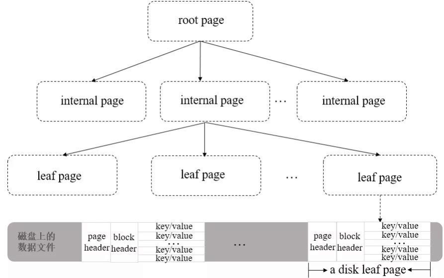

- 索引数据结构
- 索引设计原则
- 索引操作
- 索引类型
	- 单键索引；复合索引；多键索引；地理空间索引；全文索引；Hash索引；通配符索引
- 索引属性
	- 唯一索引；部分索引；稀疏索引；TTL索引；隐藏索引
- 索引使用建议
- Explain 执行计划

---
## 索引数据结构

- MongoDB采用B+Tree 做索引，索引创建在colletions上
	- 不使用索引的查询，先扫描所有的文档，再匹配符合条件的文档
	-  使用索引的查询，通过索引找到文档，使用索引能够极大的提升查询效率
- WiredTiger 数据文件在磁盘的存储结构
	- 
		- B+ Tree中的leaf page包含一个页头（page header）、块头（block header）和真正的数据（key/value）
			- 页头定义了页的类型、页中实际载荷数据的大小、页中记录条数等信息
			- 块头定义了此页的checksum、块在磁盘上的寻址位置等信息
		- WiredTiger有一个块设备管理的模块，用来为page分配block
			- 如果要定位某一行数据
				- 先通过block的位置找到此page（相对于文件起始位置的偏移量）
				- 再通过page找到行数据的相对位置
				- 最后可以得到行数据相对于文件起始位置的偏移量offsets

---
## 索引设计原则

- 每个查询原则上都需要创建对应索引 
- 单个索引设计应考虑满足尽量多的查询 
- 索引字段选择及顺序需要考虑查询覆盖率及选择性 
- 慎重
	- 对于更新及其频繁的字段上创建索引需慎重 
	- 对于数组索引需要慎重考虑未来元素个数 
	- 对于超长字符串类型字段上慎用索引 
	- 并发更新较高的单个集合上不宜创建过多索引

---
## 索引操作

- 创建索引 ` db.collection.createIndex(keys, options)`
	- Key 值为你要创建的索引字段，1 按升序创建索引， -1  按降序创建索引
	- 可选参数
		- background 创建索引后台执行，默认值为 false
		- unique 创建唯一索引，默认值为 false
		- name 索引的名称，如果未指定，MongoDB将通过连接索引的字段名和排序顺序生成一个索引名称
		- dropDups （已废弃）在建立唯一索引时是否删除重复记录
			- 指定 true 创建唯一索引。默认值为 false
		- sparse 对文档中不存在的字段数据不启用索引（稀疏索引）
			- 如果设置为true的话，在索引字段中不会查询出不包含对应字段的文档。默认值为 false
		- expireAfterSeconds 设定集合的生存时间，TTL设定以秒为单位
		- v 索引的版本号。默认的索引版本取决于mongod创建索引时运行的版本
		- weights 索引权重值，数值在 1 到 99_999 之间，表示该索引相对于其他索引字段的得分权重
		- default_language 对于文本索引，该参数决定了停用词及词干和词器的规则列表。 默认为英语
		- language_override 对于文本索引，该参数指定了包含在文档中的字段名
			- 语言覆盖默认的 language，默认值为 language
		- hidden 隐藏索引
- 查看索引 
	- `db.books.getIndexes()` 查看索引信息
	- `db.books.getIndexKeys()` 查看索引键
	- `db.collection.totalIndexSize([is_detail])` 查看索引占用空间
		- is_detail：可选参数，传入除0或false外的任意数据，都会显示该集合中每个索引的大小及总大小
			- 如果传入0或false则只显示该集合中所有索引的总大小。默认值为false
- 删除索引
	- `db.col.dropIndex("索引名称")` 删除集合指定索引
	- `db.col.dropIndexes()` 删除集合所有索引，不能删除主键索引

---
## 索引类型

- 单键索引（Single Field Indexes）：在某一个特定的字段上建立索引
	- MongoDB在ID上建立了唯一的单键索引
	- `db.books.createIndex({title:1})`
- 复合索引（Compound Index）：是多个字段组合而成的索引
	- `db.books.createIndex({type:1,favCount:1})`
- 多键索引（Multikey Index）：在数组的属性上建立索引
	- 针对这个数组的任意值的查询都会定位到这个文档，既多个索引入口或者键值引用同一个文档（多键）
	- 多键索引很容易与复合索引产生混淆
		- 复合索引是多个字段的组合，而多键索引则仅仅是在一个字段上出现了多键（multi key）
		- 多键索引也可以出现在复合字段上
			-  MongoDB 并不支持一个复合索引中同时出现多个数组字段
			- `db.inventory.createIndex( { item:1, ratings: 1 } )`
	- 支持在包含嵌套对象的数组字段上创建多键索引
	- `db.inventory.createIndex( { ratings: 1 } )`
- 地理空间索引（Geospatial Index）：专门用于实现位置检索的一种特殊索引
	- 文档属性：`location:{type:"Point",coordinates:[‐73.97,40.77]}`
	- `db.restaurant.createIndex({location : "2dsphere"})`
		- 创建一个2dsphere索引
	- 查询附近10000米：`db.restaurant.find({location:{$near:{$geometry:{type:"Point",coordinates:[-73.88,40.78]},$maxDistance:10000}}})`
		- `$near` 查询操作符，用于实现附近检索，返回数据结果会按距离排序
		- `$geometry` 操作符用于指定一个GeoJSON格式的地理空间对象
			- `type=Point` 表示地理坐标点
			- coordinates 则是用户当前所在的经纬度位置
		- `$maxDistance` 限定了最大距离，单位是米
- 全文索引（Text Indexes）：可通过建立文本索引来实现简易的分词检索
	- `db.reviews.createIndex( { comments: "text" } )`
	- `db.reviews.find({$text: {$search: "java coffee shop"}})`
		- `$text`操作符可以在有text index的集合上执行文本检索
		- `$text`将会使用空格和标点符号作为分隔符对检索字符串进行分词， 并且对检索字符串中所有的分词结果进行一个逻辑上的 OR 操作
	- MongoDB的文本索引功能存在诸多限制，而官方并未提供中文分词的功能
- Hash索引（Hashed Indexes）：在索引字段上进行精确匹配但不支持范围查询，不支持多键hash
	- `db.users.createIndex({username : 'hashed'})`
	-  Hash索引上的入口是均匀分布的，在分片集合中非常有用
- 通配符索引（Wildcard Indexes）：支持对未知或任意字段的查询
	- `db.products.createIndex( { "product_attributes.$**" : 1 } )`
	- 通配符索引不兼容的索引类型或属性
		- TTL - TTL索引
		- Compound - 复合索引
		- Text - 全文索引
		- 2d (Geospatial) - 地理空间索引
		- 2dsphere (Geospatial) - 地理空间索引
		- Hashed - Hash索引
		- Unique - 唯一索引
	- 通配符索引是稀疏的，不索引空字段
		- 通配符索引不能支持查询字段不存在的文档
	- 通配符索引为文档或数组的内容生成条目，而不是文档/数组本身
		- 通配符索引不能支持精确的文档/数组相等匹配
		- `db.products.find({ "product_attributes.colors" : [ "Blue", "Black" ] } )`
			- 不支持通配符索引
	- 通配符索引可以支持查询字段等于空文档`{}`的情况

---
## 索引属性

- 唯一索引（Unique Indexes）
	- 唯一性索引对于文档中缺失的字段，会使用null值代替，因此不允许存在多个文档缺失索引字段的情况
	- 对于分片的集合，唯一性约束必须匹配分片规则
		- 为了保证全局的唯一性，分片键必须作为唯一性索引的前缀字段
- 部分索引（Partial Indexes）
	- 部分索引仅对满足指定过滤器表达式的文档进行索引
		- 通过在一个集合中为文档的一个子集建立索引
	- 部分索引具有更低的存储需求和更低的索引创建和维护的性能成本
	- 部分索引提供了稀疏索引功能的超集，应该优先于稀疏索引
	- `db.restaurants.createIndex({cuisine:1,name:1},{partialFilterExpression:{rating:{$gt:5}}})`
		- partialFilterExpression 选项接受指定过滤条件的文档
			- 等式表达式 (例如 `field:value` 或使用 `$eq` 操作符)
			- `$exists:true`
			- `$gt $gte $lt $lte`
			- `$type `
			- 顶层的 `$and`
- 稀疏索引（Sparse Indexes）： 只对存在字段的文档进行索引（包括字段值为null的文档）
	- 索引的稀疏属性确保索引只包含具有索引字段的文档的条目
		- 索引将跳过没有索引字段的文档
	- 如果稀疏索引会导致查询和排序操作的结果集不完整，MongoDB将不会使用该索引
		- 除非`hint()`明确指定索引
		-` db.scores.find().sort( { score: ‐1 } ).hint( { score: 1 } )`
- TTL索引（TTL Indexes）：在一定时间或特定时钟时间后自动从集合中删除文档
	- TTL索引需要声明在一个日期类型的字段中，TTL 索引是特殊的单字段索引
		- TTL索引具有普通索引的功能，同样可以用于加速数据的查询
	- `db.xx.createIndex( { "lastModifiedDate": 1 }, { expireAfterSeconds:3600 } )`
		- 单位是秒
	- MongoDB会在周期性运行的后台线程中对该集合进行检查及数据清理工作
		- TTL 索引不保证过期数据会在过期后立即被删除
		- 删除过期文档的后台任务每 60 秒运行一次
	- 可变的过期时间：TTL索引在创建之后，仍然可以对过期时间进行修改
		- collMod 命令对索引的定义进行变更
		- `db.runCommand({collMod:"xx",index:{keyPattern:{createdAt:1},expireAfterSeconds:600}})`
	- 使用约束
		- TTL索引只能支持单个字段，并且必须是非`_id`字段
		- TTL索引不能用于固定集合
		- TTL索引无法保证及时的数据老化
			- MongoDB会通过后台的TTLMonitor定时器来清理老化数据，默认的间隔时间是1分钟
			- 如果在数据库负载过高的情况下，TTL的行为则会进一步受到影响
		- TTL索引对于数据的清理仅仅使用了remove命令，这种方式并不是很高效
			- TTLMonitor在运行期间对系统CPU、磁盘都会造成一定的压力
			- 相比之下，按日期分表的方式操作会更加高效
- 隐藏索引（Hidden Indexes）
	- 隐藏索引对查询规划器不可见，不能用于支持查询
	- 通过对规划器隐藏索引，用户可以在不实际删除索引的情况下评估删除索引的潜在影响
	- 创建隐藏索引 `db.restaurants.createIndex({ borough: 1 },{ hidden: true });`
	- 隐藏现有索引 `db.restaurants.hideIndex( { borough: 1} );`
	- 取消隐藏索引 `db.restaurants.unhideIndex( { borough: 1} );`
- 多索引属性场景
	- 唯一约束结合部分索引使用导致唯一约束失效
		- 如果同时指定了partialFilterExpression和唯一约束，那么唯一约束只适用于满足筛选器表达式的文档
		- 如果文档不满足筛选条件，那么带有唯一约束的部分索引不会阻止插入不满足唯一约束的文档
	- 具有稀疏性和唯一性的索引
		- 可以防止集合中存在字段值重复的文档，但允许不包含此索引字段的文档插入
- 日志存储场景：日期分表；固定集合；TTL索引
	- 插入： `writeConcern:0`
		- 发起写操作，不关心是否成功

---
## 索引使用建议

- 为每一个查询建立合适的索引
	- 针对于数据量较大比如说超过几十上百万（文档数目）数量级的集合
- 创建合适的复合索引，不要依赖于交叉索引
	- 交叉索引就是针对每个字段单独建立一个单字段索引，然后在查询执行时候使用相应的单字段索引进行索引交叉而得到查询结果
	- 交叉索引目前触发率较低，所以如果你有一个多字段查询的时候，建议使用复合索引能够保证索引正常的使用
- 复合索引字段顺序：匹配条件在前，范围条件在后（Equality First, Range After）
- 尽可能使用覆盖索引（Covered Index）
	- 建议只返回需要的字段，同时，利用覆盖索引来提升性能
- 建索引要在后台运行
	- 在对一个集合创建索引时，该集合所在的数据库将不接受其他读写操作
	- 所以对大数据量的集合建索引，建议使用后台运行选项 `{background: true}`
- 避免设计过长的数组索引
	- 数组索引是多值的，在存储时需要使用更多的空间

---
## Explain 执行计划

- 我们需要关心的问题
	- 查询是否使用了索引
	- 索引是否减少了扫描的记录数量
	- 是否存在低效的内存排序
- `db.collection.find().explain(<verbose>)`
	- verbose  可选参数，表示执行计划的输出模式，默认 queryPlanner
		- queryPlanner 执行计划的详细信息，包括查询计划、集合信息、查询条件、最佳执行计划、查询方式和 MongoDB 服务信息等
		- exectionStats 最佳执行计划的执行情况和被拒绝的计划等信息
			- executionStats 模式的返回信息中包含了 queryPlanner 模式的所有字段，并且还包含了最佳执行计划的执行情况
		- allPlansExecution 选择并执行最佳执行计划，并返回最佳执行计划和其他执行计划的执行情况
			- allPlansExecution返回的信息包含 executionStats 模式的内容，且包含`allPlansExecution:[]`块
- stage 状态
	- COLLSCAN 全表扫描
	- IXSCAN 索引扫描
	- FETCH 根据索引检索指定文档
	- SHARD_MERGE 将各个分片返回数据进行合并
	- SORT 在内存中进行了排序
	- LIMIT 使用limit限制返回数
	- SKIP 使用skip进行跳过
	- IDHACK 对_id进行查询
	- SHARDING_FILTER 通过mongos对分片数据进行查询
	- COUNTSCAN count不使用Index进行count时的stage返回
	- COUNT_SCAN count使用了Index进行count时的stage返回
	- SUBPLA 未使用到索引的`$or`查询的stage返回
	- TEXT 使用全文索引进行查询时候的stage返回
	- PROJECTION 限定返回字段时候stage的返回
- 执行计划的返回结果中尽量不要出现以下 stage
	- COLLSCAN(全表扫描) 
	- SORT (使用sort但是无index) 
	- 不合理的SKIP 
	- SUBPLA (未用到index的$or) 
	- COUNTSCAN (不使用index进行count)

