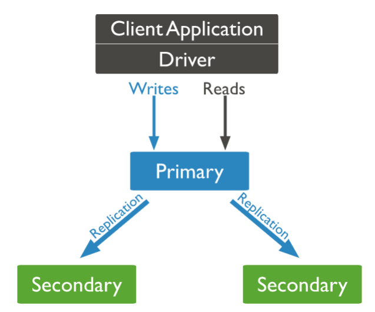
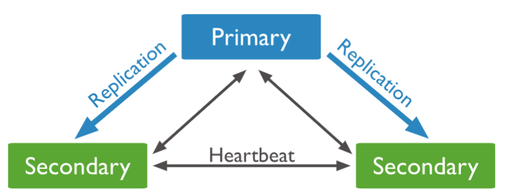
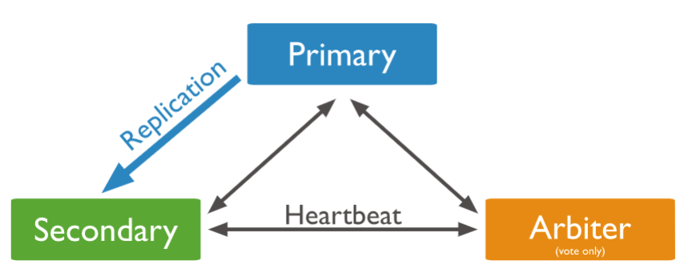
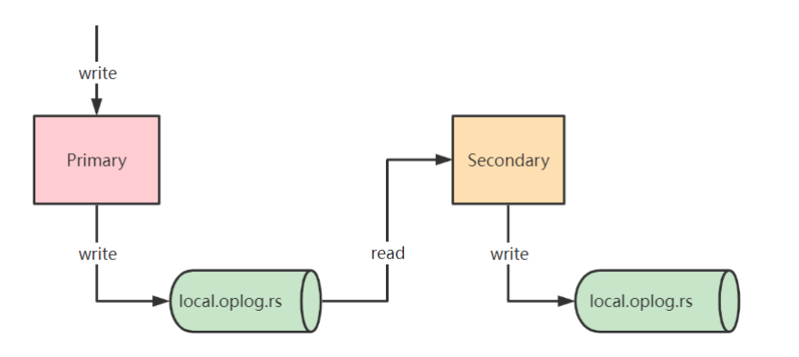
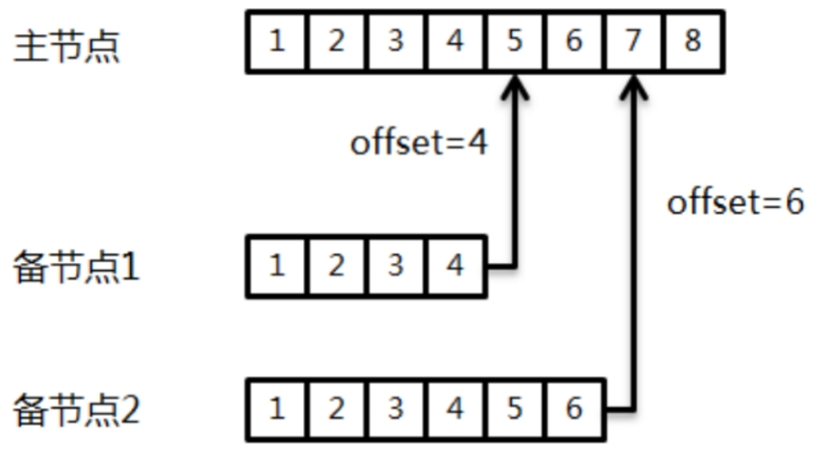

- 复制集架构
- 复制集操作
- 复制集成员角色
- 复制集高可用
- 复制集数据同步机制 oplog 

---
## 复制集架构

- 在生产环境中，不建议使用单机版的MongoDB服务器
	- 单机版的MongoDB无法保证可靠性，一旦进程发生故障或是服务器宕机，业务将直接不可用
	- 一旦服务器上的磁盘损坏，数据会直接丢失，而此时并没有任何副本可用
- Mongodb复制集（Replication Set）由一组Mongod实例（进程）组成，包含一个Primary节点和多个Secondary节点
	- Mongodb Driver（客户端）的所有数据都写入Primary
	- Secondary从Primary同步写入的数据，以保持复制集内所有成员存储相同的数据集，提供数据的高可用
	- 
- 复制集提供冗余和高可用性，是所有生产部署的基础，依赖于两个方面的功能
	- 数据写入时将数据迅速复制到另一个独立节点上
	- 在接受写入的节点发生故障时自动选举出一个新的替代节点
- 在实现高可用的同时，复制集实现了其他几个附加作用
	- 数据分发：将数据从一个区域复制到另一个区域，减少另一个区域的读延迟
	- 读写分离：不同类型的压力分别在不同的节点上执行
	- 异地容灾：在数据中心故障时候快速切换到异地
- local.system.replset：用来记录当前复制集的成员
- local.startup_log：用来记录本地数据库的启动日志信息
- local.replset.minvalid：用来记录复制集的跟踪信息，如初始化同步需要的字段

---
## 复制集操作

- PSS模式（官方推荐模式）：由一个主节点和两个备节点所组成，即 Primary+Secondary+Secondary
	- 
	- 此模式始终提供数据集的两个完整副本，如果主节点不可用，则复制集选择备节点作为主节点并继续正常操作。旧的主节点在可用时重新加入复制集
- PSA模式：由一个主节点、一个备节点和一个仲裁者节点组成，即 Primary+Secondary+Arbiter
	- 
	- 其中，Arbiter节点不存储数据副本，也不提供业务的读写操作
	- Arbiter节点发生故障不影响业务，仅影响选举投票
	- 此模式仅提供数据的一个完整副本，如果主节点不可用，则复制集将选择备节点作为主节点
- 复制集环境搭建
	- 即使暂时只有一台服务器，也要以单节点模式启动复制集
		- 单机多实例启动复制集
		- 单节点启动复制集
	- 复制集各节点软件版本必须一致
	- 增加节点不会增加系统写性能
	- 启动 MongoDB 进程：`mongod ‐f /data/db1/mongod.conf`
	- 配置复制集
		- 复制集通过`replSetInitiate`命令或mongo shell的`rs.initiate()`进行初始化
			- `rs.initiate()`
			- `rs.add("192.168.65.174:28018")`
			- 或 `rs.initiate({_id: "rs0",members: [{_id: 0,host: "192.168.65.174:28017"}]})`
		- 初始化后各个成员间开始发送心跳消息，并发起Priamry选举操作
		- 获得『大多数』成员投票支持的节点，会成为Primary，其余节点成为Secondary
- 复制集状态查询
	- `rs.status()` 查看复制集整体状态
		- 可查看各成员当前状态，包括是否健康，是否在全量同步，心跳信息，增量同步信息， 选举信息，上一次的心跳时间等
	- `db.isMaster()` 查看当前节点角色
		- 除了当前节点角色信息，是一个更精简化的信息，也返回整个复制集的成员列表，真正的Primary是谁，协议相关的配置信息等，Driver 在首次连接复制集时会发送该命令
- Mongo Shell 复制集命令
	- rs.add() 为复制集新增节点
	- rs.addArb() 为复制集新增一个 arbiter
	- rs.conf() 返回复制集配置信息
	- rs.freeze() 防止当前节点在一段时间内选举成为主节点
	- rs.help() 返回 replica set 的命令帮助
	- rs.initiate() 初始化一个新的复制集
	- rs.printReplicationInfo() 以主节点的视角返回复制的状态报告
	- rs.printSecondaryReplicationInfo() 以从节点的视角返回复制状态报告
	- rs.reconfig() 通过重新应用复制集配置来为复制集更新配置
	- rs.remove() 从复制集中移除一个节点
	- rs.secondaryOk() 为当前的连接设置从节点可读
		- 在默认配置下，MongoDB 的客户端会将读操作只定向到主节点，这样可以确保读取的数据是最新的，因为主节点是接受写操作的唯一节点
	- rs.status() 返回复制集状态信息
	- rs.stepDown() 让当前的 primary 变为从节点并触发 election
	- rs.syncFrom() 设置复制集节点从哪个节点处同步数据，将会覆盖默认选取逻辑
- 安全认证
	- 创建用户
		- `use admin`
		- `db.createUser({user:"fox",pwd:"fox",roles:[{role:"clusterAdmin",db:"admin"}]})`
	- 创建keyFile文件： 集群之间的安全认证（开启keyfile认证就默认开启了auth认证了）
		- `openssl rand ‐base64 756 > /data/mongo.key`
		- 创建keyFile前，需要先停掉复制集中所有主从节点的mongod服务，然后再创建，否则有可能出现服务启动不了的情况
		- 将主节点中的keyfile文件拷贝到复制集其他从节点服务器中，路径地址对应mongo.conf配置文件中的keyFile字段地址，并设置keyfile权限为600
		- 启动命令 `mongod ‐f /data/db1/mongod.conf ‐‐keyFile /data/mongo.key`
		- 客户端连接 `mongo ‐‐port 28017 ‐ufox ‐pfox ‐‐authenticationDatabase=admin`
- 复制集连接方式
	- 方式一：直接连接 Primary 节点，正常情况下可读写 MongoDB，但主节点故障切换后，无法正常访问
	- 方式二（强烈推荐）：通过高可用 Uri 的方式连接 MongoDB，当 Primary 故障切换后，MongoDB Driver 可自动感知并把流量路由到新的 Primary 节点
		- springboot 可以同时配置集群内所有节点

---
## 复制集成员角色

- 属性一：Priority = 0 
	- 当 Priority 等于 0 时，它不可以被复制集选举为主
	- Priority 的值越高，则被选举为主的概率更大
	- 通常，在跨机房方式下部署复制集可以使用该特性
- 属性二：Vote = 0 
	- 不可以参与选举投票，此时该节点的 Priority 也必须为 0，即它也不能被选举为主
	- 由于一个复制集中最多只有7个投票成员，因此多出来的成员则必须将其vote属性值设置为0
- 成员角色
	- Primary：主节点，其接收所有的写请求，然后把修改同步到所有备节点
		- 一个复制集只能有一个主节点，当主节点“挂掉”后，其他节点会重新选举出来一个主节点
	- Secondary：备节点，与主节点保持同样的数据集；当主节点“挂掉”时，参与竞选主节点
		- 分为以下三个不同类型
			- Hidden = false：正常的只读节点，是否可选为主，是否可投票，取决于 Priority，Vote 的值
			- Hidden = true：隐藏节点，对客户端不可见， 可以参与选举，但是 Priority 必须为 0，即不能被提升为主
				- 由于隐藏节点不会接受业务访问，因此可通过隐藏节点做一些数据备份、离线计算的任务，这并不会影响整个复制集
				- 在其他节点上执行 db.isMaster() 将不会显示隐藏节点
			- Delayed ：延迟节点，必须同时具备隐藏节点和Priority0的特性
				- 会延迟一定的时间（SlaveDelay 配置决定）从上游复制增量
				- 常用于快速回滚场景
	- Arbiter：仲裁节点，只用于参与选举投票，本身不承载任何数据，只作为投票角色
		- 2个节点的复制集，1个 Primary，1个Secondary，任意节点宕机，复制集将不能提供服务了（无法选出Primary），这时可以给复制集添加㇐个 Arbiter节点，即使有节点宕机，仍能选出Primary
		- 当复制集成员为偶数时，最好加入㇐个Arbiter节点，以提升复制集可用性
- 配置隐藏节点：很多情况下将节点设置为隐藏节点是用来协助 delayed members 的
	- `cfg = rs.conf()`
	- `cfg.members[1].priority = 0`
	- `cfg.members[1].hidden = true`
	- `rs.reconfig(cfg)`
- 配置延时节点：当我们配置一个延时节点的时候，复制过程与该节点的 oplog 都将延时时。延时节点中的数据集将会比复制集中主节点的数据延后
	- `cfg = rs.conf()`
	- `cfg.members[1].priority = 0`
	- `cfg.members[1].hidden = true`
	- `cfg.members[1].slaveDelay = 60` 延迟1分钟
	- `rs.reconfig(cfg)`
- 查看复制延迟：如果希望查看当前节点oplog的情况，则可以使用`rs.printReplicationInfo()`命令
	- oplog的大小、最早一条oplog以及最后一条oplog的产生时间
	- 通常在oplog大小不变的情况下，业务写操作越频繁，复制窗口（时间差）就会越短
	- 在节点上执行`rs.printSecondaryReplicationInfo()`命令，可以一并列出所有备节点成员的同步延迟情况
- 添加投票节点
	- `mongod ‐‐port 30000 ‐‐dbpath /data/arb ‐‐replSet rs0` 启动仲裁节点，指定数据目录和复制集名称
	- `rs.addArb("ip:30000")` 添加仲裁节点到复制集
- 移除复制集节点
	- 使用 `rs.remove()` 来移除节点 `rs.remove("ip:port")`
	- 通过 `rs.reconfig()` 来移除节点
		- `cfg = rs.conf()`
		- `cfg.members.splice(2,1)` 从2开始移除1个元素
		- `rs.reconfig(cfg)`
- 更改复制集节点
	- `cfg = rs.conf()`
	- `cfg.members[0].host = "ip:port"`
	- `rs.reconfig(cfg)`

---
## 复制集高可用

- 复制集选举：Raft算法实现，选举成功的必要条件是大多数投票节点存活
	- MongoDB对raft协议添加了一些扩展
		- 支持chainingAllowed链式复制
			- 从节点不只是从主节点上同步数据，还可以选择一个离自己最近（心跳延时最小）的节点来复制数据
		- 增加了预投票阶段，即 preVote
			- 主要是用来避免网络分区时产生 Term (任期) 值激增的问题
				- 多个节点同时选举；选举失败重试
			- 当一个节点认为自己有资格成为主节点时，它首先会向副本集中的其他节点发送预投票请求
				- 接收到预投票请求的节点会根据自身的状态进行检查，决定是否同意该请求
				- 如果接收预投票请求的节点同意该请求，它就会给发起节点一个正面的响应
				- 如果发起请求的节点收到足够多的正面响应（大多数节点同意它参与正式选举），它才会正式发起选举。否则，该节点会放弃这次尝试，并等待一段时间后再重试
		- 支持投票优先级
			- 如果从节点发现自己的优先级比主节点高，则会主动发起投票并尝试成为新的主节点
		- 一个复制集最多可以有50 个成员，但只有 7 个投票成员
			- 因为一旦过多的成员参与数据复制、投票过程，将会带来更多可靠性方面的问题
	- 当复制集内存活的成员数量不足大多数时，整个复制集将无法选举出主节点，此时无法提供写服务，这些节点都将处于只读状态
	- 如果希望避免平票结果的产生，最好使用奇数个节点成员，比如3个或5个。当然，在MongoDB复制集的实现中，对于平票问题已经提供了解决方案
		- 为选举定时器增加少量的随机时间偏差，这样避免各个节点在同一时刻发起选举，提高成功率
		- 使用仲裁者角色，该角色不做数据复制，也不承担读写业务，仅仅用来投票
- 自动故障转移
	- 在复制集组建完成之后，各成员节点会开启定时器，持续向其他成员发起心跳；这里涉及的参数为 heartbeatIntervalMillis，即心跳间隔时间，默认值是2s
		- 如果心跳成功，则会持续以2s的频率继续发送心跳
		- 如果心跳失败，则会立即重试心跳，一直到心跳恢复成功
	- 选举超时检测，一次心跳检测失败并不会立即触发重新选举；除了心跳，成员节点还会启动一个选举超时检测定时器，该定时器默认以10s的间隔执行，具体可以通过electionTimeoutMillis参数指定
		- 如果心跳响应成功，则取消上一次的electionTimeout调度（保证不会发起选举），并发起新一轮electionTimeout调度
		- 如果心跳响应迟迟不能成功，那么electionTimeout任务被触发，进而导致备节点发起选举并成为新的主节点
	- 在MongoDB的实现中，选举超时检测的周期要略大于electionTimeoutMillis设定
		- 该周期会加入一个随机偏移量，大约在10～11.5s，如此的设计是为了错开多个备节点主动选举的时间，提升成功率
	- 在electionTimeout任务中触发选举必须要满足以下条件
		- 当前节点是备节点；当前节点具备选举权限；在检测周期内仍然没有与主节点心跳成功
- 业务影响评估
	- 在复制集发生主备节点切换的情况下，会出现短暂的无主节点阶段，此时无法接受业务写操作
		- 如果是因为主节点故障导致的切换，则对于该节点的所有读写操作都会产生超时
			- 可以通过开启retryWrite来降低影响
				- `mongodb://localhost/?retryWrites=true`
				- `mongo ‐‐retryWrites`
		- 如果主节点属于强制掉电，那么整个Failover过程将会变长，很可能需要在Election定时器超时后才被其他节点感知并恢复，这个时间窗口一般会在12s以内；实际上，对于业务呼损的考量还应该加上客户端或mongos对于复制集角色的监视和感知行为（真实的情况可能需要长达30s以上）
			- 对于非常重要的业务，建议在业务层面做一些防护策略，比如设计重试机制
	- 如果想不丢数据重启复制集，更优雅的打开方式应该是这样的
		- 逐个重启复制集里所有的Secondary节点
		- 对Primary发送rs.stepDown()命令，等待primary降级为Secondary 
		- 重启降级后的Primary

---
## 复制集数据同步机制 oplog 

- 在复制集架构中，主节点与备节点之间是通过oplog来同步数据的
	- 
		- 这里的oplog是一个特殊的固定集合
		- 当主节点上的一个写操作完成后，会向oplog集合写入一条对应的日志
		- 备节点则通过这个oplog不断拉取到新的日志，在本地进行回放以达到数据同步的目的
- MongoDB oplog
	- MongoDB oplog 是 Local 库下的一个集合，用来保存写操作所产生的增量日志
	- 它是一个 Capped Collection（固定集合），即超出配置的最大值后，会自动删除最老的历史数据
		- MongoDB 针对 oplog 的删除有特殊优化，以提升删除效率
	- 主节点产生新的 oplog Entry，从节点通过复制 oplog 并应用来保持和主节点的状态一致
- 查看 oplog
	- `use local`
	- `db.oplog.rs.find().sort({$natural:‐1}).pretty()`
		- ts字段描述了oplog产生的时间戳，可称之为optime。optime是备节点实现增量日志同步的关键，它保证了oplog是节点有序的，其由两部分组成
			- 当前的系统时间，即UNIX时间至现在的秒数，32位
			- 整数计时器，不同时间值会将计数器进行重置，32位
		- optime属于BSON的Timestamp类型，这个类型一般在MongoDB内部使用
- oplog 保证了节点级有序，那么备节点便可以通过轮询的方式进行拉取；这里会用到可持续追踪的游标（tailable cursor）技术
	- 
		- 每个备节点都分别维护了自己的一个offset，也就是从主节点拉取的最后一条日志的optime
		- 在执行同步时就通过这个optime向主节点的oplog集合发起查询				
		- 为了避免不停地发起新的查询链接，在启动第一次查询后可以将cursor挂住（通过将cursor设置为tailable）
		- 这样只要oplog中产生了新的记录，备节点就能使用同样的请求通道获得这些数据
		- tailable cursor只有在查询的集合为固定集合时才允许开启
- oplog 集合的大小 `replication.oplogSizeMB`
	- 默认值为 `oplogSizeMB = min(磁盘可用空间*5%，50GB)`
	- `db.oplog.rs.stats().maxSize` 查看oplog大小
	- `replSetResizeOplog`命令，可以实现动态修改oplogSize而不需要重启服务器
		- `db.adminCommand({replSetResizeOplog: 1, size: 60000})`
- oplog 幂等性：每一条oplog记录都描述了一次数据的原子性变更，对于oplog来说，必须保证是幂等性的
- oplog 幂等性的代价
	- 简单元素的操作，$inc 转化为 $set并没有什么影响，执行开销上也差不多
	- 但当遇到数组元素操作时，情况就不一样了
		- `$push`操作被转换为了`$set`操作（设置数组指定位置的元素为某个值），开销上也差不多
		- 当向数组的头部添加元素时，oplog里的`$set`操作不再是设置数组某个位置的值（因为基本所有的元素位置都调整了），而是`$set`数组最终的结果，即整个数组的内容都要写入oplog
		- 当push操作指定了`$slice`或者`$sort`参数时，oplog的记录方式也是一样的，会将整个数组的内容作为`$set`的参数
		- `$pull`, `$addToSet`等更新操作符也是类似，更新数组后，oplog里会转换成`$set`数组的最终内容，才能保证幂等性
	- 大数组更新：oplog的写入被放大，导致同步追不上（致主备间网卡流量跑满）
		- 当数组非常大时，对数组的一个小更新，可能就需要把整个数组的内容记录到oplog里
		- 由于oplog的量太大，旧的内容很快被删除掉，最终导致Secondary追不上，转换为RECOVERING状态
	- 使用数组时，尽量注意
		- 数组的元素个数不要太多，总的大小也不要太大
		- 尽量避免对数组进行更新操作
		- 如果一定要更新，尽量只在尾部插入元素，复杂的逻辑可以考虑在业务层面上来支持
- oplog 复制延迟
	- 由于oplog集合是有固定大小的，因此存放在里面的oplog随时可能会被新的记录冲掉
	- 如果备节点的复制不够快，就无法跟上主节点的步伐，从而产生复制延迟（replication lag）问题
	- 一旦备节点的延迟过大，则随时会发生复制断裂的风险
		- 这意味着备节点的optime（最新一条同步记录）已经被主节点老化掉，于是备节点将无法继续进行数据同步
- 尽量避免复制延迟带来的风险
	- 增加oplog的容量大小，并保持对复制窗口的监视
	- 通过一些扩展手段降低主节点的写入速度
	- 优化主备节点之间的网络
	- 避免字段使用太大的数组（可能导致oplog膨胀）
- 数据回滚
	- 由于复制延迟是不可避免的，这意味着主备节点之间的数据无法保持绝对的同步
	- 当复制集中的主节点宕机时，备节点会重新选举成为新的主节点
		- 当旧的主节点重新加入时，必须回滚掉之前的一些“脏日志数据”，以保证数据集与新的主节点一致
			- 主备复制集合的差距越大，发生大量数据回滚的风险就越高
	- 对于写入的业务数据来说，如果已经被复制到了复制集的大多数节点，则可以避免被回滚的风险
		- 应用上可以通过设定更高的写入级别（writeConcern：majority）来保证数据的持久性
	- 这些由旧主节点回滚的数据会被写到单独的rollback目录下，必要的情况下仍然可以恢复这些数据
		- 当rollback发生时，MongoDB将把rollback的数据以BSON格式存放到dbpath路径下rollback文件夹中，BSON文件的命名格式：`<database>.<collection>.<timestamp>.bson`
		- `mongorestore ‐‐host 192.168.192:27018 ‐‐db test ‐‐collection emp ‐ufox ‐pfox  ‐‐authenticationDatabase=admin rollback/emp_rollback.bson`
- 同步源选择：MongoDB 是允许通过备节点进行复制的
	- 在`settings.chainingAllowed`开启的情况下（默认是开启的），备节点自动选择一个最近的节点（ping命令时延最小）进行同步
	- 默认情况下备节点并不一定会选择主节点进行同步，这个副作用就是会带来延迟的增加，关闭这个设置：
		- `cfg = rs.config()`
		- `cfg.settings.chainingAllowed = false`
		- `rs.reconfig（cfg)`
	- 使用`replSetSyncFrom`命令临时更改当前节点的同步源，比如在初始化同步时将同步源指向备节点来降低对主节点的影响
		- `db.adminCommand( { replSetSyncFrom: "hostname:port" })`

