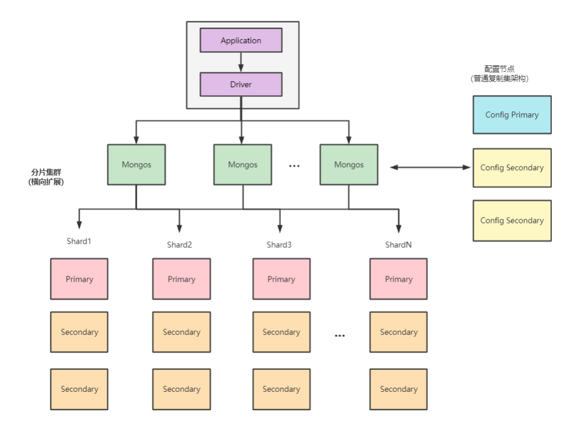
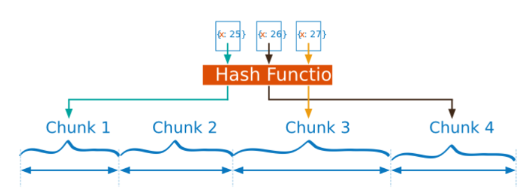
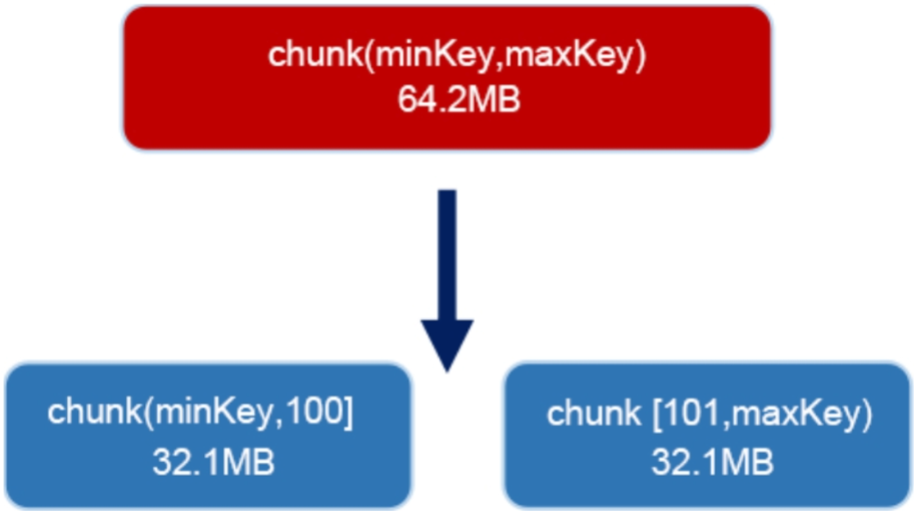
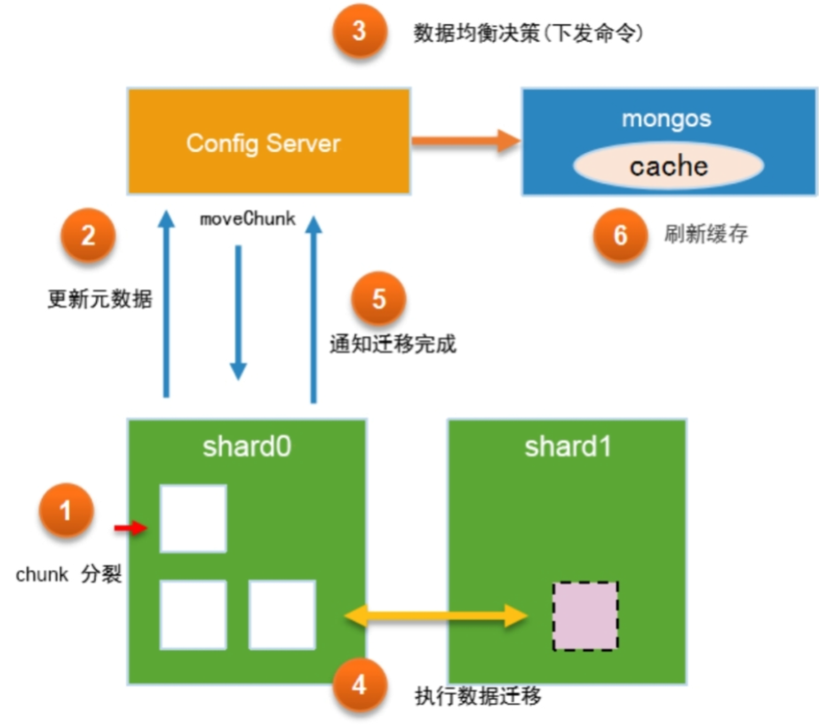

- 分片集群架构
- 分片策略
- 数据均衡

---
## 分片集群架构

- 使用分片的场景
	- 存储容量需求超出单机的磁盘容量
	- 活跃的数据集超出单机内存容量，导致很多请求都要从磁盘读取数据
	- 写IOPS超出单个MongoDB节点的写服务能力
- MongoDB 分片集群架构（Sharded Cluster）：水平扩展
	- 在分片模式下，存储不同的切片数据的节点被称为分片节点，除了分片节点，集群中还需要一些配置节点、路由节点，以保证分片机制的正常运作
		- 
- 核心概念
	- 数据分片
		- 分片用于存储真正的数据，并提供最终的数据读写访问。分片仅仅是一个逻辑的概念，它可以是一个单独的mongod实例，也可以是一个复制集
		- 在生产环境中也一般会使用复制集的方式，这是为了防止数据节点出现单点故障
	- 配置服务器（Config Server）
		- 配置服务器包含多个节点，并组成一个复制集结构
		- 配置复制集中保存了整个分片集群中的元数据，其中包含各个集合的分片策略，以及分片的路由表等
	- 查询路由（mongos）
		- mongos是分片集群的访问入口，其本身并不持久化数据
		- mongos启动后，会从配置服务器中加载元数据
		- 之后mongos开始提供访问服务，并将用户的请求正确路由到对应的分片
		- 在分片集群中可以部署多个mongos以分担客户端请求的压力
- 使用分片集群
	- `sh.enableSharding("shop")` 先开启database的分片功能
	- `sh.shardCollection("shop.product",{productId:"hashed"},false,{numInitialChunks:4})`
		- 对集合执行分片初始化
		- shop.product集合将productId作为分片键，并采用了哈希分片策略
		- “numInitialChunks：4”表示将初始化4个chunk
		- numInitialChunks 必须和哈希分片策略配合使用
		- 这个选项只能用于空的集合，如果已经存在数据则会返回错误
- 查询数据分布 `db.product.getShardDistribution()` 
- chunk的意思是数据块，一个chunk代表了集合中的“一段数据”
	- chunk所描述的是范围区间，就是分片键各个值（或哈希值）的连续区间
	- 集群在操作分片集合时，会根据分片键找到对应的chunk，并向该chunk所在的分片发起操作请求
	- chunk的分布在一定程度上会影响数据的读写路径，这由以下两点决定
		- chunk的切分方式，决定如何找到数据所在的chunk
		- chunk的分布状态，决定如何找到chunk所在的分片

---
## 分片策略

- 分片算法：chunk切分是根据分片策略进行实施的，分片策略的内容包括分片键和分片算法
	- 范围分片（range sharding）：范围分片能很好地满足范围查询的需求
		- 缺点在于，如果Shard Key有明显递增（或者递减）趋势，则新插入的文档会分布到同一个chunk，此时写压力会集中到一个节点，从而导致单点的性能瓶颈
			- 时间值；ObjectId，自动生成的_id由时间、计数器组成；UUID，包含系统时间、时钟序列；自增整数序列
	- 哈希分片（hash sharding）：适用于日志，物联网等高并发场景
		- 事先根据分片键计算出一个新的哈希值（64位整数），再根据哈希值按照范围分片的策略进行chunk的切分
		- 
		- 哈希分片与范围分片是互补的（哈希分片的离散性既是优点也是缺点）
			- 由于哈希算法保证了随机性，所以文档可以更加离散地分布到多个chunk上，这避免了集中写问题
			- 然而，在执行一些范围查询时，哈希分片并不是高效的（离散）
	- 哈希分片只能选择单个字段，而范围分片允许采用组合式的多字段作为分片键
		- 4.4 以后的版本，可以将单个字段的哈希分片和一个到多个的范围分片键字段来进行组合
			- `{x:1 , y:"hashed"}`
- 分片标签：MongoDB允许通过为分片添加标签（tag）的方式来控制数据分发
	- 一个标签可以关联到多个分片区间（TagRange）
		- 均衡器会优先考虑chunk是否正处于某个分片区间上（被完全包含）；意思是当前的chunk是不是在某个分片区间上被完全包含了（可以关联多个分片区间）
			- 如果是则会将chunk迁移到分片区间所关联的分片，否则按一般情况处理
	- 分片标签适用于一些特定的场景
		- 集群中可能同时存在OLTP和OLAP处理
			- 一些系统日志的重要性相对较低，而且主要以少量的统计分析为主
			- 为了便于单独扩展，我们可能希望将日志与实时类的业务数据分开，此时就可以使用标签
	- `sh.addShardTag("shard01","oltp")` 让分片拥有指定的标签
	- `sh.addTagRange("main.devices",{shardKey:MinKey},{shardKey:MaxKey},"oltp")` 指定分片标签
- 分片键（ShardKey）的选择
	- 在选择分片键时，需要根据业务的需求及范围分片、哈希分片的不同特点进行权衡
	- 在设计分片键时需要考虑的因素包括
		- 分片键的基数（cardinality），取值基数越大越有利于扩展
		- 分片键的取值分布应该尽可能均匀
		- 业务读写模式，尽可能分散写压力，而读操作尽可能来自一个或少量的分片
		- 分片键应该能适应大部分的业务操作
- 分片键（ShardKey）的约束：ShardKey 必须是一个索引
	- 非空集合须在 ShardCollection 前创建索引
	- 空集合 ShardCollection 自动创建索引
	- ShardKey 大小无限制
	- 支持复合哈希分片键
	- Document 中可以不包含 ShardKey，插入时被当 做 Null 处理
	- 为 ShardKey 添加后缀 refineCollectionShardKey 命令，可以修改 ShardKey 包含的 Field
	- 如果 ShardKey 为非 `_ID` 字段， 那么可以修改 ShardKey 对应的值

---
## 数据均衡

- 均衡的方式：为了保证分片集群的水平扩展能力，业务数据应当尽可能地保持均匀分布
	- 所有的数据应均匀地分布于不同的chunk上（由业务场景和分片策略来决定）
	- 每个分片上的chunk数量尽可能是相近的
		- 手动均衡
			- 可以在初始化集合时预分配一定数量的chunk（仅适用于哈希分片）
			- 可以通过splitAt、moveChunk命令进行手动切分、迁移
		- 自动均衡：开箱即用
			- 均衡器会在后台对各分片的chunk进行监控，一旦发现了不均衡状态就会自动进行chunk的搬迁以达到均衡
- chunk 不均衡通常来自于两方面的因素
	- 在没有人工干预的情况下，chunk会持续增长并产生分裂（split），而不断分裂的结果就会出现数量上的不均衡
	- 在动态增加分片服务器时，也会出现不均衡的情况
- chunk 分裂：默认情况下，一个chunk的大小为64MB，该参数由配置的chunksize参数指定
	- 如果持续地向该chunk写入数据，并导致数据量超过了chunk大小，则MongoDB会自动进行分裂，将该chunk切分为两个相同大小的chunk
		- 
	- chunk分裂是基于分片键进行的，如果分片键的基数太小，则可能因为无法分裂而会出现 jumbo chunk（超大块）的问题
		- jumbo chunk对水平扩展有负面作用，该情况不利于数据的均衡，业务上应尽可能避免
- 写入压力过大的情况可能会导致chunk多次失败（split）
	- 最终当chunk中的文档数大于`1.3×avgObjectSize`时会导致无法迁移
- 自动均衡
	- MongoDB的数据均衡器运行于Primary Config Server（配置服务器的主节点）上，而该节点也同时会控制chunk数据的搬迁流程
		- 
		- 分片shard0在持续的业务写入压力下，产生了chunk分裂
		- 分片服务器通知Config Server进行元数据更新
		- Config Server的自动均衡器对chunk分布进行检查，发现shard0和shard1的chunk数差异达到了阈值
			- 向shard0下发moveChunk命令以执行chunk迁移
		- shard0执行指令，将指定数据块复制到shard1
			- 该阶段会完成索引、chunk数据的复制
			- 整个过程中业务侧对数据的操作仍然会指向shard0
			- 在第一轮复制完毕之后，目标shard1会向shard0确认是否还存在增量更新的数据
				- 如果存在则继续复制
		- shard0完成迁移后发送通知，此时Config Server开始更新元数据库，将chunk的位置更新为目标shard1
			- 在更新完元数据库后并确保没有关联cursor的情况下，shard0会删除被迁移的chunk副本
		- Config Server通知mongos服务器更新路由表
			- 新的业务请求将被路由到shard1
- 迁移阈值：均衡器对于数据的“不均衡状态”判定是根据两个分片上的chunk个数差异来进行的
	- chunk个数少于20 迁移阈值 2
	- chunk个数20～79 迁移阈值 4
	- chunk个数80及以上 迁移阈值 8
- 迁移速度：整个过程并不是很快
	- `_secondaryThrottle`：用于调整迁移数据写到目标分片的安全级别（默认设定为 false）
		- 如果没有设定，则会使用`w:2`选项，即至少一个备节点确认写入迁移数据后才算成功
		- MongoDB 3.4版本开始，`_secondaryThrottle`被默认设定为false，chunk迁移不再等待备节点写入确认
	- `_waitForDelete`：在chunk迁移完成后，源分片会将不再使用的chunk删除（默认设定为 false）
		- 如果`_waitForDelete`是true，那么均衡器需要等待chunk同步删除后才进行下一次迁移
		- 该选项默认为false，这意味着对于旧chunk的清理是异步进行的
	- 并行迁移数量：允许n个分片的集群同时执行n/2个并发任务
	- 从MongoDB 4.0版本开始，支持在迁移数据的过程中并发地读取源端和写入目标端
		- 使得新加入的分片能更快地分担集群的访问读写压力
- 数据均衡带来的问题：会影响性能
	- 在分片间进行数据块的迁移是一个“繁重”的工作，很容易带来磁盘I/O使用率飙升，或业务时延陡增等一些问题
		- 提升磁盘能力
		- 将数据均衡的窗口对齐到业务的低峰期以降低影响
			- `use config`
			- `sh.setBalancerState(true)`
			- `db.settings.update({_id:"balancer"},{$set:{activeWindow:{start:"02:00",stop:"04:00"}}},{upsert:true})`
				- 启用了自动均衡器，同时在每天的凌晨2点到4点运行数据均衡操作
	- 对分片集合中执行count命令可能会产生不准确的结果
		- mongos在处理count命令时会分别向各个分片发送请求，并累加最终的结果
			- 如果分片上正在执行数据迁移，则可能导致重复的计算
		- 替代办法是使用`db.collection.countDocuments({})`方法
			- 该方法会执行聚合操作进行实时扫描，可以避免元数据读取的问题，但需要更长时间
	- 在执行数据库备份的期间，不能进行数据均衡操作，会产生不一致的备份数据
		- 在备份操作之前，可以通过如下命令确认均衡器的状态
			- `sh.getBalancerState()`：查看均衡器是否开启
			- `sh.isBalancerRunning()`：查看均衡器是否正在运行
			- `sh.getBalancerWindow()`：查看当前均衡的窗口设定

