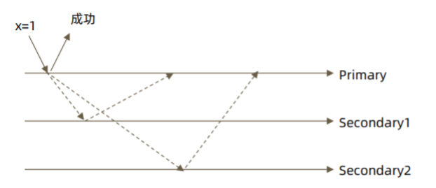
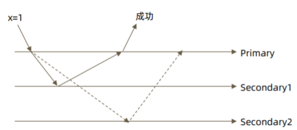
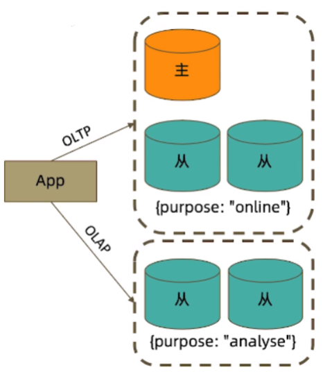
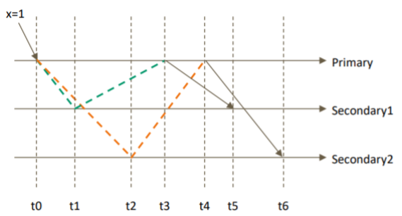
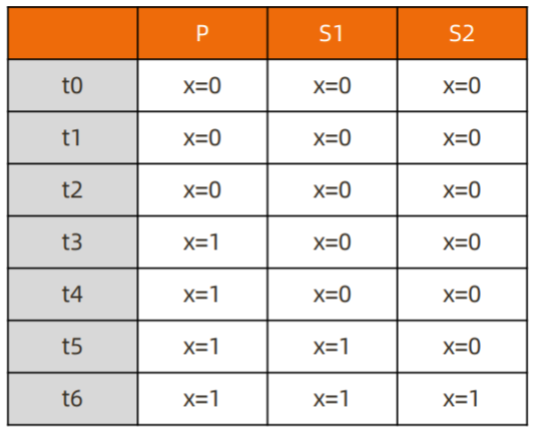
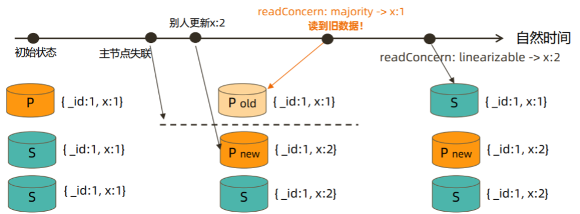

- MongoDB 多文档事务
	- writeConcern
	- readPreference
	- readConcern
- 事务隔离级别

---
## MongoDB 多文档事务

- 对单个文档的操作是原子的
	- 由于可以在单个文档结构中使用内嵌文档和数组来获得数据之间的关系，而不必跨多个文档和集合进行范式化，所以这种单文档原子性避免了许多实际场景中对多文档事务的需求
- 支持多文档事务（能不用尽量不用）
	- 通过合理地设计文档模型，可以规避绝大部分使用事务的必要性
- 支持分布式事务，事务可以跨多个操作、集合、数据库、文档和分片使用
- 使用事务的原则
	- 无论何时，事务的使用总是能避免则避免
	- 模型设计先于事务，尽可能用模型设计规避事务
	- 不要使用过大的事务（尽量控制在 1000 个文档更新以内）
	- 当必须使用事务时，尽可能让涉及事务的文档分布在同一个分片上，这将有效地提高效率
- 事务支持机制
	- Atomocity 原子性：单表单文档；复制集多表多行；分片集群多表多行
	- Consistency 一致性： writeConcern, readConcern
	- Isolation 隔离性：readConcern
	- Durability 持久性：Journal and Replication
- 使用方法
```java
// java
try (ClientSession clientSession = client.startSession()) { 
	clientSession.startTransaction();
	collection.insertOne(clientSession, docOne);
	collection.insertOne(clientSession, docTwo);
	clientSession.commitTransaction();
}

// js
var session = db.getMongo().startSession()
session.startTransaction({readConcern:{level:"snapshot"},writeConcern:{w:"majority"}})
session.commitTransaction()
session.abortTransaction() // 回滚事务
```

### writeConcern

- writeConcern 决定一个写操作落到多少个节点上才算成功
	- w: 数据写入到number个节点才向用客户端确认
		- {w: 0} 对客户端的写入不需要发送任何确认，适用于性能要求高，但不关注正确性的场景
		- {w: 1} 默认的writeConcern，数据写入到Primary就向客户端发送确认
			- 
		- {w: "majority"} 数据写入到副本集大多数成员后向客户端发送确认，适用于对数据安全性要求比较高的场景，该选项会降低写入性能
			- 
	-  j: 写入操作的journal持久化后才向客户端确认
		- 默认为{j: false}，如果要求Primary写入持久化了才向客户端确认，则指定该选项为true
	- wtimeout: 写入超时时间，仅w的值大于1时有效
		- 当指定{w: }时，数据需要成功写入number个节点才算成功，如果写入过程中有节点故障，可能导致这个条件一直不能满足，从而一直不能向客户端发送确认结果
			- 客户端可设置wtimeout选项来指定超时时间，当写入过程持续超过该时间仍未结束，则认为写入失败
- 注意事项
	- 然多于半数的 writeConcern 都是安全的，但通常只会设置 majority，因为这是等待写入延迟时间最短的选择
	- 不要设置 writeConcern 等于总节点数，因为一旦有一个节点故障，所有写操作都将失败
	- writeConcern 虽然会增加写操作延迟时间，但并不会显著增加集群压力，因此无论是否等待，写操作最终都会复制到所有节点上。设置 writeConcern 只是让写操作等待复制后再返回而已
	- 应对重要数据应用 {w: “majority”}，普通数据可以应用 {w: 1} 以确保最佳性能

### readPreference

- readPreference 决定使用哪一个节点来满足正在发起的读请求
	- primary: 只选择主节点，默认模式
	- primaryPreferred：优先选择主节点，如果主节点不可用则选择从节点
	- secondary：只选择从节点
	- secondaryPreferred：优先选择从节点， 如果从节点不可用则选择主节点
	- nearest：根据客户端对节点的 Ping 值判断节点的远近，选择从最近的节点读取
- 场景举例
	- primary/primaryPreferred 用户下订单后马上将用户转到订单详情页（此时从节点可能还没复制到新订单）
	- secondary/secondaryPreferred 用户查询自己下过的订单（时效性通常没有太高要求）
	- secondary 生成报表（对时效性要求不高，但资源需求大）
	- nearest 将用户上传的图片分发到全世界，让各地用户能够就近读取
- readPreference 配置
	- `mongodb://host1:27107,host2:27107,host3:27017/?replicaSet=rs0&readPreference=secondary`
	- `MongoCollection.withReadPreference(ReadPreference readPref)`
	- `db.collection.find().readPref( "secondary" )`
- Tag：readPreference 只能控制使用一类节点。Tag 则可以将节点选择控制到一个或几个节点
	- 
	- `conf = rs.conf()`
	- `conf.members[1].tags = { purpose: "online"}`
	- `conf.members[4].tags = { purpose: "analyse"}`
	- `rs.reconfig(conf)`
	- `db.collection.find({}).readPref( "secondary", [ {purpose: "analyse"} ] )`
- 注意事项
	- 指定 readPreference 时也应注意高可用问题
		- 将 readPreference 指定 primary，则发生故障转移不存在 primary 期间将没有节点可读。如果业务允许，则应选择 primaryPreferred
	- 使用 Tag 时也会遇到同样的问题，如果只有一个节点拥有一个特定 Tag，则在这个节点失效时将无节点可读。这在有时候是期望的结果，有时候不是
	- Tag 有时需要与优先级、选举权综合考虑。例如做报表的节点通常不会希望它成为主节点，则优先级应为 0

### readConcern

- 在 readPreference 选择了指定的节点后，readConcern 决定这个节点上的数据哪些是可读的，类似事务隔离级别
	- available：读取所有可用的数据
	- local（默认）：读取所有可用且属于当前分片的数据
	- majority（数据读一致性的充分保证）：读取在大多数节点上提交完成的数据
	- linearizable（增强处理 majority 情况下主节点失联时候的例外情况 ）：可线性化读取文档，仅支持从主节点读
	- snapshot（最高隔离级别）：读取最近快照中的数据，仅可用于多文档事务
	- `db.user.find().readConcern("local")`
- 在复制集中 local 和 available 是没有区别的，两者的区别主要体现在分片集上
	- 一个 chunk x 正在从 shard1 向 shard2 迁移
	- 整个迁移过程中 chunk x 中的部分数据会在 shard1 和 shard2 中同时存在，但源分片 shard1仍然是chunk x 的负责方
		- 所有对 chunk x 的读写操作仍然进入 shard1
		- config 中记录的信息 chunk x 仍然属于 shard1
	- 此时如果读 shard2，则会体现出 local 和 available 的区别
		- local：只取应该由 shard2 负责的数据（不包括 x）
		- available：shard2 上有什么就读什么（包括 x）
	- 注意事项
		- 虽然看上去总是应该选择 local，但毕竟对结果集进行过滤会造成额外消耗。在一些无关紧要的场景（例如统计）下，也可以考虑 available
		- 从主节点读取数据时默认 readConcern 是 local
		- 从从节点读取数据时默认 readConcern 是 available（向前兼容原因）
- `readConcern:majority` 只读取大多数据节点上都提交了的数据
	- 
	- 
	- 考虑 t3 时刻的 Secondary1
		- 对于要求 majority 的读操作，它将返回 x=0
		- 对于不要求 majority 的读操作，它将返回 x=1
	- 配置文件：`replication:enableMajorityReadConcern: true`
- MVCC 机制（节点上维护多个 x 版本），MongoDB 通过维护多个快照来链接不同的版本
	- 每个被大多数节点确认过的版本都将是一个快照
	- 快照持续到没有人使用为止才被删除
- MongoDB 中的回滚
	- 写操作到达大多数节点之前都是不安全的，一旦主节点崩溃，而从节点还没复制到该次操作，刚才的写操作就丢失了
	- 把一次写操作视为一个事务，从事务的角度，可以认为事务被回滚了
- `readConcern:majority` 可以有效避免脏读
	- 如果在一次写操作到达大多数节点前读取了这个写操作，然后因为系统故障该操作回滚了，则发生了脏读问题
- 安全的读写分离：向主节点写入一条数据之后立即从从节点读取这条数据（可能读不到）
	- 使用 writeConcern+readConcern majority 来解决
		- `db.orders.insert({oid:101,sku:"kite",q:1},{writeConcern:{w:"majority"}})`
		- `db.orders.find({oid:101}).readPref("secondary").readConcern("majority")`
- `readConcern: linearizable` 只读取大多数节点确认过的数据。和 majority 最大差别是保证绝对的操作线性顺序
	- 在写操作自然时间后面的发生的读，一定可以读到之前的写 
	- 只对读取单个文档时有效
	- 可能导致非常慢的读，因此总是建议配合使用 maxTimeMS
	- 
- `readConcern: snapshot` 只在多文档事务中生效
	- 将保证在事务中的读：不出现脏读、不可重复读、幻读
	- 因为所有的读都将使用同一个快照，直到事务提交为止该快照才被释放

---
## 事务隔离级别

- 事务完成前，事务外的操作对该事务所做的修改不可访问
	- readPreference 
		- available：读取所有可用的数据
		- local（默认）：读取所有可用且属于当前分片的数据
		- majority（数据读一致性的充分保证）：读取在大多数节点上提交完成的数据
		- linearizable（增强处理 majority 情况下主节点失联时候的例外情况 ）
			- 可线性化读取文档，仅支持从主节点读
		- snapshot（最高隔离级别）：读取最近快照中的数据，仅可用于多文档事务
- 如果事务内使用 {readConcern: “snapshot”}，则可以达到可重复读 
- 事务超时
	- 默认情况下MongoDB会为每个事务设置1分钟的超时时间，如果在该时间内没有提交，就会强制将其终止
	- 该超时时间可以通过transactionLifetimeLimitSecond变量设定
- 事务写机制
	- 当一个事务开始后，如果事务要修改的文档在事务外部被修改过，则事务修改这个文档时会触发 Abort 错误，因为此时的修改冲突了
		- 这种情况下，只需要简单地重做事务就可以了
	- 如果一个事务已经开始修改一个文档，在事务以外尝试修改同一个文档，则事务以外的修改会等待事务完成才能继续进行
- 注意事项
	- 可以实现和关系型数据库类似的事务场景
	- 必须使用与 MongoDB 4.2 兼容的驱动
	- 事务默认必须在 60 秒（可调）内完成，否则将被取消
	- 涉及事务的分片不能使用仲裁节点
	- 事务会影响 chunk 迁移效率。正在迁移的 chunk 也可能造成事务提交失败（重试即可）
	- 多文档事务中的读操作必须使用主节点读
	- readConcern 只应该在事务级别设置，不能设置在每次读写操作上


