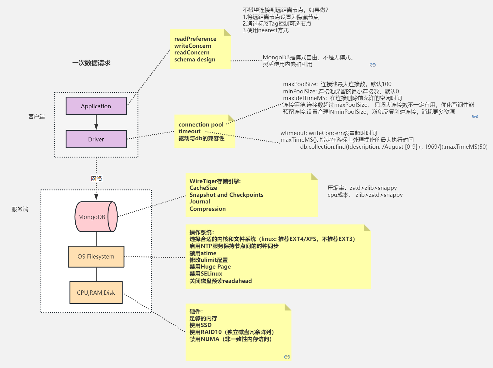

- 影响 MongoDB 性能的因素
- MongoDB 性能监控工具：mongostat；mongotop；Profiler；`db.currentOp()`

---

## 影响 MongoDB 性能的因素

- 导致MongoDB性能不佳的原因
	- 慢查询；阻塞等待（通常是因为模型/索引设计不佳导致的）
	- 硬件资源不足
- 影响MongoDB性能的因素
	- 
- MongoDB 优化建模
	- 使用数组索引区分不同的属性，比如一张电影票在不同影院的价格，用户查最优价格的时候就可以使用数组索引
	- 对数据的分段存储
		- 比如高频时序数据，那么可以利用嵌套文档把每秒钟的数据单独存放为一个属性，然后把每分钟的数据单独存放为一个文档（恰好WiredTiger是每分钟进行一次刷盘）

---

## MongoDB 性能监控工具

- mongostat：可以提供数据库节点或者整个集群当前的状态视图（当前的QPS/内存使用/连接数，以及多个分片的压力分布），采用Go语言实现，其内部使用了`db.serverStatus()`命令，要求执行用户需具备clusterMonitor角色权限
	- `mongostat -h 192.168.65.174 --port 28017 -ufox -pfox --authenticationDatabase=admin --discover -n 300 2`
		- `--discover`：启用自动发现，可展示集群中所有分片节点的状态
		- `-n 300 2`：表示输出300次，每次间隔2s。也可以不指定`-n 300`，此时会一直保持输出
	- 需要关注的指标主要有
		- 插入、删除、修改、查询的速率是否产生较大波动，是否超出预期
		- qrw、arw：队列是否较高，若长时间大于0则说明此时读写速度较慢
			- `qrw` 客户端读写等待队列数量，高并发时，一般队列值会升高
			- `arw` 客户端读写活跃个数
		- conn：连接数是否太多
			- `conn` 当前连接数
		- dirty：百分比是否较高，若持续高于10%则说明磁盘I/O存在瓶颈
			- `%dirty` WiredTiger 缓存中脏数据百分比
			- `%used` WiredTiger 正在使用的缓存百分比
		- netIn、netOut：是否超过网络带宽阈值
			- `netIn` 网络接收数据量
			- `netOut` 网络发送数据量
		- repl：状态是否异常，如PRI、SEC、RTR为正常，若出现REC等异常值则需要修复
			- `repl` 复制节点状态（主节点/二级节点……)
	- `--interactive`选项，用来实现非滚动式的监视（交互模式）
		- `mongostat -h 192.168.65.174 --port 28017 -ufox -pfox --authenticationDatabase=admin --discover --interactive -n 2`
- mongotop：可用于查看数据库的热点表，可以判定是哪些集合占用了大部分读写时间，mongotop与mongostat的实现原理类似，同样需要clusterMonitor角色权限
	- `mongotop -h 192.168.65.174 --port=28017 -ufox -pfox --authenticationDatabase=admin`
		- 默认情况下，mongotop会持续地每秒输出当前的热点表
	- 需要关注的因素主要有
		- 热点表操作耗费时长是否过高
			- 这里的时长是在一定的时间间隔内的统计值，它代表某个集合读写操作所耗费的时间总量
			- 在业务高峰期时，核心表的读写操作一般比平时高一些，通过mongotop的输出可以对业务尖峰做出一些判断
		- 是否存在非预期的热点表。一些慢操作导致的性能问题可以从mongotop的结果中体现出来
	- `mongotop -h 192.168.65.174 --port=28017 -ufox -pfox --authenticationDatabase=admin -n 100 2`
		- 最多输出100次，每次间隔时间为2s
- Profiler：可以用来记录、分析MongoDB的详细操作日志。默认情况下该功能是关闭的，对某个业务库开启Profiler模块之后，符合条件的慢操作日志会被写入该库的system.profile集合中
	- 提供了几种调试级别
		- 0 日志关闭，无任何输出
		- 1 部分开启，仅符合条件（时长大于slowms）的操作日志会被记录
		- 2 日志全开，所有的操作日志都被记录
	- `db.setProfilingLevel(2)` 对当前的数据库开启 Profiler 模块，并将 level 设置为2（日志全开）
	- `db.getProfilingStatus()` 检查是否生效
		- slowms 是慢操作的阈值，单位是毫秒
		- sampleRate 表示日志随机采样的比例，1.0则表示满足条件的全部输出
	- `db.setProfilingLevel(1,500)` 只记录时长超过500ms的操作，则可以将level设置为1
	- `db.setProfilingLevel(1,{slowms:500,sampleRate:0.5})` 设置随机采样的比例
	- `db.system.profile.find().limit(5).sort({ts:-1}).pretty()` 查看最近发生的操作日志
		- ns：名称空间，格式为 `{db}.{collection}`
		- numYield：操作数，大于0表示等待锁或者是磁盘I/O操作
		- nreturned：返回条目数
		- keysExamined：扫描索引条目数，如果比nreturned大出很多，则说明查询效率不高
		- docsExamined：扫描文档条目数，如果比nreturned大出很多，则说明查询效率不高
		- locks：锁占用的情况
		- responseLength：响应数据大小（字节数），一次性查询太多的数据会影响性能，可以使用limit、batchSize进行一些限制
		- ts：命令执行的时间点
	- `db.system.profile.find().limit(10).sort({millis:-1}).pretty()` 查看执行时长最大的10条操作记录
	- `db.system.profile.find({op:"update",ns:"shop.user"})` 查看某个集合中的update操作日志
	- 注意事项
		- system.profile是一个1MB的固定大小的集合，随着记录日志的增多，一些旧的记录会被滚动删除
		- 在线上开启Profiler模块需要非常谨慎，这是因为其对MongoDB的性能影响比较大。建议按需部分开启，同时slowms的值不要设置太低
		- sampleRate的默认值是1.0，该字段可以控制记录日志的命令数比例，但只有在MongoDB 4.0版本之后才支持
		- Profiler模块的设置是内存级的，重启服务器后会自动恢复默认状态
- `db.currentOp()` 用来查看数据库当前正在执行的一些操作，读取的是当前数据库的命令快照
	- 返回有用的信息
		- 操作的运行时长，快速发现耗时漫长的低效扫描操作
		- 执行计划信息，用于判断是否命中了索引，或者存在锁冲突的情况
		- 操作ID、时间、客户端等信息，方便定位出产生慢操作的源头
	- 优化
		- 字段加索引
		- 如果更新的数据集非常大，要避免大范围update操作，切分成小批量的操作
	- `db.killOp(4001)`
		- opid表示当前操作在数据库进程中的唯一编号
		- 如果已经发现该操作正在导致数据库系统响应缓慢，则可以考虑将其“杀”死
	- 命令输出
		- currentOp.type：操作类型，可以是op、idleSession、idleCursor的一种，一般的操作信息以op表示
		- currentOp.currentOpTime：操作的开始时间
		- currentOp.opid：操作的标志编号
		- currentOp.active：操作是否活跃。如果是空闲状态则为false
		- currentOp.secs_running：操作持续时间（以秒为单位）
		- currentOp.ns：操作目标的集合命名空间
		- currentOp.locks：当前操作持有锁的类型和模式
		- currentOp.waitingForLock：是否正在等待锁
		- currentOp.numYields：当前操作执行yield的次数。一些锁互斥或者磁盘I/O读取都会导致该值大于0
		- currentOp.lockStats：当前操作持有锁的统计
	- 注意事项
		- db.currentOp返回的是数据库命令的瞬时状态，因此如果数据库压力不大，则通常只会返回极少的结果
		- 如果启用了复制集，那么currentOp还会返回一些复制的内部操作（针对local.oplog.rs），需要筛选
		- db.currentOp的结果是一个BSON文档，如果大小超过16MB则会被压缩。可以使用聚合操作`$currentOp`获得完整的结果
- `db.currentOp()` 过滤条件
	- `db.currentOp({ secs_running:{$gt:1} })`  查看执行时间超过1s的操作
	- `db.currentOp({ ns:/test/ })` 查看test数据库中的操作
	- 查看等待锁的增加、删除、修改、查询操作
		- `db.currentOp({  waitingForLock:true, $or:[ `
			- `{op:{$in:["insert","update","remove"]}},{"query.findandmodify":{$exists:true}}]})`

