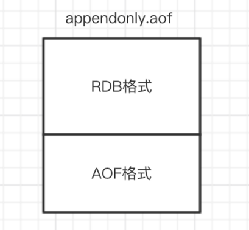

::: tip 介绍
1. RDB：dump.rdb （二进制文件）
2. AOF（append-only file）：appendonly.aof（resp协议格式）
3. 混合持久化：RDB+AOF
4. 数据备份策略
:::

## RDB: dump.rdb

- RDB：dump.rdb （二进制文件）
	- 配置文件：`bgsave` 方式
		- `save 60 1000`  关闭RDB只需要将所有的 `save` 保存策略注释掉即可
			- 60 秒内有至少有 1000 个键被改动， 则进行一次 RDB 持久化
	- 命令：覆盖原有 rdb 快照文件
		- `save`：同步
		- `bgsave`：异步，写时复制 - COW机制
			- `bgsave` 子进程是由主线程 fork 生成的，可以共享主线程的所有内存数据
				- 在生成子进程执行调用fork函数时会有短暂阻塞
			- 如果主线程要修改一块数据，那么，这块数据就会被复制一份，生成该数据的副本。然后，`bgsave` 子进程会把这个副本数据写入 RDB 文件，而在这个过程中，主线程仍然可以直接修改原来的数据

::: danger 缺点
宕机后，服务器将丢失最近写入、且仍未保存到快照中的数据
:::

## AOF: appendonly.aof

- AOF（append-only file）：appendonly.aof（resp协议格式）
	- 将修改的每一条指令记录进文件appendonly.aof中（先写入os cache，每隔一段时间fsync到磁盘）
	- 命令：`bgrewriteaof`  （fork出一个子进程去做）
	- 配置文件

|配置文件|介绍|
|-|-|
|`appendonly yes`|开启AOF模式|
|`appendfsync always`|每条命令都fsync一次，拉低性能|
|`appendfsync everysec`|每秒fsync一次，推荐，缺点是宕机后会丢失1秒的数据，但可以从数据库恢复|
|`appendfsync no`|让操作系统决定fsync的时机，快但不安全|
|`auto‐aof‐rewrite‐min‐size 64mb`|AOF文件超过64M时，重写AOF文件（整合命令）|
|`auto‐aof‐rewrite‐percentage 100`|自上一次重写后文件大小增长了100%则再次触发重写|

::: warning 缺点
体积大，恢复慢
:::

## 混合持久化

- 混合持久化：RDB+AOF
	- 配置文件（必须先开启AOF）：`aof‐use‐rdb‐preamble yes`
	- 将重写这一刻之前的内存做RDB快照处理，并且将RDB快照内容和增量的AOF修改内存数据的命令（生成RDB过程中产生的命令）存在一起，都写入新的AOF文件
	- 新的文件一开始不叫appendonly.aof，等到重写完新的AOF文件才会进行改名，覆盖原有的AOF文件，完成新旧两个AOF文件的替换

::: info 优点
在 Redis 重启的时候，可以先加载 RDB 的内容，然后再重放增量 AOF 日志就可以完全替代之前的AOF 全量文件重放，因此重启效率大幅得到提升
:::

## 数据备份策略

- 数据备份策略：
	1. 写crontab定时调度脚本，每小时都copy一份rdb或aof的备份到一个目录中去，仅仅保留最近48小时的备份
	2. 每天都保留一份当日的数据备份到一个目录中去，可以保留最近1个月的备份
	3. 每次copy备份的时候，删除一些旧备份
	4. 每天晚上将当前机器上的备份复制一份到其他机器上，以防机器损坏
