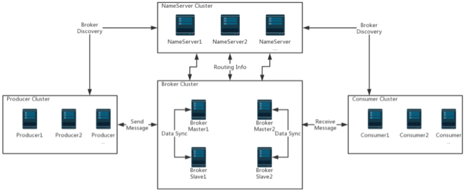
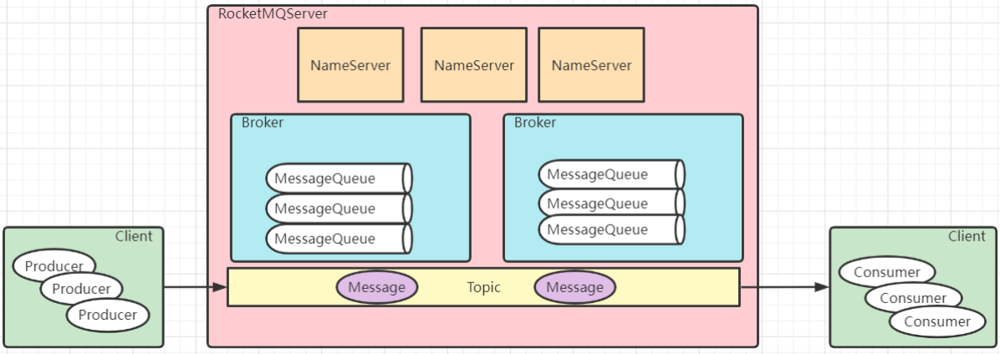

- RocketMQ 集群架构 
	- 
	- Producer：消息生产者集群。通常是业务系统中的一个功能模块。 
	- Consumer：消息消费者集群。通常也是业务系统中的一个功能模块。
	- Broker：实际处理消息存储、转发等服务的核心组件。
	- NameServer : 提供轻量级的Broker路由服务。 管理Broker
		- 所以我们要启动RocketMQ服务，需要先启动NameServer。
	- Topic：区分消息的种类；
		- 一个发送者可以发送消息给一个或者多个Topic
		- 一个消息的接收者可以订阅一个或者多个Topic消息
	- Message Queue：相当于是Topic的分区；用于并行发送和接收消息
	- 这种主从结构是只做数据备份，没有容灾功能
- Dledger 高可用集群：基于Raft协议
	- 修改conf/dleger下的配置文件
- 系统参数调优
	- 配置RocketMQ的JVM内存大小 `runbroker.sh`
		- `-XX:+UseG1GC` 使用G1垃圾回收器
		- `-XX:G1HeapRegionSize=16m` 将G1的region块大小设为16M
		- `-XX:G1ReservePercent` 在G1的老年代中预留25%空闲内存
		- `-XX:InitiatingHeapOccupancyPercent=30` 当堆内存的使用率达到30%之后就会启动G1垃圾回收器尝试回收垃圾
	- RocketMQ的其他一些核心参数
		- `sendMessageThreadPoolNums=16` RocketMQ内部用来发送消息的线程池的线程数量是16个
	- Linux内核参数定制
		- ulimit，需要进行大量的网络通信和磁盘IO
		- vm.extra_free_kbytes，告诉VM在后台回收（kswapd）启动的阈值与直接回收（通过分配进程）的阈值之间保留额外的可用内存。RocketMQ使用此参数来避免内存分配中的长延迟
		- vm.min_free_kbytes，如果将其设置为低于1024KB，将会巧妙的将系统破坏，并且系统在高负载下容易出现死锁
		- vm.max_map_count，限制一个进程可能具有的最大内存映射区域数。RocketMQ将使用mmap加载CommitLog和ConsumeQueue，因此建议将为此参数设置较大的值
		- vm.swappiness，定义内核交换内存页面的积极程度。较高的值会增加攻击性，较低的值会减少交换量。建议将值设置为10来避免交换延迟
		- File descriptor limits，RocketMQ需要为文件（CommitLog和ConsumeQueue）和网络连接打开文件描述符。我们建议设置文件描述符的值为655350
			- `/proc/sys/vm`
		- 另外，RocketMQ的bin目录下有个`os.sh`里面设置了RocketMQ建议的系统内核参数
- RocketMQ消息转发模型
	- 
	- 消息模型（Message Model） 
		- RocketMQ 主要由 Producer、Broker、Consumer 三部分组成
		- Producer 负责生产消息，Consumer 负责消费消息，Broker 负责存储消息
		- Broker 在实际部署过程中对应一台服务器
			- 每个 Broker 可以存储多个Topic的消息，每个Topic 的消息也可以分片存储于不同的 Broker
		- Message Queue 用于存储消息的物理地址
			- 每个Topic中的消息地址存储于多个 Message Queue 中
		- ConsumerGroup 由多个Consumer 实例构成
	- 消息生产者（Producer） 
		- 一个消息生产者会把业务应用系统里产生的消息发送到broker服务器
		- 同步发送、异步发送、顺序发送、单向发送
			- 同步和异步方式均需要Broker返回确认信息，单向发送不需要
		-  生产者中，会把同一类Producer组成一个集合，叫做生产者组
			- 同一组的Producer被认为是发送同一类消息且发送逻辑一致
	- 消息消费者（Consumer） 
		-  负责消费消息，一般是后台系统负责异步消费
		- 一个消息消费者会从Broker服务器拉取消息、并将其提供给应用程序
		- 拉取式消费
			- 拉取式消费的应用通常主动调用Consumer的拉消息方法从Broker服务器拉消息、主动权由应用控制。一旦获取了批量消息，应用就会启动消费过程
		- 推动式消费
			- 推动式消费模式下Broker收到数据后会主动推送给消费端，该消费模式一般实时性较高
		-  消费者同样会把同一类Consumer组成一个集合，叫做消费者组
			- 这类Consumer通常消费同一类消息且消费逻辑一致
			- 消费者组使得在消息消费方面，实现负载均衡和容错的目标变得非常容易
			- 消费者组的消费者实例必须订阅完全相同的Topic
		- 集群消费模式下,  相同Consumer Group的每个Consumer实例平均分摊消息
		- 广播消费模式下，相同Consumer Group的每个Consumer实例都接收全量的消息
	- 主题（Topic）
		- 表示一类消息的集合，每个主题包含若干条消息，每条消息只能属于一个主题，是RocketMQ进行消息订阅的基本单位
		-  Topic只是一个逻辑概念，并不实际保存消息
		- 同一个Topic下的消息，会分片保存到不同的Broker上，而每一个分片单位，就叫做MessageQueue
		- MessageQueue是一个具有FIFO特性的队列结构，生产者发送消息与消费者消费消息的最小单位
	- 代理服务器（Broker Server） 
		- 消息中转角色，负责存储消息、转发消息
			- 负责接收从生产者发送来的消息并存储、同时为消费者的拉取请求作准备
			- 也存储消息相关的元数据，包括消费者组、消费进度偏移和主题和队列消息等
		- Broker Server是RocketMQ真正的业务核心，包含了多个重要的子模块
			- Remoting Module：整个Broker的实体，负责处理来自clients端的请求
			- Client Manager：负责管理客户端(Producer/Consumer)和维护Consumer的Topic订阅信息
			- Store Service：提供方便简单的API接口处理消息存储到物理硬盘和查询功能
			- HA Service：高可用服务，提供Master Broker 和 Slave Broker之间的数据同步
			- Index Service：根据特定的Message key对投递到Broker的消息进行索引服务
		- RocketMQ中有两种Broker架构模式
			- 普通集群
				- 这种集群模式下会给每个节点分配一个固定的角色
				- master负责响应客户端的请求，并存储消息
				- slave则只负责对master的消息进行同步保存，并响应部分客户端的读请求
				- 消息同步方式分为同步同步和异步同步
				- 这种集群模式下各个节点的角色无法进行切换
					- 也就是说，master节点挂了，这一组Broker就不可用了
			- Dledger高可用集群
				- 集群会随机选出一个节点作为master
					- 当master节点挂了后，会从slave中自动选出一个节点升级成为master
				- 完成master节点往slave节点的消息同步
	- 名字服务（Name Server） 
		- 名称服务充当路由消息的提供者
		- Broker Server会在启动时向所有的Name Server注册自己的服务信息
			- 后续通过心跳请求的方式保证这个服务信息的实时性
		- 生产者或消费者能够通过名字服务查找各主题相应的Broker IP列表
		- 多个Namesrv实例组成集群，但相互独立，没有信息交换
			-  这种特性也就意味着NameServer中任意的节点挂了，只要有一台服务节点正常，整个路由服务就不会有影响
	- 消息（Message） 
		- 消息系统所传输信息的物理载体，生产和消费数据的最小单位，每条消息必须属于一个主题Topic
		- RocketMQ中每个消息拥有唯一的Message ID，且可以携带具有业务标识的Key
			- 系统提供了通过Message ID和Key查询消息的功能
		- 并且Message上有一个为消息设置的标志，Tag标签
			- 用于同一主题下区分不同类型的消息
			- 来自同一业务单元的消息，可以根据不同业务目的在同一主题下设置不同标签

