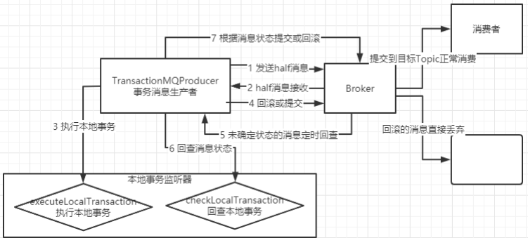

- 消息类型
- ACL 权限控制 

---
## 消息类型

- 顺序消息 
	- 保证的是消息的局部有序，而不是全局有序
	- 消息发送者会采取Round Robin轮询方式把消息发送到不同的 MessageQueue (分区队列)
		- 消费者消费的时候也从多个MessageQueue上拉取消息，这种情况下消息是不能保证顺序的
		- 而只有当一组有序的消息发送到同一个MessageQueue上时，才能利用MessageQueue先进先出的特性保证这一组消息有序
		- MessageListenerConcurrently这个消息监听器则不会锁队列，每次都是从多个Message中取一批数据（默认不超过32条）。因此也无法保证消息有序
	- 消费者会从多个消息队列上去拿消息
		- 这时虽然每个消息队列上的消息是有序的，但是多个队列之间的消息仍然是乱序的
		- 消费者端要保证消息有序，就需要按队列一个一个来取消息，即取完一个队列的消息后，再去取下一个队列的消息
		- 而给consumer注入的MessageListenerOrderly对象，在RocketMQ内部就会通过锁队列的方式保证消息是一个一个队列来取的
- 广播消息 
- 延迟消息：`Message#setDelayTimeLevel`
	- 在调用producer.send方法后，消息并不会立即发送出去，而是会等一段时间再发送出去
	- 只支持18个固定的延迟级别（18种消息队列）
- 批量消息 
	- 将多条消息合并成一个批量消息，一次发送出去
	- 如果批量消息大于1MB就不要用一个批次发送，而要拆分成多个批次消息发送
		- 实际最大的限制是4MB
	- 这些消息应该有相同的Topic，相同的waitStoreMsgOK
	- 而且不能是延迟消息、事务消息等
- 过滤消息
	- 可以使用Message的Tag属性来简单快速的过滤信息
	- 一个应用可以就用一个Topic，而应用中的不同业务就用TAG来区分
	- 可以使用SQL表达式来对消息进行过滤：`MessageSelector#bySql`
		- 只有推模式的消费者可以使用SQL过滤
- 事务消息
	- `TransactionMQProducer -> TransactionListener`
	- 事务消息只保证消息发送者的本地事务与发消息这两个操作的原子性
		- 但是并不保证消费者本地事务的原子性
	- 事务消息不支持延迟消息和批量消息
	- 默认将单个消息的检查次数限制为 15 次 `transactionCheckMax`
		- 超过则 Broker 将丢弃此消息，默认情况下同时打印错误日志 `AbstractTransactionCheckListener`
	- 事务消息将在 Broker 配置文件中的参数 transactionMsgTimeout 这样的特定时间长度之后被检查
		- 用户还可以通过设置用户属性 CHECK_IMMUNITY_TIME_IN_SECONDS 来改变这个限制
			- 该参数优先于 transactionMsgTimeout 参数
	- 事务性消息可能不止一次被检查或消费
	- 提交给用户的目标主题消息可能会失败，目前这依日志的记录而定
		- 如果希望确保事务消息不丢失、并且事务完整性得到保证，建议使用同步的双重写入机制
	- 事务消息的生产者 ID 不能与其他类型消息的生产者 ID 共享
		- 事务消息允许反向查询、MQ服务器能通过它们的生产者 ID 查询到消费者
	- 事务消息的实现机制
		- 
			- 在发送消息时，会将消息转为一个half半消息，并存入RocketMQ内部的一个 RMQ_SYS_TRANS_HALF_TOPIC 这个Topic，这样对消费者是不可见的
			- 再经过一系列事务检查通过后，再将消息转存到目标Topic，这样对消费者就可见了
	- 事务消息的作用
		- 事务消息只保证了分布式事务的一半
		- 对于复杂的分布式事务，RocketMQ提供的事务消息也是目前业内最佳的降级方案

---
## ACL 权限控制 

- 权限控制（ACL）主要为RocketMQ提供Topic资源级别的用户访问控制
- 用户在使用RocketMQ权限控制时，可以在Client客户端通过 RPCHook注入AccessKey和SecretKey签名
	- 同时，将对应的权限控制属性（包括Topic访问权限、IP白名单和AccessKey和SecretKey签名等）设置在`$ROCKETMQ_HOME/conf/plain_acl.yml`的配置文件中
- Broker端对AccessKey所拥有的权限进行校验，校验不过，抛出异常
- Broker端要在broker.conf中打开acl的标志
	- 这个配置文件是热加载的，也就是说要修改配置时，只要修改配置文件就可以了，不用重启Broker服务

