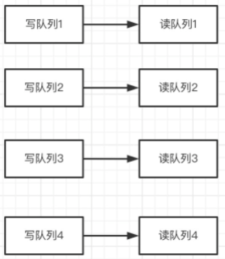
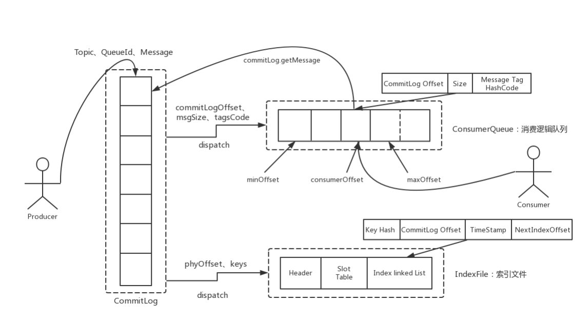
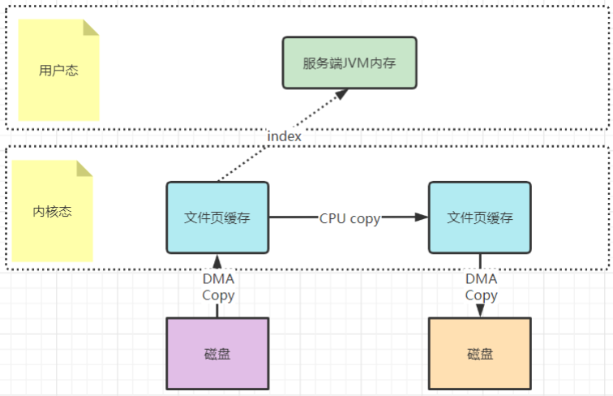
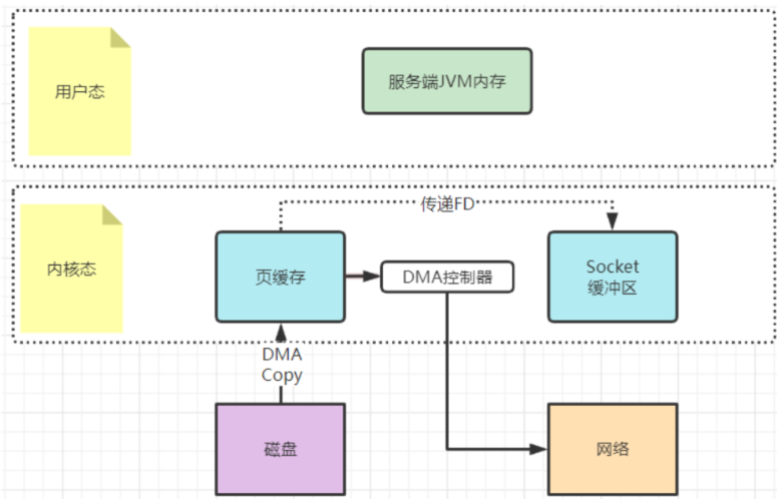
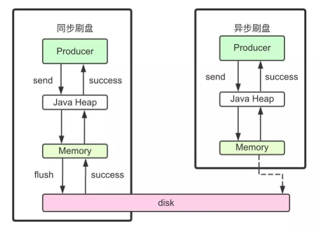
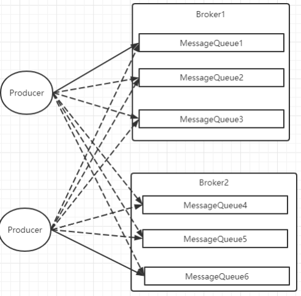
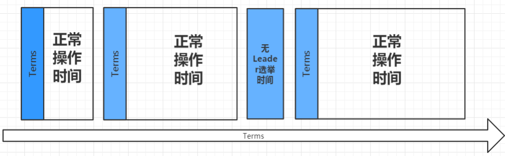

:::tip
- 读队列与写队列
- 消息持久化
- 过期文件删除
- 高效文件写
	- 零拷贝
	- 顺序写
	- 刷盘机制
- 消息主从复制
- 负载均衡
- 消息重试
- 死信队列
- 消息幂等
- Dledger 集群
	- 选举
	- 消息同步
:::

---
## 读队列与写队列

- 通常在运行时，都需要设置读队列=写队列
- 读写分离
	- 写队列会真实的创建对应的存储文件，负责消息写入
	- 读队列会记录Consumer的Offset，负责消息读取
-  在往写队列里写Message时，会同步写入到一个对应的读队列中
	- 
- 如果写队列大于读队列，就会有一部分写队列无法写入到读队列中，这一部分的消息就无法被读取，就会造成消息丢失（消息存入了，但是读不出来）
- 如果写队列小于读队列，那就有一部分读队列里是没有消息写入的。如果有一个消费者被分配的是这些没有消息的读队列，那这些消费者就无法消费消息，造成消费者空转，极大的浪费性能
- 对Topic的MessageQueue进行缩减的时候，可以考虑将读写队列设置为不一致
	- 例如原来四个队列，现在要缩减成两个队列
	- 如果立即缩减读写队列，那么被缩减的MessageQueue上没有被消费的消息，就会丢失
	- 这时，可以先缩减写队列，待空出来的读队列上的消息都被消费完了之后，再来缩减读队列，这样就可以比较平稳的实现队列缩减了

---
## 消息持久化

- RocketMQ消息直接采用磁盘文件保存消息，默认路径在`${user_home}/store`目录（`broker.conf`）
- 存储文件主要分为三个部分
	- CommitLog：存储消息的元数据
		- 所有消息都会顺序存入到CommitLog文件当中
		- CommitLog由多个文件组成，每个文件固定大小1G
		- 以第一条消息的偏移量为文件名
	- ConsumerQueue：存储消息在CommitLog的索引
		- 一个MessageQueue一个文件
		- 记录当前MessageQueue被哪些消费者组消费到了哪一条CommitLog
	- IndexFile
		- 为了消息查询提供了一种通过key或时间区间来查询消息的方法
		- 这通过IndexFile来查找消息的方法不影响发送与消费消息的主流程
	- CommitLog文件和ConsumeQueue文件都是以偏移量命名
- 还有几个辅助的存储文件
	- checkpoint：数据存盘检查点
		- 里面主要记录commitlog文件、ConsumeQueue文件以及IndexFile文件最后一次刷盘的时间戳
	- `config/*.json`：这些文件是将RocketMQ的一些关键配置信息进行存盘保存
		- 例如Topic配置、消费者组配置、消费者组消息偏移量Offset 等等一些信息
	- abort：这个文件是RocketMQ用来判断程序是否正常关闭的一个标识文件
		- 正常情况下，会在启动时创建，而关闭服务时删除
		- 但是如果遇到一些服务器宕机，这个abort文件就不会删除
		- 因此RocketMQ就可以判断上一次服务是非正常关闭的，后续就会做一些数据恢复的操作
- 整体的消息存储结构
	- 
- CommitLog文件存储所有消息实体
	- 所有生产者发过来的消息，都会无差别的依次存储到Commitlog文件当中
		- 这样的好处是可以减少查找目标文件的时间，让消息以最快的速度落盘
		- 对比Kafka存文件时，需要寻找消息所属的Partition文件，再完成写入，当Topic比较多时，这样的Partition寻址就会浪费比较多的时间，所以Kafka不太适合多Topic的场景
		- 而RocketMQ的这种快速落盘的方式在多Topic场景下，优势就比较明显
	-  文件结构：CommitLog的文件大小是固定的，但是其中存储的每个消息单元长度是不固定的
		- 所以RocketMQ在每次存CommitLog文件时，都会去检查当前CommitLog文件空间是否足够
			- 如果不够的话，就重新创建一个CommitLog文件
			- 文件名为当前消息的偏移量
- ConsumeQueue文件主要是加速消费者的消息索引
	- 他的每个文件夹对应RocketMQ中的一个MessageQueue
		- 文件夹下的文件记录了每个MessageQueue中的消息在CommitLog文件当中的偏移量
		- 这样，消费者通过ComsumeQueue文件，就可以快速找到CommitLog文件中感兴趣的消息记录
		- 而消费者在ConsumeQueue文件当中的消费进度，会保存在`config/consumerOffset.json`文件当中
	- 文件结构：每个ConsumeQueue文件固定由30万个固定大小20byte的数据块组成，数据块的内容包括
		- msgPhyOffset (8byte，消息在文件中的起始位置)
		- msgSize (4byte，消息在文件中占用的长度)
		- msgTagCode (8byte，消息的tag的Hash值)
- IndexFile文件主要是辅助消息检索
	- 消费者进行消息消费时，通过ConsumeQueue文件就足够完成消息检索了，但是如果要按照MeessageId或者MessageKey来检索文件，比如RocketMQ管理控制台的消息轨迹功能，ConsumeQueue文件就不够用了
	- 他的文件名比较特殊，不是以消息偏移量命名，而是用的时间命名
	- 文件结构：也是一个固定大小的文件
		- indexHeader (固定40byte)
		- slot (固定500W个，每个固定20byte)
		- index (最多`500W*4`个，每个固定20byte) 

---
## 过期文件删除

- 判断过期文件：唯一标准就是非当前写文件的保留时间（`broker.conf -> fileReservedTime`）
	- 如果超过了一定的保留时间，那么这些文件都会被认为是过期文件，随时可以删除
	- 并不关心文件当中的消息是否被消费过
		- 所以，RocketMQ的消息堆积也是有时间限度的
- 删除过期文件
	- 内部有一个定时任务，对文件进行扫描，并且触发文件删除的操作
		- `broker.conf -> deleteWhen`，默认是凌晨四点
	- 还会检查服务器的磁盘空间是否足够，如果磁盘空间的使用率达到一定的阈值，也会触发过期文件删除
		- broker的磁盘空间不要少于4

---
## 高效文件写

### 零拷贝

- 所谓的零拷贝技术，其实并不是不拷贝，而是要尽量减少CPU拷贝
- 引入DMA拷贝之后，在读写请求的过程中，CPU不再需要参与具体的工作
	- DMA可以独立完成数据在系统内部的复制
	- 但是，数据复制过程中，依然需要借助数据总进线
		- 当系统内的IO操作过多时，还是会占用过多的数据总线，造成总线冲突，最终还是会影响数据读写性能
- 为了避免DMA总线冲突对性能的影响，后来又引入了Channel通道的方式
	- Channel，是一个完全独立的处理器，专门负责IO操作
	- 既然是处理器，Channel就有自己的IO指令，与CPU无关，他也更适合大型的IO操作，性能更高
- mmap：`FileChannel#map`
	- mmap机制适合操作小文件，如果文件太大，映射信息也会过大，容易造成很多问题
	- 通常mmap机制建议的映射文件大小不要超过2G
	- RocketMQ的CommitLog文件保持在1G固定大小，也是为了方便文件映射
	- 
- sendFile：`FileChannel#transferTo`
	- 在拷贝过程中，并不直接拷贝文件的内容，而是只拷贝一个带有文件位置和长度等信息的文件描述符FD
		- 这样就大大减少了需要传递的数据
	- 而真实的数据内容，会交由DMA控制器，从页缓存中打包异步发送到socket中
	- sendfile机制在内核态直接完成了数据的复制，不需要用户态的参与，所以这种机制的传输效率是非常稳定的
	- sendfile机制非常适合大数据的复制转移
	- 

### 顺序写

- 在磁盘中提前申请一块连续的磁盘空间
	- 每次写数据时，就可以避免这些寻址操作，直接在之前写入的地址后面接着写就行
- 顺序写的性能基本能够达到内存级别

### 刷盘机制

- 在操作系统层面
	- 当应用程序写入一个文件时，文件内容并不会直接写入到硬件当中，而是会先写入到操作系统中的一个缓存PageCache中
		- PageCache缓存以4K大小为单位，缓存文件的具体内容
		- 这些写入到PageCache中的文件，在应用程序看来，是已经完全落盘保存好了的
		- 但是，本质上，PageCache依然是内存状态，所以一断电就会丢失
		- 因此，需要将内存状态的数据写入到磁盘当中，这样数据才能真正完成持久化，断电也不会丢失
			- 这个过程就称为刷盘
	- PageCache是源源不断产生的，操作系统只会在某些特定的时刻将PageCache写入到磁盘
		- 正常关机时
		- 当 Dirty Page (脏页) 的比例达到一定的阈值时（对于有数据修改的PageCache，会标记为Dirty状态）
	- 可以通过/proc/meminfo文件查看到Page Cache的状态
	- fsync：可以让应用程序完成PageCache的强制刷盘
-  RocketMQ对于何时进行刷盘，也设计了两种刷盘机制，同步刷盘和异步刷盘 
	- `broker.conf -> flushDiskType`
	- 
	- 同步刷盘：在返回写成功状态时，消息已经被写入磁盘
		- 消息写入内存的PAGECACHE后，立刻通知刷盘线程刷盘
		-  然后等待刷盘完成
		- 刷盘线程执行完成后唤醒等待的线程，返回消息写成功的状态
	- 异步刷盘：在返回写成功状态时，消息可能只是被写入了内存的PAGECACHE
		- 写操作的返回快，吞吐量大
		- 当内存里的消息量积累到一定程度时，统一触发写磁盘动作，快速写入
	- 同步刷盘机制会更频繁的调用fsync，所以吞吐量相比异步刷盘会降低，但是数据的安全性会得到提高

---
## 消息主从复制 

- 同步复制：等Master和Slave都写入消息成功后才反馈给客户端写入成功的状态
	- 如果Master节点故障，Slave上有全部的数据备份，这样容易恢复数据
	- 但是同步复制会增大数据写入的延迟，降低系统的吞吐量
- 异步复制：只要master写入消息成功，就反馈给客户端写入成功的状态
	- 然后再异步的将消息复制给Slave节点
	- 系统拥有较低的延迟和较高的吞吐量
	- 但是如果master节点故障，而有些数据没有完成复制，就会造成数据丢失
- `broker.conf -> brokerRole`
	- ASYNC_MASTER、 SYNC_MASTER、SLAVE

---
## 负载均衡

- Producer 负载均衡 
	- 
	- Producer发送消息时，默认会轮询目标Topic下的所有MessageQueue，并采用递增取模的方式往不同的MessageQueue上发送消息，以达到让消息平均落在不同的queue上的目的
	- 由于MessageQueue是分布在不同的Broker上的，所以消息也会发送到不同的broker上
	- 同时生产者在发送消息时，可以指定一个MessageQueueSelector
		- 通过这个对象来将消息发送到自己指定的MessageQueue上
		- 这样可以保证消息局部有序
- Consumer负载均衡： Consumer也是以MessageQueue为单位来进行负载均衡
	- 集群模式 
		- 每条消息只需要投递到订阅这个topic的Consumer Group下的一个实例即可
		- RocketMQ采用主动拉取的方式拉取并消费消息
			- 在拉取的时候需要明确指定拉取哪一条message queue
		- 每当实例的数量有变更，都会触发一次所有实例的负载均衡
			- 这时候会按照queue的数量和实例的数量平均分配queue给每个实例
		- 每次分配时，都会将MessageQueue和消费者ID进行排序后，再用不同的分配算法进行分配
		- 内置的分配的算法共有六种，分别对应AllocateMessageQueueStrategy下的六种实现类
			- 可以在consumer中直接set来指定。默认情况下使用的是最简单的平均分配策略
	- 广播模式
		- 每一条消息都会投递给订阅了Topic的所有消费者实例，所以也就没有消息分配这一说
		- 在实现上，就是在Consumer分配Queue时，所有Consumer都分到所有的Queue
		- 实现的关键是将消费者的消费偏移量不再保存到broker当中
			- 而是保存到客户端当中，由客户端自行维护自己的消费偏移量
- 集群模式分配算法
	- AllocateMachineRoomNearby： 将同机房的Consumer和Broker优先分配在一起
		- 可以通过一个machineRoomResolver对象来定制Consumer和Broker的机房解析规则
		- 然后还需要引入另外一个分配策略来对同机房的Broker和Consumer进行分配
			- 一般也就用简单的平均分配策略或者轮询分配策略
	- AllocateMessageQueueAveragely（默认）：平均分配。将所有MessageQueue平均分给每一个消费者
	- AllocateMessageQueueAveragelyByCircle： 轮询分配。轮流的给一个消费者分配一个MessageQueue
	- AllocateMessageQueueByConfig： 不分配，直接指定一个messageQueue列表
		- 类似于广播模式，直接指定所有队列
	- AllocateMessageQueueByMachineRoom：按逻辑机房的概念进行分配
		- 又是对BrokerName和ConsumerIdc有定制化的配置
	- AllocateMessageQueueConsistentHash：一致性哈希策略
		- 只需要指定一个虚拟节点数，是用的一个哈希环的算法
		- 虚拟节点是为了让Hash数据在换上分布更为均匀

---
## 消息重试

- 集群消费方式下，消息消费失败后期望消息重试，需要在消息监听器接口的实现中明确进行配置 
	- `MessageListener#consume`
	- 返回 Action.ReconsumeLater（推荐） 消息重试
	- 返回 Action.CommitMessage 消费失败后不重试
	- 返回 null
	- 抛出异常
- 处理重试消息
	- 重试的消息会进入一个 “%RETRY%”+ConsumeGroup 的队列中
	- 默认允许每条消息最多重试16次
		- 这个重试时间跟延迟消息的延迟级别是对应的
		- 不过取的是延迟级别的后16级别
	- `consumer#setMaxReconsumeTimes` 定制重试次数
		- 当定制的重试次数超过16次后，消息的重试时间间隔均为2小时
	- 如果消息重试16次后仍然失败，消息将不再投递。转为进入死信队列
	- 一条消息无论重试多少次，这些重试消息的MessageId始终都是一样的
		- 在4.9.1版本中，每次重试MessageId都会重建
	- 配置覆盖
		- 消息最大重试次数的设置对相同GroupID下的所有Consumer实例有效
		- 并且最后启动的Consumer会覆盖之前启动的Consumer的配置

---
## 死信队列

- 如果消息重试16次（`consumer#setMaxReconsumeTimes`）后仍然失败，消息将不再投递。转为进入死信队列
- 死信队列的名称是 %DLQ%+ConsumGroup
- 死信队列的特征
	- 一个死信队列对应一个ConsumGroup，而不是对应某个消费者实例
	- 如果一个ConsumeGroup没有产生死信队列，RocketMQ就不会为其创建相应的死信队列
	- 一个死信队列包含了这个ConsumeGroup里的所有死信消息，而不区分该消息属于哪个Topic
	- 死信队列中的消息不会再被消费者正常消费
	- 死信队列的有效期跟正常消息相同。默认3天（`broker.conf -> fileReservedTime`）
		- 超过这个最长时间的消息都会被删除，而不管消息是否消费过
- 一般需要人工去查看死信队列中的消息，对错误原因进行排查
	- 然后对死信消息进行处理，比如转发到正常的Topic重新进行消费，或者丢弃
- 默认创建出来的死信队列，他里面的消息是无法读取的，在控制台和消费者中都无法读取
	- 这些默认的死信队列，他们的权限 perm 被设置成了 2:禁读
		- 权限有三种：2:禁读，4:禁写，6:可读可写
	- 需要手动将死信队列的权限配置成 6，才能被消费

---
## 消息幂等

- 在MQ系统中，对于消息幂等有三种实现语义
	- at most once 最多一次：每条消息最多只会被消费一次
	- at least once 至少一次：每条消息至少会被消费一次
	- exactly once 刚刚好一次：每条消息都只会确定的消费一次
- RocketMQ 只能保证 at least once，保证不了 exactly once
	- 所以，使用RocketMQ时，需要由业务系统自行保证消息的幂等性
- 消息重复
	- 发送时消息重复
		- 当一条消息已被成功发送到服务端并完成持久化，此时出现了网络闪断或者客户端宕机，导致服务端对客户端应答失败
		- 此时生产者意识到消息发送失败并尝试再次发送消息
		- 消费者后续会收到两条内容相同并且 Message ID 也相同的消息
	- 投递时消息重复
		- 消息消费的场景下，消息已投递到消费者并完成业务处理，当客户端给服务端反馈应答的时候网络闪断
		- 为了保证消息至少被消费一次，消息队列 RocketMQ 的服务端将在网络恢复后再次尝试投递之前已被处理过的消息
		- 消费者后续会收到两条内容相同并且 Message ID 也相同的消息
	- 负载均衡时消息重复：网络抖动、Broker 重启以及订阅方应用重启
		- 当消息队列 RocketMQ 的 Broker 或客户端重启、扩容或缩容时，会触发 Rebalance，此时消费者可能会收到重复消息
- 处理方式：要在业务上自行来保证消息消费的幂等性
	- RocketMQ的每条消息都有一个唯一的 MessageId，这个参数在多次投递的过程中是不会改变的
	- 业务上可以用这个MessageId来作为判断幂等的关键依据
	- 但是，这个MessageId是无法保证全局唯一的，也会有冲突的情况
	- 所以在一些对幂等性要求严格的场景，最好是使用业务上唯一的一个标识比较靠谱
	- 而这个业务标识可以使用Message的Key来进行传递

---
## Dledger 集群

- 高可用集群：基于Raft，在RocketMQ的主从集群基础上，增加了自动选举的功能
- Dledger集群主要包含两个功能
	- 从集群中选举产生master节点
	- 优化master节点往slave节点的消息同步机制

### 选举

- Dledger是使用Raft算法来进行节点选举
	- 节点有三个状态，Leader，follower 和 candidate (候选人)
		- 正常运行的情况下，集群中会有一个leader，其他都是follower
		- follower只响应Leader和Candidate的请求
		- 客户端的请求全部由Leader处理
			- 即使有客户端请求到了一个follower，也会将请求转发到leader
	- 选举流程
		- 集群刚启动时，每个节点都是follower状态
		- 之后集群内部会发送一个timeout信号
		- 所有follower就转成candidate去拉取选票，获得大多数选票的节点选为leader，其他候选人转为follower
		- 如果一个timeout信号发出时，没有选出leader，将会重新开始一次新的选举
	- 心跳
		- Leader节点会往其他节点发送心跳信号，确认他的leader状态
		- 然后follower会启动定时器，如果在指定时间内没有收到Leader的心跳，就会转为Candidate状态
		- 然后向其他成员发起投票请求，如果收到半数以上成员的投票，则Candidate会晋升为Leader
			- 然后leader也有可能会退化成follower
- 在Raft协议中，会将时间分为一些任意时间长度的时间片段，叫做term
	- 
	- term会使用一个全局唯一，连续递增的编号作为标识，也就是起到了一个逻辑时钟的作用
	- 在每一个term时间片里，都会进行新的选举，每一个Candidate都会努力争取成为leader
		- 获得票数最多的节点就会被选举为Leader
	- 被选为Leader的这个节点，在一个term时间片里就会保持leader状态
		- 保证在同一时间段内，集群中只会有一个Leader
	- 在某些情况下，选票可能会被各个节点瓜分，形成不了多数派，那这个term可能直到结束都没有leader
		- 直到下一个term再重新发起选举，这也就没有了Zookeeper中的脑裂问题
	- 在每次重新选举的过程中， leader也有可能会退化成为follower
		- 也就是说，在这个集群中， leader节点是会不断变化的
- 每次选举的过程中，每个节点都会存储当前term编号，并在节点之间进行交流时，都会带上自己的term编号
	- 如果一个节点发现他的编号比另外一个小，那么他就会将自己的编号更新为较大的那一个
	- 如果leader或者candidate发现自己的编号不是最新的，他就会自动转成follower
	- 如果接收到的请求term编号小于自己的编号，term将会拒绝执行
-  在选举过程中，Raft协议会通过心跳机制发起leader选举
	- 节点都是从follower状态开始的，如果收到了来自leader或者candidate的心跳RPC请求，那他就会保持follower状态，避免争抢成为candidate
	- leader会往其他节点发送心跳信号，来确认自己的地位
	- 如果follower一段时间(两个timeout信号)内没有收到Leader的心跳信号，他就会认为leader挂了，发起新一轮选举
-  选举开始后，每个follower会增加自己当前的term，并将自己转为candidate
	- 然后向其他节点发起投票请求，请求时会带上自己的编号和term，也就是说都会默认投自己一票
	- 之后candidate状态可能会发生以下三种变化
		- 赢得选举，成为leader
			- 如果它在一个term内收到了大多数的选票，将会在接下的剩余term时间内称为leader
			- 然后就可以通过发送心跳确立自己的地位
			- 每一个server在一个term内只能投一张选票，并且按照先到先得的原则投出
		- 其他节点成为leader
			- 在等待投票时，可能会收到其他server发出心跳信号，说明其他leader已经产生了
			- 这时通过比较自己的term编号和RPC过来的term编号
				- 如果比对方大，说明leader的term过期了，就会拒绝该RPC,并继续保持候选人身份
				- 如果对方编号不比自己小,则承认对方的地位,转为follower
		- 选票被瓜分,选举失败
			- 如果没有candidate获取大多数选票, 则没有leader产生
			- candidate们等待超时后发起另一轮选举
			- 为了防止下一次选票还被瓜分, raft采用随机electiontimeout(随机休眠时间)的机制防止选票被持续瓜分
			- 通过将timeout随机设为一段区间上的某个值, 因此很大概率会有某个candidate率先超时然后赢得大部分选票
- 所以以三个节点的集群为例，选举过程会是这样的
	- 集群启动时，三个节点都是follower，发起投票后，三个节点都会给自己投票。这样一轮投票下来，三个节点的term都是1，是一样的，这样是选举不出Leader的
	- 当一轮投票选举不出Leader后，三个节点会进入随机休眠，例如A休眠1秒，B休眠3秒，C休眠2秒
	- 一秒后，A节点醒来，会把自己的term加一票，投为2。然后2秒时，C节点醒来，发现A的term已经是2，比自己的1大，就会承认A是Leader，把自己的term也更新为2。实际上这个时候，A已经获得了集群中的多数票，2票，A就会被选举成Leader。这样，一般经过很短的几轮选举，就会选举出一个Leader来
	- 到3秒时，B节点会醒来，他也同样会承认A的term最大，他是Leader，自己的term也会更新为2。这样集群中的所有Candidate就都确定成了leader和follower
	- 然后在一个任期内，A会不断发心跳给另外两个节点。当A挂了后，另外的节点没有收到A的心跳，就会都转化成Candidate状态，重新发起选举

### 消息同步

Dledger还会采用Raft协议进行多副本的消息同步：
- 使用Dledger集群后，数据主从同步会分为两个阶段，一个是uncommitted阶段，一个是commited阶段
- Leader Broker上的Dledger收到一条数据后，会标记为uncommitted状态，然后他通过自己的DledgerServer组件把这个uncommitted数据发给Follower Broker的DledgerServer组件
- 接着Follower Broker的DledgerServer收到uncommitted消息之后，必须返回一个ack给Leader Broker的Dledger。然后如果Leader Broker收到超过半数的Follower Broker返回的ack之后，就会把消息标记为committed状态
-  再接下来， Leader Broker上的DledgerServer就会发送committed消息给Follower Broker上的DledgerServer，让他们把消息也标记为committed状态。这样，就基于Raft协议完成了两阶段的数据同步

