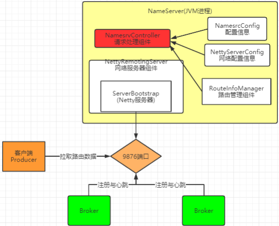
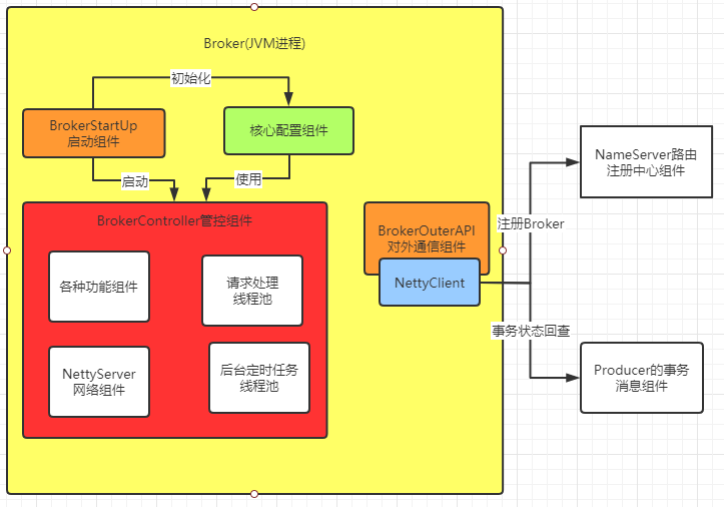
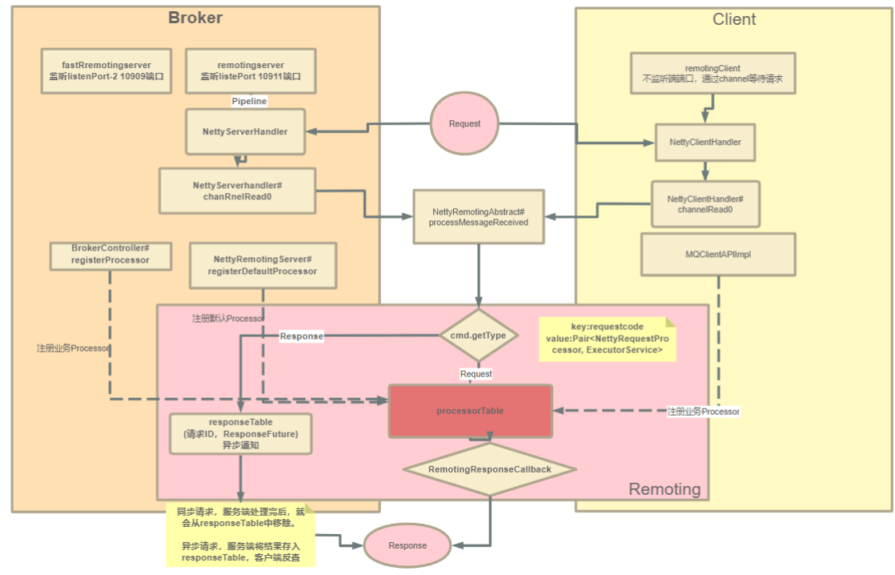
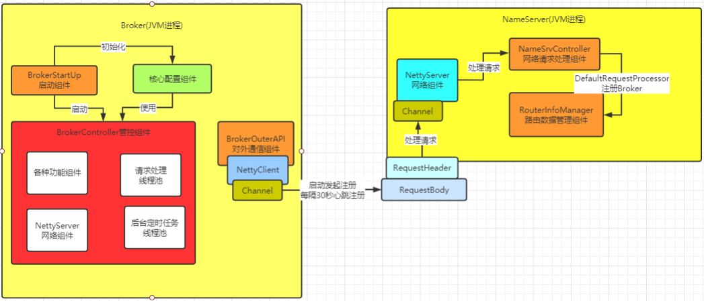
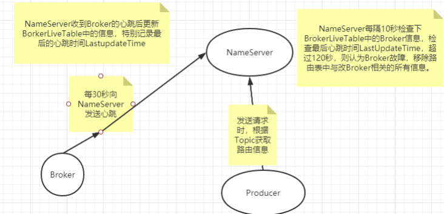
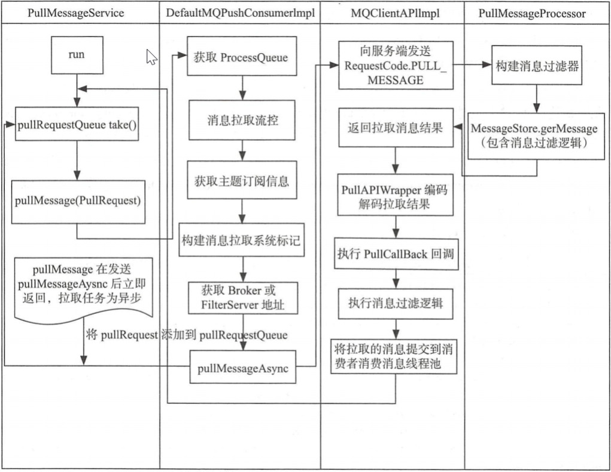
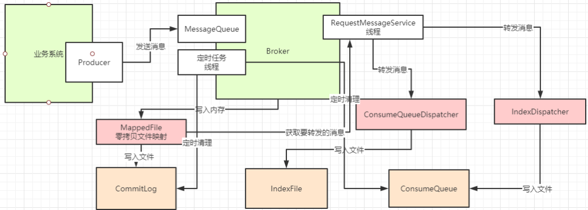
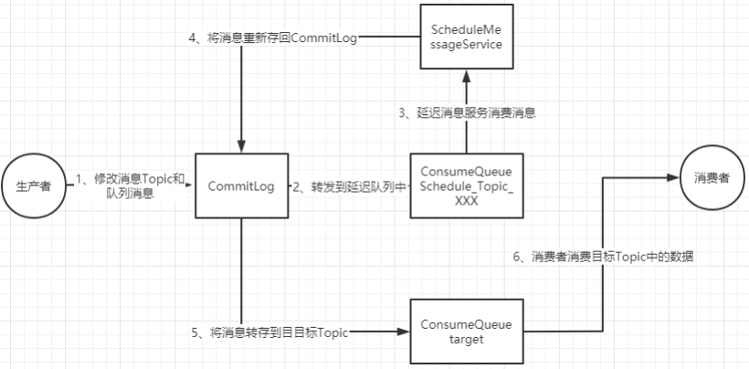
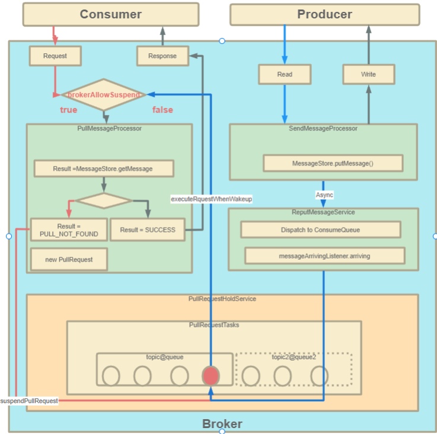
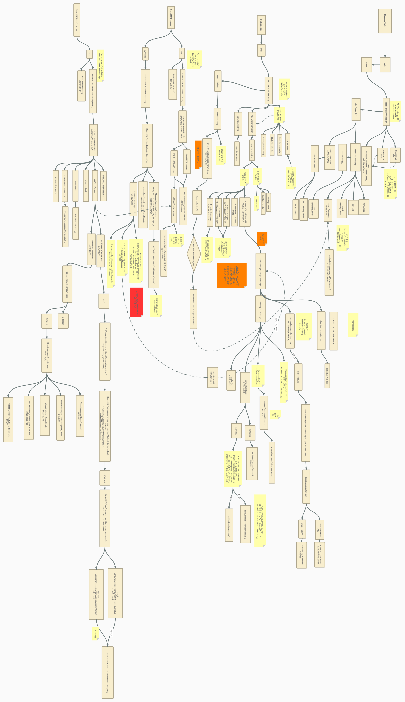

:::tip
- NameServer的结构
- Broker的结构
- Netty服务注册框架
- RocketMQ的同步结果推送与异步结果推送
- Broker心跳注册过程
- Producer发送消息过程
- Consumer拉取消息过程
- 文件存储
- 延迟消息
- 长轮询机制
:::

---
## NameServer的结构

- NameServer的核心作用
	- 一是维护Broker的服务地址并进行及时的更新
	- 二是给Producer和Consumer提供服务获取Broker列表
- NameServer的启动入口为NamesrvStartup类的main方法
- 整个NameServer的核心就是一个NamesrvController对象

---
## Broker的结构

- Broker是整个RocketMQ的业务核心，所有消息存储、转发这些最为重要的业务都是在Broker中进行处理的
- Broker启动的入口在BrokerStartup这个类的main方法
- 重点也是围绕一个BrokerController对象
- 在BrokerStartup.createBrokerController方法中可以看到Broker的几个核心配置
	- BrokerConfig 
	- NettyServerConfig  ：Netty服务端占用了10911端口。同样也可以在配置文件中覆盖
	- NettyClientConfig  
	- MessageStoreConfig

---
## Netty服务注册框架

- RocketMQ使用Netty框架提供了一套基于服务码的服务注册机制，让各种不同的组件都可以按照自己的需求，注册自己的服务方法
- Netty的所有远程通信功能都由remoting模块实现。RemotingServer模块里包含了RPC的服务端RemotingServer以及客户端RemotingClient
- RocketMQ基于Netty保持客户端与服务端的长连接Channel
- 所有的请求都封装成RemotingCommand对象。而每个处理消息的服务逻辑，会封装成一个NettyRequestProcessor对象
- 服务端和客户端都维护了一个processorTable，这是个HashMap，key是服务码requestCode，value是对应的运行单元
	- Pair<NettyRequestProcessor, ExecutorService>  类型，包含了处理逻辑Prcessor和执行线程池ExecutorService
- 服务端的注册BrokerController.registerProcessor() ，客户端的服务注册见MQClientAPIImpl。NameServer则会注册一个大的DefaultRequestProcessor，统一处理所有的服务
- 服务注册流程：

- NameServer会维护Broker的路由列表，并对路由列表进行实时更新
- BrokerController.this.registerBrokerAll方法会发起向NameServer注册心跳。启动时会立即注册，同时也会启动一个线程池，以10秒延迟，默认30秒的间隔持续向NameServer发送心跳
-  BrokerController.this.registerBrokerAll这个方法就是注册心跳的入口
- 然后，在NameServer中也会启动一个定时任务，扫描不活动的Broker。具体观察NamesrvController.initialize方法

---
## RocketMQ的同步结果推送与异步结果推送

- RocketMQ的RemotingServer服务端，会维护一个responseTable，这是一个线程同步的Map结构。 key为请求的ID，value是异步的消息结果 ConcurrentMap<Integer  , ResponseFuture>
- 处理同步请求(NettyRemotingAbstract#invokeSyncImpl)时，处理的结果会存入responseTable，通过ResponseFuture提供一定的服务端异步处理支持，提升服务端的吞吐量。 请求返回后，立即从responseTable中移除请求记录
-  处理异步请求(NettyRemotingAbstract#invokeAsyncImpl)时，处理的结果依然会存入responsTable，等待客户端后续再来请求结果。但是他保存的依然是一个ResponseFuture，也就是在客户端请求结果时再去获取真正的结果
	- 另外，在RemotingServer启动时，会启动一个定时的线程任务，不断扫描responseTable，将其中过期的response清除掉

---
## Producer发送消息过程 

- Producer有两种
	- 普通发送者：DefaultMQProducer。只负责发送消息，发送完消息，就可以停止了
		- DefaultMQProducer只需要构建一个Netty客户端，往Broker发送消息就行了
		- 异步回调只是在Producer接收到Broker的响应后自行调整流程，不需要提供Netty服务
	- 事务消息发送者： TransactionMQProducer。支持事务消息机制。需要在事务消息过程中提供事务状态确认的服务，这就要求事务消息发送者虽然是一个客户端，但是也要完成整个事务消息的确认机制后才能退出
		- TransactionMQProducer由于需要在事务消息机制中给Broker提供状态确认服务，所以在发送消息的同时，还需要保持连接，提供服务
		- TransactionMQProducer的启动过程中，会往RemotingClient中注册相应的Processor，这样RemotingServer和RemotingClient之间就可以通过channel进行双向的服务请求了
- 整个Producer的流程，大致分两个步骤
	- start方法，进行一大堆的准备工作
	- 各种各样的send方法，进行消息发送
- 重点关注以下几个问题
	- Producer的核心启动流程以及两种消息发送者的区别
		- 所有Producer的启动过程，最终都会调用DefaultMQProducerImpl#start方法
			- 在start方法中的通过一个mQClientFactory对象，启动生产者的一大堆重要服务
		- 所有客户端的启动流程是固定的，不同客户端的区别只是在于他们在启动前注册的一些信息不同
			- 生产者注册到producerTable，消费者注册到consumerTable，管理控制端注册到adminExtTable
	- Producer如何管理Borker路由信息
		- Producer需要拉取Broker列表，然后跟Broker建立连接等等很多核心的流程，其实都是在发送消息时建立的。因为在启动时，还不知道要拉取哪个Topic的Broker列表呢
		- 对NameServer的地址管理，则是散布在启动和发送的多个过程当中，并且NameServer地址可以通过一个Http服务来获取
		- Send方法中，首先需要获得Topic的路由信息。这会从本地缓存中获取，如果本地缓存中没有，就从NameServer中去申请 DefaultMQProducerImpl#tryToFindTopicPublishInfo 方法
		- 
	- Producer的负载均衡
		- Producer在获取路由信息后，会选出一个MessageQueue去发送消息
		- 这个选MessageQueue的方法就是一个索引自增然后取模的方式
		- 然后根据MessageQueue再找所在的Broker，往Broker发送请求
	- 在发送Netty请求时，如何制定Broker
		- 实际上是指定的MessageQueue，而不是Topic。Topic只是用来找MessageQueue

---
## Consumer拉取消息过程 

- 消费者也是有两种，推模式消费者（用的最多）和拉模式消费者
- 消费者组之间有集群模式和广播模式两种消费模式
- 消费者端的负载均衡的原理。即消费者是如何绑定消费队列的，哪些消费策略到底是如何落地的
- 在推模式的消费者中，MessageListenerConcurrently 和MessageListenerOrderly这两种消息监听器的处理逻辑到底有什么不同，为什么后者能保持消息顺序
-  DefaultMQPushConsumer.start作为入口。最终消费者的启动过程，跟生产者一样，也交由了mQClientFactory
	- pullMessageService主要处理拉取消息服务；rebalanceService主要处理客户端的负载均衡
- 客户端负载均衡策略
	- 在消费者示例的start方法中，启动RebalanceService，这个是客户端进行负载均衡策略的启动服务。他只负责根据负载均衡策略获取当前客户端分配到的MessageQueue
	- 五种负载策略，可以由Consumer的allocateMessageQueueStrategy属性来选择
		- 这个属性可以在DefaultMQPushConsumer的构造方法当中指定。默认是AllocateMessageQueueAveragely策略
		- 最常用的是AllocateMessageQueueAveragely平均分配和AllocateMessageQueueAveragelyByCircle平均轮询分配
			- 平均分配是把MessageQueue按组内的消费者个数平均分配
			- 平均轮询分配就是把MessageQueue按组内的消费者一个一个轮询分配
- 并发消费与顺序消费的过程
	- 消费的过程依然是在DefaultMQPushConsumerImpl的 consumeMessageService中
	- 他有两个子类ConsumeMessageConcurrentlyService和ConsumeMessageOrderlyService
	- 最主要的差别是ConsumeMessageOrderlyService会在消费前把队列锁起来，优先保证拉取同一个队列里的消息
	- 消费过程的入口在DefaultMQPushConsumerImpl的pullMessage中定义的PullCallback中
- RocketMQ消息消费方式分别为集群模式、广播模式
- 消息队列负载由RebalanceService线程默认每隔20s进行一次消息队列负载
	- 根据当前消费者组内消费者个数与主题队列数量按照某一种负载算法进行队列分配
	- 分配原则为同一个消费者可以分配多个消息消费队列
	- 同一个消息消费队列同一个时间只会分配给一个消费者
- 消息拉取由PullMessageService线程根据RebalanceService线程创建的拉取任务进行拉取
	- 默认每次拉取一批消息(可以由业务指定，默认是1)，提交给消费者消费线程后继续下一次消息拉取
	- 如果消息消费过慢产生消息堆积会触发消息消费拉取流控
- 并发消息消费指消费线程池中的线程可以并发对同一个消息队列的消息进行消费
	- 消费成功后，取出消息队列中最小的消息偏移量作为消息消费进度偏移量存储在于消息消费进度存储文件中
	- 集群模式消息消费进度存储在Broker（消息服务器）
	- 广播模式消息消费进度存储在消费者端
- RocketMQ不支持任意精度的定时调度消息，只支持自定义的消息延迟级别
	- 可通过在broker配置文件中设置messageDelayLevel
- 顺序消息一般使用集群模式，是指对消息消费者内的线程池中的线程对消息消费队列只能串行消费
	- 与并发消息消费最本质的区别是消息消费时必须成功锁定消息消费队列
	- 在Broker端会存储消息消费队列的锁占用情况
- 拉模式核心服务类： PullMessageService
	- PullRequest里有messageQueue和processQueue，其中messageQueue负责拉取消息，拉取到后，将消息存入processQueue，进行处理。 存入后就可以清空messageQueue，继续拉取了
	- 

---
## 文件存储

- Broker接收到消息后是如何把消息进行存储的
- 最终存储的文件
	- commitLog：消息存储目录
	- config：运行期间一些配置信息
	- consumerqueue：消息消费队列存储目录
	- index：消息索引文件存储目录 
	- abort：如果存在改文件寿命Broker非正常关闭 
	- checkpoint：文件检查点，存储CommitLog文件最后一次刷盘时间戳、 consumerquueue最后一次刷盘时间，index索引文件最后一次刷盘时间戳
- messageStore就是负责消息存储的核心组件
- 消息存储的入口在：DefaultMessageStore.putMessage
- commitLog写入
	- CommitLog的doAppend方法就是Broker写入消息的实际入口
	- 这个方法最终会把消息追加到MappedFile映射的一块内存里，并没有直接写入磁盘
	- 写入消息的过程是串行的，一次只会允许一个线程写入
- 分发ConsumeQueue和IndexFile
	- 当CommitLog写入一条消息后，在DefaultMessageStore的start方法中，会启动一个后台线程reputMessageService每隔1毫秒就会去拉取CommitLog中最新更新的一批消息，然后分别转发到ComsumeQueue和IndexFile里去
	- 如果服务异常宕机，会造成CommitLog和ConsumeQueue、IndexFile文件不一致，有消息写入CommitLog后，没有分发到索引文件，这样消息就丢失了
	- DefaultMappedStore的load方法提供了恢复索引文件的方法，入口在load方法
- 文件同步刷盘与异步刷盘：CommitLog.submitFlushRequest
	- 同步刷盘也是使用异步机制实现的
		- 刷盘是一个很重的操作，所以，RocketMQ即便是同步刷盘，也要对刷盘次数精打细算
			- 单条消息，那么直接将commitlog刷盘即可
			- 批量消息，RockeMQ会先收集这一批次消息的刷盘请求，再进行一次统一的刷盘操作
			- 一批消息有可能会跨两个commitlog文件，所以在刷盘时，要严格计算commitlog文件的刷盘次数
	- 异步刷盘
		- 通过RocketMQ自己实现的一个CountDownLatch2提供了线程阻塞，使用CAS来驱动CountDownLatch2的countDown操作
		- 每来一个消息就启动一次CAS，成功后，调用一次countDown
		- 这个CountDownLatch2在CountDownLatch的基础上，增加实现了reset功能，实现了对象的重用
	- TransientStorePoolEnable。如果开启了堆外内存，会在启动时申请一个跟CommitLog文件大小一致的堆外内存，这部分内存就可以确保不会被交换到虚拟内存中
- CommigLog主从复制：CommitLog.submitReplicaRequest
	- RocketMQ整体是基于Netty实现的网络请求，而在主从复制这一块，却放弃了Netty框架，转而使用更轻量级的Java的NIO来构建
	-  在主要的HAService中，会在启动过程中启动三个守护进程
		- 其中与Master相关的是acceptSocketService和groupTransferService
			- acceptSocketService主要负责维护Master与Slave之间的TCP连接
			- groupTransferService主要与主从同步复制有关
		- 而slave相关的则是haClient
- 过期文件删除：DefaultMessageStore.addScheduleTask -> DefaultMessageStore.this.cleanFilesPeriodically
	- Broker会启动后台线程，每60秒，检查CommitLog、ConsumeQueue文件
		- 然后对超过72小时的数据进行删除
		- 默认情况下， RocketMQ只会保存3天内的数据
		- 可以通过fileReservedTime来配置
	- 他删除时，并不会检查消息是否被消费了
- 整个文件存储的核心入口在DefaultMessageStore的start方法中

---
## 延迟消息

- 延迟消息的核心使用方法就是在Message中设定一个MessageDelayLevel参数，对应18个延迟级别
- 然后Broker中会创建一个默认的Schedule_Topic主题，这个主题下有18个队列，对应18个延迟级别
- 消息发过来之后，会先把消息存入Schedule_Topic主题中对应的队列
	- 等延迟时间到了，再转发到目标队列，推送给消费者进行消费
- 延迟消息的处理入口在scheduleMessageService， 他会在broker启动时也一起加载
- 消息写入：CommitLog.putMessage
	- 在CommitLog写入消息时，会判断消息的延迟级别，然后修改Message的Topic和Queue，达到转储Message的目的
- 消息转储到目标Topic：scheduleMessageService
	- 这个服务只在master节点上启动，而在slave节点上会主动关闭这个服务
	-  由于RocketMQ的主从节点支持切换，所以就需要考虑这个服务的幂等性
		- 在节点切换为slave时就要关闭服务，切换为master时就要启动服务
		- 即便节点多次切换为master，服务也只启动一次：通过一个CAS操作来保证服务的启动状态
		-  这个CAS操作还保证了在后面，同一时间只有一个DeliverDelayedMessageTimerTask执行
	- ScheduleMessageService会每隔1秒钟执行一个executeOnTimeup任务，将消息从延迟队列中写入正常Topic中：ScheduleMessageService -> DeliverDelayedMessageTimerTask.executeOnTimeup

---
## 长轮询机制

- RocketMQ对消息消费者提供了Push推模式和Pull拉模式两种消费模式
	- 但是这两种消费模式的本质其实都是Pull拉模式
	- Push模式可以认为是一种定时的Pull机制
- 长轮询机制简单来说，就是当Broker接收到Consumer的Pull请求时，判断如果没有对应的消息，不用直接给Consumer响应 (给响应也是个空的，没意义)，而是就将这个Pull请求给缓存起来
	- 当Producer发送消息过来时，增加一个步骤去检查是否有对应的已缓存的Pull请求，如果有，就及时将请求从缓存中拉取出来，并将消息通知给Consumer

---

