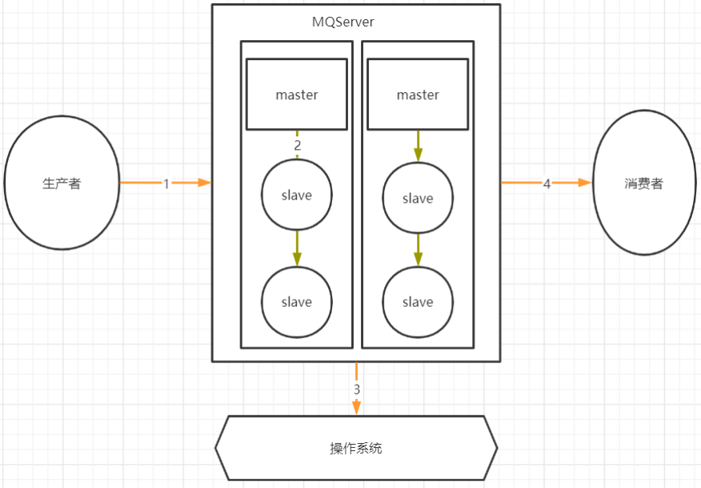
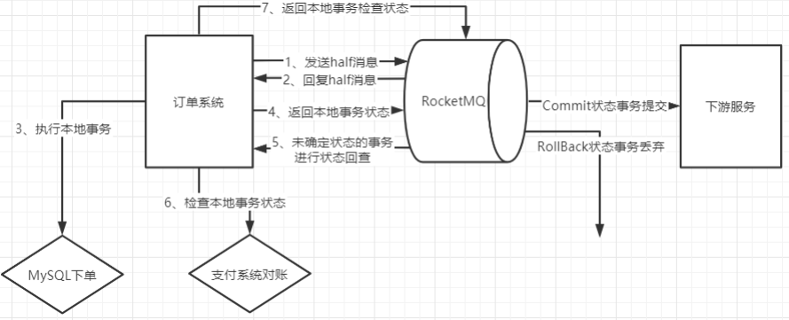
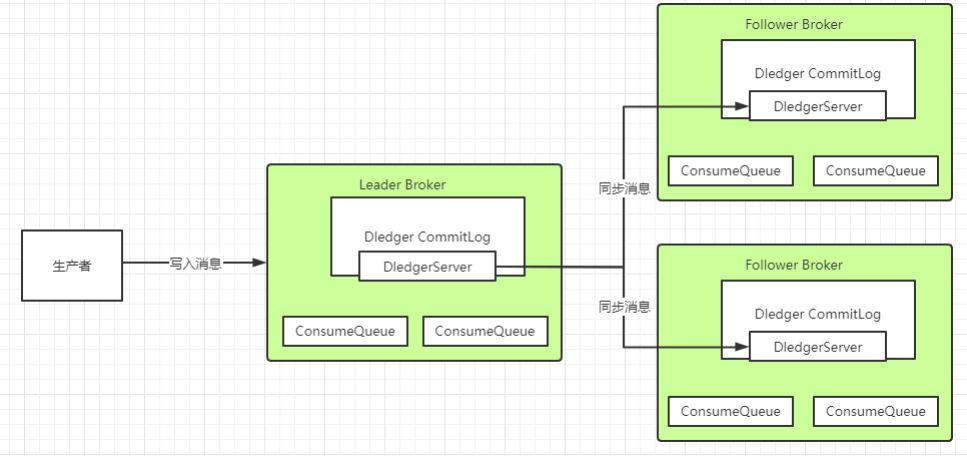

:::tip
- 消息零丢失
- 消息顺序
- 消息积压
- 消息轨迹
:::

---
## 消息零丢失

- 哪些环节会有丢消息的可能
	- 
	- 1，2，4 三个场景都是跨网络的，而跨网络就肯定会有丢消息的可能
	- 通常MQ存盘时都会先写入操作系统的缓存page cache中，然后再由操作系统异步的将消息写入硬盘
		- 这个中间有个时间差，就可能会造成消息丢失
		- 如果服务挂了，缓存中还没有来得及写入硬盘的消息就会丢失
- 生产者使用事务消息机制保证消息零丢失
	- 
	- half 消息
		- 这个half消息是在订单系统进行下单操作前发送，并且对下游服务的消费者是不可见的
		- 这个消息的作用更多的体现在确认RocketMQ的服务是否正常
		- half 消息如果写入失败了，可以在下单时给订单一个状态标记，然后等待MQ服务正常后再进行补偿操作，等MQ服务正常后重新下单通知下游服务
	- 订单系统写数据库失败
		- 可以另外找个地方把订单消息先缓存起来
		- 然后给RocketMQ返回一个UNKNOWN状态
			- 这样RocketMQ就会过一段时间来回查事务状态
		- 可以在回查事务状态时再尝试把订单数据写入数据库，如果数据库这时候已经恢复了，那就能完整正常的下单，再继续后面的业务
	- half消息写入成功后RocketMQ挂了
		- 未知状态的事务状态回查是由RocketMQ的Broker主动发起的
		- 等RocketMQ恢复后，只要存储的消息没有丢失，RocketMQ就会再次继续状态回查的流程
	- 下单成功后如何优雅的等待支付成功
		- 可以用事务消息的状态回查机制来替代定时的任务
		- 在下单时，给Broker返回一个UNKNOWN的未知状态
		- 在状态回查的方法中去查询订单的支付状态
		- 我们只需要配置RocketMQ中的事务消息回查次数(默认15次)和事务回查间隔时间(messageDelayLevel)
	- 事务消息机制的作用
		- 保证的是订单系统下单和发消息这两个事件的事务一致性
		- 而对下游服务的事务并没有保证
- RocketMQ配置同步刷盘+Dledger主从架构保证MQ主从同步时不会丢消息
	- 同步刷盘
	- Dledger的文件同步：基于Raft协议
		- 
		- Dledger会通过两阶段提交的方式保证文件在主从之间成功同步
			- uncommitted阶段
				- Leader Broker上的Dledger收到一条数据后，会标记为uncommitted状态
				- 然后他通过自己的DledgerServer组件把这个uncommitted数据发给Follower Broker的DledgerServer组件
				- 接着Follower Broker的DledgerServer收到uncommitted消息之后，必须返回一个ack给Leader Broker的Dledger
			- commited阶段
				- 如果Leader Broker收到超过半数的Follower Broker返回的ack之后，就会把消息标记为committed状态
				- 再接下来， Leader Broker上的DledgerServer就会发送committed消息给Follower Broker上的DledgerServer
				- 让他们把消息也标记为committed状态
- 消费者端不要使用异步消费机制
	- 正常情况下，消费者端都是需要先处理本地事务，然后再给MQ一个ACK响应，这时MQ就会修改Offset，将消息标记为已消费，从而不再往其他消费者推送消息
	- 所以在Broker的这种重新推送机制下，消息是不会在传输过程中丢失的
	- 但是如果在开启异步消费线程后，直接返回 `ConsumeConcurrentlyStatus.CONSUME_SUCCESS`
		- 那么一旦消费失败，这个消息就丢失了
- RocketMQ特有的问题，NameServer挂了如何保证消息不丢失
	- NameServer在RocketMQ中，是扮演的一个路由中心的角色，提供到Broker的路由功能
	- 集群中任意多的节点挂掉，都不会影响他提供的路由功能
	- 如果集群中所有的NameServer节点都挂了，生产者和消费者立即就无法工作了
		- RocketMQ相当于整个服务都不可用了，那他本身肯定无法给我们保证消息不丢失了
	- 降级方案
		- 可以暂存到其他地方，然后起一个线程定时的扫描这些失败的订单消息，尝试往RocketMQ发送
- 这整套的消息零丢失方案，在各个环节都大量的降低了系统的处理性能以及吞吐量
	- 要根据实际的业务情况来考虑
	- 在有些对消息可靠性要求没有那么高的场景
		- 在生产者端就可以采用其他一些更简单的方案来提升吞吐
		- 而采用定时对账、补偿的机制来提高消息的可靠性

---
## 消息顺序

- 全局有序：整个MQ系统的所有消息严格按照队列先入先出顺序进行消费
	- 通常意义下，全局有序都可以压缩成局部有序的问题
- 局部有序：只保证一部分关键消息的消费顺序
	- 在大部分的MQ业务场景，我们只需要能够保证局部有序就可以了
- 通常情况下，发送者发送消息时，会通过MessageQueue轮询的方式保证消息尽量均匀的分布到所有的MessageQueue上，而消费者也就同样需要从多个MessageQueue上消费消息
	- MessageQueue是RocketMQ存储消息的最小单元，他们之间的消息都是互相隔离的，在这种情况下，是无法保证消息全局有序的
		- 通常所谓的保证Topic全局消息有序的方式，就是将Topic配置成只有一个MessageQueue队列(默认是4个)
		- 对整个Topic的消息吞吐影响是非常大的，如果这样用，基本上就没有用MQ的必要了
	-  而对于局部有序的要求，只需要将有序的一组消息都存入同一个MessageQueue里，这样MessageQueue的FIFO设计天生就可以保证这一组消息的有序
		- RocketMQ中，可以在发送者发送消息时指定一个MessageSelector对象，让这个对象来决定消息发入哪一个MessageQueue。这样就可以保证一组有序的消息能够发到同一个MessageQueue里

---
## 消息积压

- 如何确定RocketMQ有大量的消息积压
	- 在正常情况下，使用MQ都会要尽量保证他的消息生产速度和消费速度整体上是平衡的
	- 但是如果部分消费者系统出现故障，就会造成大量的消息积累
	- 使用web控制台，就能直接看到消息的积压情况
	- 也可以通过mqadmin指令在后台检查各个Topic的消息延迟情况
	- RocketMQ也会在他的 ${storePathRootDir}/config目录下落地一系列的json文件，也可以用来跟踪消息积压情况
- 如何处理大量积压的消息
	- 如果Topic下的MessageQueue配置得是足够多的，那每个Consumer实际上会分配多个MessageQueue来进行消费
		- 可以简单的通过增加Consumer的服务节点数量来加快消息的消费，等积压消息消费完了，再恢复成正常情况
		- 最极限的情况是把Consumer的节点个数设置成跟MessageQueue的个数相同
			- 再继续增加Consumer的服务节点就没有用了
	- 如果Topic下的MessageQueue配置得不够多的话：可以创建一个新的Topic，配置足够多的MessageQueue
		- 然后把所有消费者节点的目标Topic转向新的Topic，并紧急上线一组新的消费者，只负责消费旧Topic中的消息，并转储到新的Topic中，这个速度是可以很快的
		- 然后在新的Topic上，就可以通过增加消费者个数来提高消费速度了。之后再根据情况恢复成正常情况
- 如果RocketMQ原本是采用的普通方式搭建主从架构，而现在想要中途改为使用Dledger高可用集群
	- 这时候如果不想历史消息丢失，就需要先将消息进行对齐，也就是要消费者把所有的消息都消费完，再来切换主从架构
	- 因为Dledger集群会接管RocketMQ原有的CommitLog日志，所以切换主从架构时，如果有消息没有消费完，这些消息是存在旧的CommitLog中的，就无法再进行消费了
		- 这个场景下也是需要尽快的处理掉积压的消息

---
## 消息轨迹

- `broker.conf -> traceTopicEnable=true`
- 消息轨迹数据存储 
	- 默认情况下，消息轨迹数据是存于一个系统级别的 Topic (RMQ_SYS_TRACE_TOPIC)
		- 这个Topic在Broker节点启动时，会自动创建出来
		- 也支持客户端自定义轨迹数据存储的 Topic
- 在客户端的两个核心对象 DefaultMQProducer 和 DefaultMQPushConsumer 的构造函数中，都有两个可选的参数来打开消息轨迹存储
	- enableMsgTrace：是否打开消息轨迹。默认是false
	- customizedTraceTopic：配置将消息轨迹数据存储到用户指定的Topic

