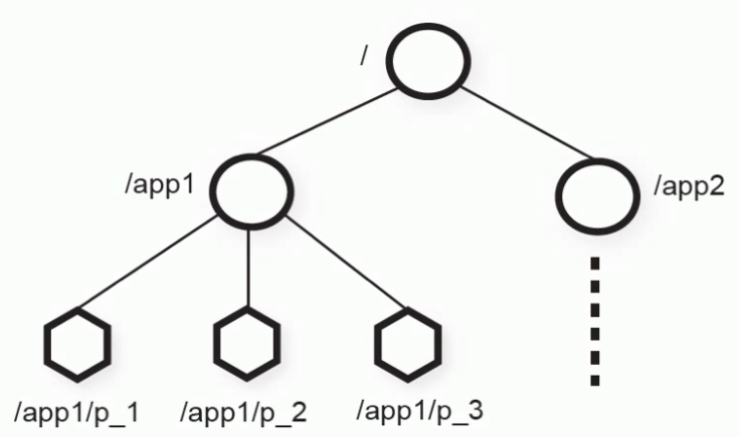
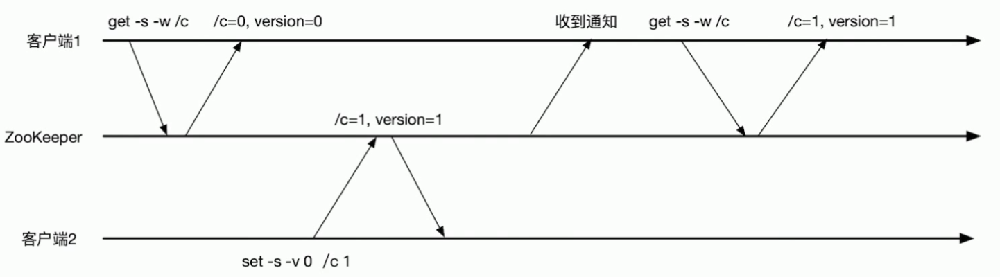
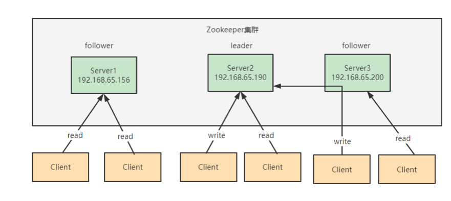
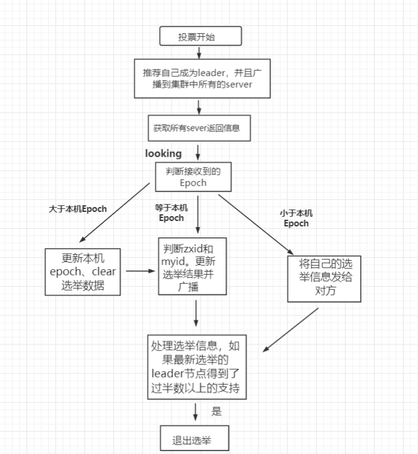
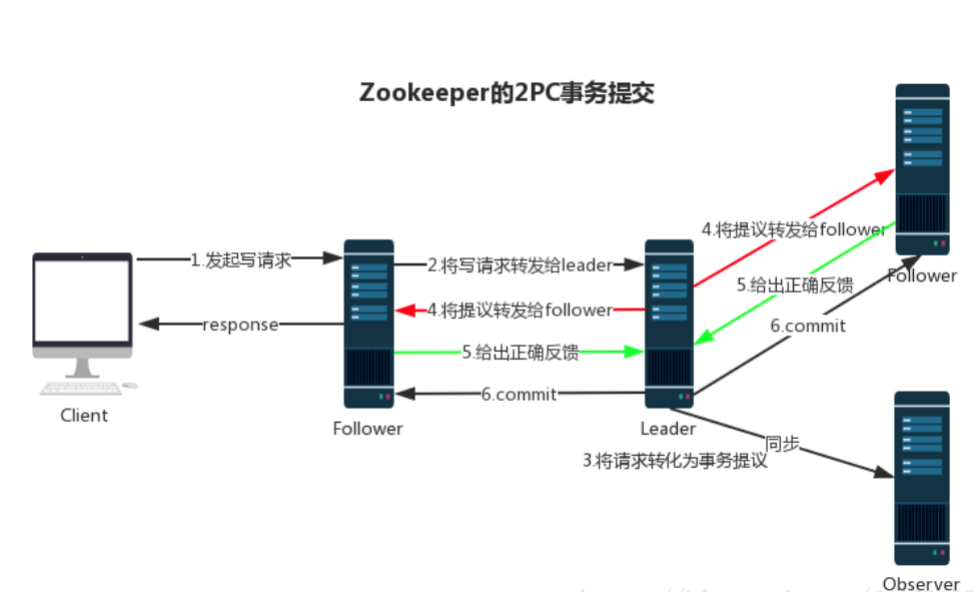

:::tip
- CP架构
- 常见命令
- 数据结构
- 监听通知机制
- 节点特性
- ACL权限控制
- 集群
- 四字命令
- Leader 选举原理
- 数据同步流程
:::

---
## CP架构

- CAP 理论指出对于一个分布式计算系统来说，不可能同时满足以下三点
	- 一致性：在分布式环境中，一致性是指数据在多个副本之间是否能够保持一致的特性，等同于所有节点访问同一份最新的数据副本。在一致性的需求下，当一个系统在数据一致的状态下执行更新操作后，应该保证系统的数据仍然处于一致的状态
	- 可用性：每次请求都能获取到正确的响应，但是不保证获取的数据为最新数据
	- 分区容错性：分布式系统在遇到任何网络分区故障的时候，仍然需要能够保证对外提供服务，除非是整个网络环境都发生了故障
- 一个分布式系统最多只能同时满足一致性（Consistency）、可用性（Availability）和分区容错性（Partition tolerance）这三项中的两项
	- P 是必须的，因此只能在 CP 和 AP 中选择，zookeeper 保证的是 CP
- BASE 理论：BASE 是 Basically Available(基本可用)、Soft-state(软状态) 和 Eventually Consistent(最终一致性) 三个短语的缩写
	- 基本可用：在分布式系统出现故障，允许损失部分可用性（服务降级、页面降级）
	- 软状态：允许分布式系统出现中间状态。而且中间状态不影响系统的可用性。这里的中间状态是指不同的 data replication（数据备份节点）之间的数据更新可以出现延时的最终一致性
	- 最终一致性：data replications 经过一段时间达到一致性
- Zookeeper 写入是强一致性，读取是顺序一致性（版本号）
- ZooKeeper本质上是一个分布式的小文件存储系统（Zookeeper=文件系统+监听机制）
	- 是一个基于观察者模式设计的分布式服务管理框架

---
## 常见命令

- ls 查看当前 znode 的子节点 \[可监听\]
	- -w: 监听子节点变化
	- -s: 节点状态信息（时间戳、版本号、数据大小等）
	- -R: 表示递归的获取
- create 创建节点
	- -s : 创建有序节点
	- -e : 创建临时节点
	- -c : 创建一个容器节点
	- \[-t ttl\] : 创建一个TTL节点， -t 时间（单位毫秒）
	- data : 节点的数据，可选，如果不使用时，节点数据就为null
	- acl : 访问控制
- get 获取节点数据信息
	-  -s: 节点状态信息（时间戳、版本号、数据大小等）
	-  -w: 监听节点变化
- set 设置节点数据
	- -s: 表示节点为顺序节点
	- -v: 指定版本号
- getAcl 获取节点的访问控制信息
	- -s: 节点状态信息（时间戳、版本号、数据大小等）
- setAcl 设置节点的访问控制列表
	- -s: 节点状态信息（时间戳、版本号、数据大小等）
	- -v: 指定版本号
	- -R: 递归的设置
- stat 查看节点状态信息
- delete  删除某一节点，只能删除无子节点的节点
	- -v: 表示节点版本号
- deleteall 递归的删除某一节点及其子节点
- setquota 对节点增加限制
	- -n: 表示子节点的最大个数
	- -b: 数据值的最大长度，-1表示无限制

---
## 数据结构

- ZooKeeper的数据模型是层次模型，层次模型常见于文件系统。层次模型和key-value模型是两种主流的数据模型。ZooKeeper使用文件系统模型主要基于以下两点考虑
	- 文件系统的树形结构便于表达数据之间的层次关系
	- 文件系统的树形结构便于为不同的应用分配独立的命名空间 ( namespace ) 
- ZooKeeper的层次模型称作Data Tree，Data Tree的每个节点叫作Znode
	- 每一个 ZNode 默认能够存储 1MB 的数据
	- 每个 ZNode 都可以通过其路径唯一标识
	- 每个节点都有一个版本(version)，版本从0开始计数
	- 
- 节点分类
	- 持久节点 (PERSISTENT): 这样的znode在创建之后即使发生ZooKeeper集群宕机或者client宕机也不会丢失
	- 临时节点 (EPHEMERAL ): client宕机或者client在指定的timeout时间内没有给ZooKeeper集群发消息，这样的znode就会消失
	- 持久顺序节点 (PERSISTENT_SEQUENTIAL): znode除了具备持久性znode的特点之外，名字具备顺序性
	- 临时顺序节点 (EPHEMERAL_SEQUENTIAL): znode除了具备临时性znode的特点之外，名字具备顺序性
	- Container节点 (3.5.3版本新增)：Container容器节点，当容器中没有任何子节点，该容器节点会被zk定期删除（定时任务默认60s 检查一次)
		- 和持久节点的区别是 ZK 服务端启动后，会有一个单独的线程去扫描，所有的容器节点，当发现容器节点的子节点数量为 0 时，会自动删除该节点
		- 可以用于 leader 或者锁的场景中
	- TTL节点:  带过期时间节点，默认禁用
		- 在zoo.cfg中添加 `extendedTypesEnabled=true `开启
		- ttl 不能用于临时节点
- 节点状态信息
	- cZxid ：Znode创建的事务id
	- ctime：节点创建时的时间戳
	- mZxid ：Znode被修改的事务id，即每次对znode的修改都会更新mZxid
		- 对于zk来说，每次的变化都会产生一个唯一的事务id，zxid（ZooKeeper Transaction Id）
		- 通过zxid，可以确定更新操作的先后顺序
		- 如果zxid1小于zxid2，说明zxid1操作先于zxid2发生
		- zxid对于整个zk都是唯一的，即使操作的是不同的znode
	- pZxid: 表示该节点的子节点列表最后一次修改的事务ID
		- 只有子节点列表变更了才会变更pzxid，子节点内容变更不会影响pzxid
			- 添加子节点或删除子节点就会影响子节点列表
			- 但是修改子节点的数据内容则不影响该ID
	- mtime：节点最新一次更新发生时的时间戳
	- cversion ：子节点的版本号
		- 当znode的子节点有变化时，cversion 的值就会增加1
	- dataVersion：数据版本号
		- 每次对节点进行set操作，dataVersion的值都会增加1（即使设置的是相同的数据）
		- 可有效避免了数据更新时出现的先后顺序问题
	- ephemeralOwner
		- 如果该节点为临时节点, ephemeralOwner值表示与该节点绑定的session id
			- 在client和server通信之前,首先需要建立连接,该连接称为session
			- 连接建立后,如果发生连接超时、授权失败,或者显式关闭连接,连接便处于closed状态, 此时session结束
		- 如果不是, ephemeralOwner值为0 (持久节点)
	- dataLength： 数据的长度
	- numChildren：子节点的数量（只统计直接子节点的数量）

---
## 监听通知机制

- watcher 机制
	- 一个Watch事件是一个一次性的触发器
		- 当被设置了Watch的数据发生了改变的时候，则服务器将这个改变发送给设置了Watch的客户端，以便通知它们
	- Zookeeper采用了 Watcher机制实现数据的发布订阅功能
		- 多个订阅者可同时监听某一特定主题对象，当该主题对象的自身状态发生变化时例如节点内容改变、节点下的子节点列表改变等，会实时、主动通知所有订阅者
	- watcher机制事件上与观察者模式类似，也可看作是一种观察者模式在分布式场景下的实现方式
- watcher 的过程
	- 客户端向服务端注册watcher
	- 服务端事件发生触发watcher
	- 客户端回调watcher得到触发事件情况
- Zookeeper中的watch机制，必须客户端先去服务端注册监听，这样事件发送才会触发监听，通知给客户端
- 支持的事件类型
	- None: 连接建立事件
	- NodeCreated： 节点创建 
	- NodeDeleted： 节点删除 
	- NodeDataChanged：节点数据变化
	- NodeChildrenChanged：子节点列表变化 
	- DataWatchRemoved：节点监听被移除 
	- ChildWatchRemoved：子节点监听被移除
- 特性
	- 一次性触发：watcher是一次性的，一旦被触发就会移除，再次使用时需要重新注册
	- 客户端顺序回调：watcher回调是顺序串行执行的，只有回调后客户端才能看到最新的数据状态。一个watcher回调逻辑不应该太多，以免影响别的watcher执行
	- 轻量级：WatchEvent是最小的通信单位，结构上只包含通知状态、事件类型和节点路径，并不会告诉数据节点变化前后的具体内容
	- 时效性：watcher只有在当前session彻底失效时才会无效，若在session有效期内快速重连成功，则watcher依然存在，仍可接收到通知
- 使用场景
	- master-worker 机制
	- 基于版本号的条件更新
		- 

---
## 节点特性

- 同一级节点 key 名称是唯一的
- 创建节点时，必须要带上全路径
- session 关闭，临时节点清除
- 自动创建顺序节点
- watch 机制，监听节点变化
	- 监听事件被单次触发后，事件就失效了
- 永久性 Watch（`addWatch [‐m mode] path`）：是Zookeeper 3.6.0版本新增的功能
	- 在被触发之后，仍然保留，可以继续监听ZNode上的变更
	- 针对指定节点添加事件监听，支持两种模式
		- PERSISTENT，持久化订阅，针对当前节点的修改和删除事件，以及当前节点的子节点的删除和新增事件
		- PERSISTENT_RECURSIVE，持久化递归订阅，在PERSISTENT的基础上，增加了子节点修改的事件触发，以及子节点的子节点的数据变化都会触发相关事件
- delete 命令只能一层一层删除
- deleteall 命令递归删除
- 应用场景：适用于存储和协同相关的关键数据，不适合用于大数据量存储
	- 注册中心 
	- 数据发布/订阅（常用于实现配置中心） 
		- 数据量小的KV
		- 数据内容在运行时会发生动态变化
		- 集群机器共享，配置一致
		- 推拉结合
			- 服务端会推给注册了监控节点的客户端 Watcher 事件通知
			- 客户端获得通知后，然后主动到服务端拉取最新的数据
	- 统一集群管理
	- 负载均衡
	- 命名服务
	- 分布式协调/通知
	- 集群管理
	- Master选举
	- 分布式锁
	- 分布式队列

---
## ACL权限控制

- zookeeper 的 ACL（Access Control List，访问控制表）权限可以针对节点设置相关读写等权限
- zookeeper 的 acl 通过 `[scheme:id:permissions]` 来构成权限列表
	- scheme：授权的模式，代表采用的某种权限机制
		- 包括 world、auth、digest、ip、super 几种
	- id：授权对象，代表允许访问的用户
		- 如果我们选择采用 IP 方式，使用的授权对象可以是一个 IP 地址或 IP 地址段
		- 而如果使用 Digest 或 Super 方式，则对应于一个用户名
		- 如果是 World 模式，是授权系统中所有的用户
	- permissions：授权的权限，权限组合字符串，由 cdrwa 组成，其中每个字母代表支持不同权限
		- 创建权限 create(c)、删除权限 delete(d)、读权限 read(r)、写权限 write(w)、管理权限admin(a)。

| 模式     | 描述                                        |
| ------ | ----------------------------------------- |
| world  | 授权对象只有一个anyone，代表登录到服务器的所有客户端都能对该节点执行某种权限 |
| ip     | 对连接的客户端使用IP地址认证方式进行认证                     |
| auth   | 使用以添加认证的用户进行认证                            |
| digest | 使用用户:密码方式验证                               |

| 权限类型   | ACL简写 | 描述              |
| ------ | ----- | --------------- |
| read   | r     | 读取节点及显示子节点列表的权限 |
| write  | w     | 设置节点数据的权限       |
| create | c     | 创建子节点的权限        |
| delete | d     | 删除子节点的权限        |
| admin  | a     | 设置该节点ACL权限的权限   |

| 授权命令    | 用法                   | 描述             |
| ------- | -------------------- | -------------- |
| getAcl  | getAcl path          | 读取节点的ACL       |
| setAcl  | setAcl path acl      | 设置节点的ACL       |
| create  | create path data acl | 创建节点时设置ACL     |
| addAuth | addAuth scheme auth  | 添加认证用户，类似于登录操作 |
- setAcl
	- `set Acl /name world:anyone:cdwa`
- auth授权模式
	- 创建用户 `addauth digest fox:123456`
	- `setAcl /name auth:fox:123456:cdrwa`
	- 密码加密
		- `echo -n fox:123456 | openssl dgst -binary -sha1 | openssl base64`
		- `setAcl /name auth:fox:ZsWwgmtnTnx1usRF1voHFJAYGQU=:cdrwa`
- digest授权模式
	- `setAcl /tuling/fox digest:fox:ZsWwgmtnTnx1usRF1voHFJAYGQU=:cdrwa`
- IP授权模式
	- `setAcl /node-ip ip:192.168.109.128:cdwra`
	- `create /node-ip data ip:192.168.109.128:cdwra`
		- 多个指定IP可以通过逗号分隔
			- `setAcl /node-ip ip:IP1:rw,ip:IP2:a`
- Super 超级管理员模式
	- 这是一种特殊的Digest模式， 在Super模式下超级管理员用户可以对Zookeeper上的节点进行任何的操作
	- 需要在启动脚本上通过添加JVM 参数开启
		- `-Dzookeeper.DigestAuthenticationProvider.superDigest=admin:<base64encoded(SHA1(123456))`

---
## 集群

- 集群角色
	- Leader： 领导者
		- 事务请求（写操作）的唯一调度者和处理者，保证集群事务处理的顺序性
		- 集群内部各个服务器的调度者
		- 对于create、setData、delete等有写操作的请求，则要统一转发给leader处理，leader需要决定编号、执行操作，这个过程称为事务
	- Follower：跟随者
		- 处理客户端非事务（读操作）请求（可以直接响应）
		- 转发事务请求给 Leader
		- 参与集群 Leader 选举投票
	- Observer：观察者
		- 对于非事务请求可以独立处理（读操作）
		- 对于事务性请求会转发给 leader 处理
		- Observer 节点接收来自 leader 的 inform 信息，更新自己的本地存储
		- 不参与提交和选举投票
		- 在不影响集群事务处理能力的前提下提升集群的非事务处理能力
		- Observer 应用场景
			- 提升集群的读性能
			- 跨数据中心部署
				- 比如需要部署一个北京和香港两地都可以使用的zookeeper集群服务，并且要求北京和香港客户的读请求延迟都很低。解决方案就是把香港的节点都设置为observer
- 集群架构
	- 
	- leader节点可以处理读写请求
	- follower只可以处理读请求
	- follower在接到写请求时会把写请求转发给leader来处理
- Zookeeper数据一致性保证
	- 全局可线性化 (Linearizable) 写入：先到达leader的写请求会被先处理，leader决定写请求的执行顺序
	- 客户端FIFO顺序：来自给定客户端的请求按照发送顺序执行
- 集群搭建
	- 修改zoo.cfg配置，添加server节点配置：`server.A=B:C:D`
		- `dataDir=/data/zookeeper`
		- `server.1=192.168.65.156:2888:3888`
		- A 是一个数字，表示这个是第几号服务器
			- 集群模式下配置一个文件 myid，这个文件在 dataDir 目录下，这个文件里面有一个数据 就是 A 的值，Zookeeper 启动时读取此文件，拿到里面的数据与 zoo.cfg 里面的配置信息比较从而判断到底是哪个server
		- B 是这个服务器的地址
		- C 是这个服务器Follower与集群中的Leader服务器交换信息的端口
		- D 是万一集群中的Leader服务器挂了，需要一个端口来重新进行选举，选出一个新的Leader
			- 而这个端口就是用来执行选举时服务器相互通信的端口
	- 创建 myid 文件，配置服务器编号
	- 启动 zookeeper server 集群 `bin/zkServer.sh start`

---
## 四字命令

- zookeeper 支持某些特定的四字命令与其交互，用户获取 zookeeper 服务的当前状态及相关信息
	- 用户在客户端可以通过 telenet 或者 nc（netcat） 向 zookeeper 提交相应的命令
- 开启四字命令
	- 在 zoo.cfg 文件里加入配置项让这些指令放行
		- `4lw.commands.whitelist=*`
	- 在 zk 的启动脚本 zkServer.sh 中新增放行指令（添加ＶＭ环境变量）
		- `ZOOMAIN="-Dzookeeper.4lw.commands.whitelist=* ${ZOOMAIN}"`
- `echo [command] | nc [ip] [port]`
	- stat 命令用于查看 zk 的状态信息
		- `echo stat | nc 192.168.65.156 2181`

| 四字命令 | 功能描述                                                                        |
| ---- | --------------------------------------------------------------------------- |
| conf | 3.3.0版本引入的。打印出服务相关配置的详细信息。                                                  |
| cons | 3.3.0版本引入的。列出所有连接到这台服务器的客户端全部连接/会话详细信息。包括"接受/发送"的包数量、会话id、操作延迟、最后的操作执行等等信息。 |
| crst | 3.3.0版本引入的。重置所有连接的连接和会话统计信息。                                                |
| dump | 列出那些比较重要的会话和临时节点。这个命令只能在leader节点上有用。                                        |
| envi | 打印出服务环境的详细信息。                                                               |
| reqs | 列出未经处理的请求                                                                   |
| ruok | 测试服务是否处于正确状态。如果确实如此，那么服务返回"imok"，否则不做任何相应。                                  |
| stat | 输出关于性能和连接的客户端的列表。                                                           |
| srst | 重置服务器的统计。                                                                   |
| srvr | 3.3.0版本引入的。列出连接服务器的详细信息                                                     |
| wchs | 3.3.0版本引入的。列出服务器watch的详细信息。                                                 |
| wchc | 3.3.0版本引入的。通过session列出服务器watch的详细信息，它的输出是一个与watch相关的会话的列表。                  |
| wchp | 3.3.0版本引入的。通过路径列出服务器watch的详细信息。它输出一个与session相关的路径。                          |
| mntr | 3.4.0版本引入的。输出可用于检测集群健康状态的变量列表                                               |

---
## Leader 选举原理

- zookeeper 的 leader 选举存在两个阶段
	- 一个是服务器启动时 leader 选举
	- 另一个是运行过程中 leader 服务器宕机
- 重要的参数
	- 服务器 ID(myid)：编号越大在选举算法中权重越大
	- 事务 ID(zxid)：值越大说明数据越新，权重越大
	- 逻辑时钟(epoch-logicalclock)：同一轮投票过程中的逻辑时钟值是相同的，每投完一次值会增加
- 选举状态
	- LOOKING: 竞选状态
	- FOLLOWING: 随从状态，同步 leader 状态，参与投票 
	- OBSERVING: 观察状态，同步 leader 状态，不参与投票 
	- LEADING: 领导者状态
- 服务器启动时的 leader 选举
	- 每个节点启动的时候都 LOOKING 观望状态，接下来就开始进行选举主流程
		- 第一台服务器 server1启动时，无法进行 leader 选举
		- 当第二台服务器 server2 启动时，两台机器可以相互通信，进入 leader 选举过程
	- 
		1. 每台 server 发出一个投票
			1. 由于是初始情况，server1 和 server2 都将自己作为 leader 服务器进行投票
			2. 每次投票包含所推举的服务器myid、zxid、epoch，使用（myid，zxid）表示
			3. 此时 server1 投票为（1,0），server2 投票为（2,0），然后将各自投票发送给集群中其他机器
		2. 接收来自各个服务器的投票
			1. 集群中的每个服务器收到投票后，首先判断该投票的有效性
			2. 如检查是否是本轮投票（epoch）、是否来自 LOOKING 状态的服务器
		3. 分别处理投票
			1. 针对每一次投票，服务器都需要将其他服务器的投票和自己的投票进行对比
				1. 优先比较 epoch
				2. 检查 zxid，zxid 比较大的服务器优先作为 leader
				3. 如果 zxid 相同，那么就比较 myid，myid 较大的服务器作为 leader 服务器
		4. 统计投票
			1. 每次投票后，服务器统计投票信息，判断是否有过半机器接收到相同的投票信息
			2. server1、server2 都统计出集群中有两台机器接受了（2,0）的投票信息，此时已经选出了 server2 为 leader 节点
		5. 改变服务器状态
			1. 一旦确定了 leader，每个服务器响应更新自己的状态
			2. 如果是 follower，那么就变更为 FOLLOWING，如果是 Leader，变更为 LEADING
			3. 此时 server3继续启动，直接加入变更自己为 FOLLOWING
- 运行过程中的 leader 选举：当集群中 leader 服务器出现宕机或者不可用情况时，整个集群无法对外提供服务，进入新一轮的 leader 选举
	1. 变更状态：leader 挂后，其他非 Oberver服务器将自身服务器状态变更为 LOOKING
	2. 每个 server 发出一个投票：在运行期间，每个服务器上 zxid 可能不同
	3. 处理投票：规则同启动过程
	4. 统计投票：与启动过程相同
	5. 改变服务器状态：与启动过程相同

---
## 数据同步流程

- 在 Zookeeper 中，主要依赖 ZAB 协议来实现分布式数据一致性
- ZAB 协议分为两部分：消息广播；崩溃恢复
- 消息广播
	- 
	- Zookeeper 使用单一的主进程 Leader 来接收和处理客户端所有事务请求
	- 并采用 ZAB 协议的原子广播协议，将事务请求以 Proposal 提议广播到所有 Follower 节点
	- 当集群中有过半的Follower 服务器进行正确的 ACK 反馈
		- 那么Leader就会再次向所有的 Follower 服务器发送commit 消息，将此次提案进行提交
	- 这个过程可以简称为 2pc 事务提交
	- 注意 Observer 节点只负责同步 Leader 数据，不参与 2PC 数据同步过程
- 崩溃恢复
	- 在正常情况消息下广播能运行良好，但是一旦 Leader 服务器出现崩溃，或者由于网络原理导致 Leader 服务器失去了与过半 Follower 的通信，那么就会进入崩溃恢复模式
	- 需要选举出一个新的 Leader 服务器
	- 在这个过程中可能会出现两种数据不一致性的隐患，需要 ZAB 协议的特性进行避免
		- Leader 服务器将消息 commit 发出后，立即崩溃
		- Leader 服务器刚提出 proposal 后，立即崩溃
	- ZAB 协议的恢复模式使用了以下策略
		- 选举 zxid 最大的节点作为新的 leader
		- 新 leader 将事务日志中尚未提交的消息进行处理

