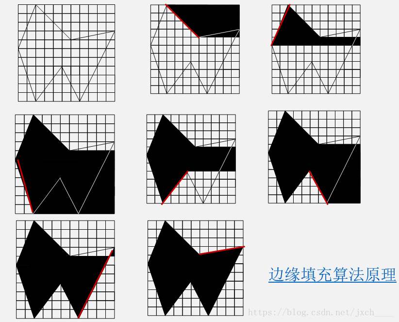

## 填充原理
边缘填充算法是先求出多边形的每条边与扫描线的交点，然后**将交点右侧的所有像素颜色全部取为补色（或反色**）。按任意顺序处理完多边形的所有边后，就完成了多边形的填充任务。边缘填充算法利用了图像处理中的求“补”或求“反”的概念，对于黑白图像，求补就是把RGB(1,1,1)（白色）的像素置为RGB(0,0,0)（黑色），反之亦然；对于彩色图像，求补就是将背景色置为填充色，反之亦然。求补的一条基本性质是**一个像素求补两次就恢复为原色**。**如果多边形内部的像素被求补偶数次，保持原色，如果被求补奇数次，显示填充色。**

## 填充过程
假定边的顺序为E0、E1、E2、E3、E4、E5和E6。这里，边的顺序并不影响填充结果，只是方便编写循环结构而已。

